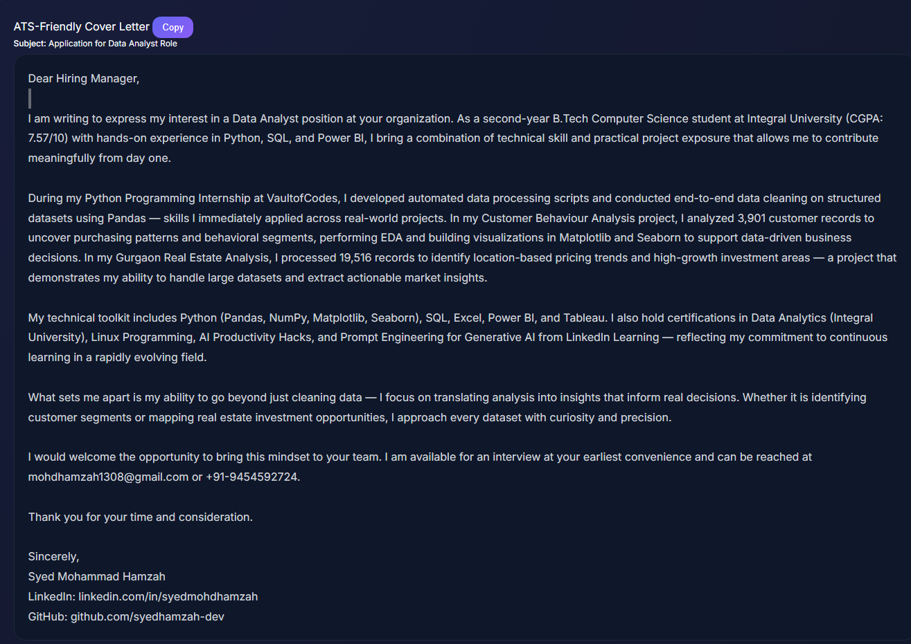
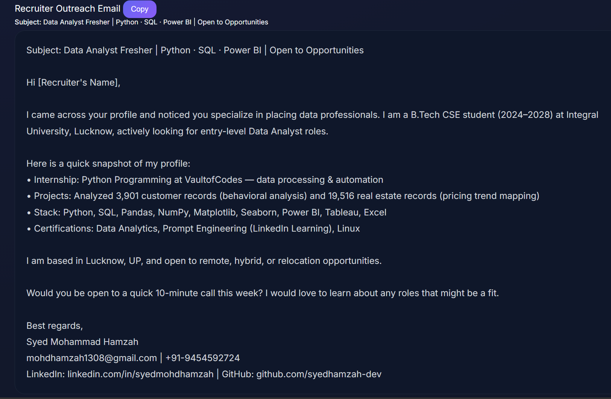
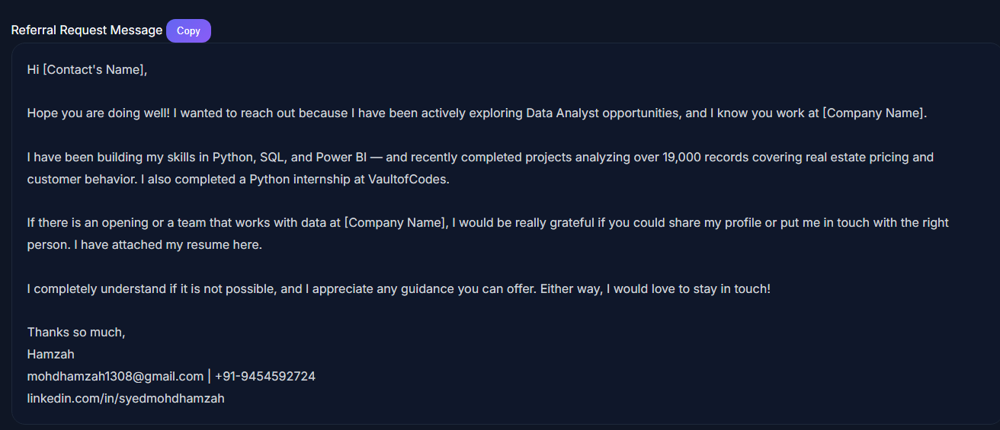

# 🚀 Day 12 – Job Search & Personal Branding Toolkit

## abtalks 60 Days Claude Challenge

### Using AI to Build a Complete Career Toolkit

---

# 📖 Overview

For Day 12 of the abtalks 60 Days Claude Challenge, I explored how AI can assist beyond coding and productivity.

The objective was to create a complete job search and personal branding toolkit tailored to my profile and career goals.

The generated toolkit included:

* ATS Analysis
* Cover Letters
* Recruiter Outreach Templates
* Referral Requests
* LinkedIn Networking Messages
* Interview Talking Points
* Skill Gap Analysis
* Personal Branding Strategy

---

# 🎯 Challenge Objective

Create a complete career toolkit that helps:

* Improve visibility to recruiters
* Build a stronger professional brand
* Identify skill gaps
* Improve networking efforts
* Prepare for interviews
* Optimize job search strategy

---

# 📸 Screenshots

## ATS-Friendly Cover Letter

---

## Recruiter Outreach Email

---

## Referral Request Message

---

# ✨ Key Outputs Generated

### Career Communication

* ATS-Friendly Cover Letter
* Recruiter Outreach Email
* Hiring Manager Email
* Referral Request Message
* Follow-Up Email

### Networking

* LinkedIn Connection Request
* Personal Introduction Script
* Interview Talking Points

### Career Strategy

* Recommended Job Titles
* Recruiter Strength Analysis
* Skill Gap Analysis
* Learning Roadmap

### Personal Branding

* Unique Value Proposition
* Positioning Statement
* LinkedIn Headline

---

# 📊 Key Findings

## Strengths Identified

* Python
* SQL
* Power BI
* Tableau
* Data Cleaning
* Exploratory Data Analysis
* Real-world Projects
* Internship Experience

---

## Areas for Improvement

* Advanced SQL
* Statistics & Probability
* Machine Learning Fundamentals
* Cloud Data Tools
* Dashboard Storytelling
* Database Design

---

# 📚 What I Learned

## 1. Job Searching Is A Skill

Technical skills alone are not enough.

You must also learn how to communicate your value.

---

## 2. Recruiters Focus On Outcomes

Projects should be described using measurable impact rather than only listing tools.

---

## 3. Personal Branding Matters

A strong LinkedIn headline and positioning statement help recruiters understand your profile faster.

---

## 4. Skill Gaps Create Roadmaps

Gap analysis highlights what to learn next instead of guessing what employers want.

---

# 💡 Biggest Insight

> Don't market your tools. Market your results.

Recruiters remember outcomes, not software names.

---

# 🌟 Final Takeaway

This challenge helped me think beyond resumes and projects.

It taught me how to position myself professionally, communicate my strengths effectively, and create a roadmap for becoming a stronger Data Analyst and future Data Scientist.

---

# 📨 Career Communication Assets

As part of this challenge, Claude generated multiple professional communication templates tailored to my profile and target role.

These templates can be customized and used during the job search process to improve networking, recruiter outreach, and application success rates.

## ATS-Friendly Cover Letter

  

The cover letter was optimized to highlight relevant skills, projects, and experiences while maintaining ATS compatibility.

---

## Recruiter Outreach Email

  

A professional outreach template designed to connect with recruiters and express interest in relevant opportunities.

---

## Referral Request Message

  

A concise and professional referral request message that can be used when reaching out to industry professionals and connections.

---

### Key Learning

> Strong communication can create opportunities even before an interview is scheduled.

Learning how to present skills, projects, and achievements professionally is just as important as building those skills in the first place.

---

# 📅 Challenge Progress

* ✅ Day 1 – Getting Started with Claude
* ✅ Day 2 – Prompt Engineering
* ✅ Day 3 – Context Engineering
* ✅ Day 4 – Chain-of-Thought Prompting
* ✅ Day 5 – The Power of Context
* ✅ Day 6 – ATS Resume Optimization
* ✅ Day 7 – Claude Usage Strategy
* ✅ Day 8 – Environmental Health Analyzer
* ✅ Day 9 – NutriScope
* ✅ Day 10 – Portfolio Website Builder
* ✅ Day 11 – ATS Resume Optimization & Gap Analysis
* ✅ Day 12 – Job Search & Personal Branding Toolkit
* 🔜 Day 13 – Coming Soon

---

### 🚀 Learning in Public

Building AI Skills • Career Readiness • Personal Branding • Continuous Growth
