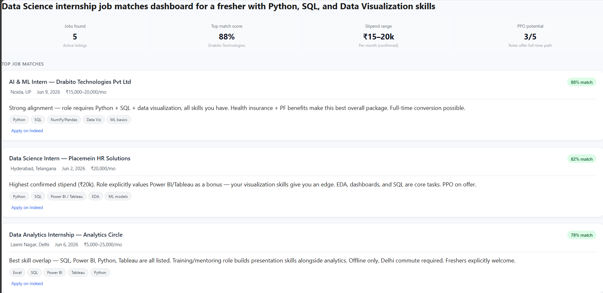
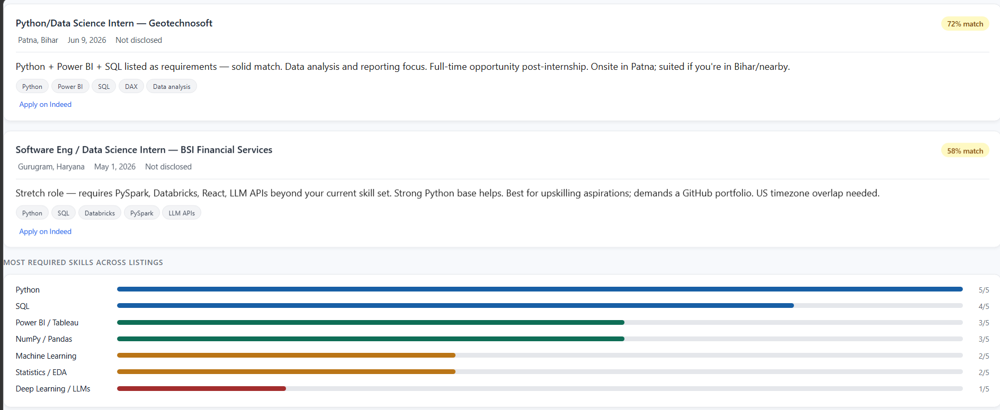
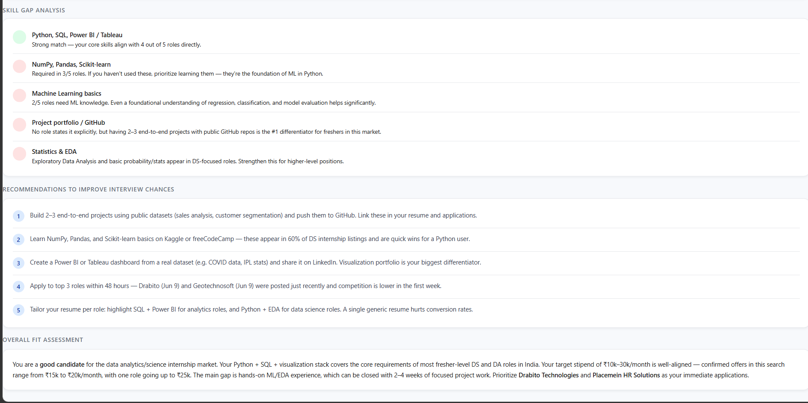
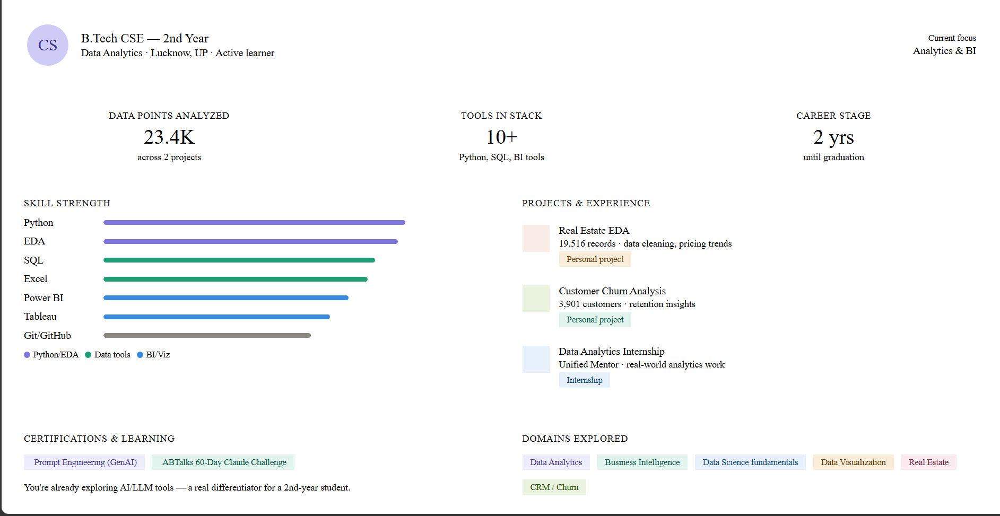

# 🚀 Day 13 – AI-Powered Job Discovery & Market Analysis

## abtalks 60 Days Claude Challenge

### Using Claude and Indeed to Discover Career Opportunities

---

# 📖 Overview

For Day 13 of the abtalks 60 Days Claude Challenge, I explored how AI can assist with job discovery, career planning, and market research.

Using Claude connected to Indeed, I analyzed job opportunities that matched my skills, interests, and career goals.

The challenge went beyond finding jobs and helped identify skill gaps, market demand, and areas for future growth.

---

# 🎯 Challenge Objective

Use AI-assisted job discovery to:

* Find relevant opportunities
* Analyze market demand
* Identify skill gaps
* Understand recruiter expectations
* Improve job search strategy
* Create a personalized career roadmap

---

# 📸 Screenshots

## Top Job Opportunities

---

## Skill Gap Analysis

---

## Market Demand Insights

---

# 🔍 Key Findings

## Most Commonly Required Skills

* SQL
* Python
* Excel
* Data Visualization
* Power BI
* Tableau
* Statistics
* Data Cleaning
* Exploratory Data Analysis

---

## Skill Gaps Identified

* Advanced SQL
* Statistical Analysis
* Machine Learning Fundamentals
* Dashboard Storytelling
* Cloud Technologies
* Business Communication

---

## Market Demand Insights

The analysis showed strong demand for:

* Data Analysts
* Business Analysts
* Data Science Interns
* Junior Data Analysts

Many opportunities emphasized practical experience, project work, and problem-solving ability.

---

# 📚 What I Learned

## 1. Job Descriptions Are Learning Roadmaps

Instead of seeing missing skills as weaknesses, they can be viewed as future learning goals.

---

## 2. Fundamentals Matter

SQL, Python, Excel, and Data Visualization continue to be among the most requested skills.

---

## 3. Projects Create Differentiation

Recruiters value practical projects that demonstrate real-world problem-solving.

---

## 4. AI Can Accelerate Career Research

AI can quickly analyze opportunities, identify patterns, and highlight important market trends.

---

# 💡 Biggest Insight

> A skill gap analysis is not a list of what you're missing.

> It's a roadmap showing what to learn next.

---

# 🌟 Final Takeaway

This challenge helped me understand that job searching is not only about finding opportunities.

It's also about understanding market expectations, identifying growth areas, and continuously improving.

The insights gained today will help guide my learning journey toward becoming a Data Analyst and future Data Scientist.

---

# 📅 Challenge Progress

* ✅ Day 1 – Getting Started with Claude
* ✅ Day 2 – Prompt Engineering
* ✅ Day 3 – Context Engineering
* ✅ Day 4 – Chain-of-Thought Prompting
* ✅ Day 5 – The Power of Context
* ✅ Day 6 – ATS Resume Optimization
* ✅ Day 7 – Claude Usage Strategy
* ✅ Day 8 – Environmental Health Analyzer
* ✅ Day 9 – NutriScope
* ✅ Day 10 – Portfolio Website Builder
* ✅ Day 11 – ATS Resume Optimization & Gap Analysis
* ✅ Day 12 – Job Search & Personal Branding Toolkit
* ✅ Day 13 – AI-Powered Job Discovery & Market Analysis
* 🔜 Day 14 – Coming Soon

---

### 🚀 Learning in Public

Building AI Skills • Career Growth • Data Analytics • Continuous Improvement
