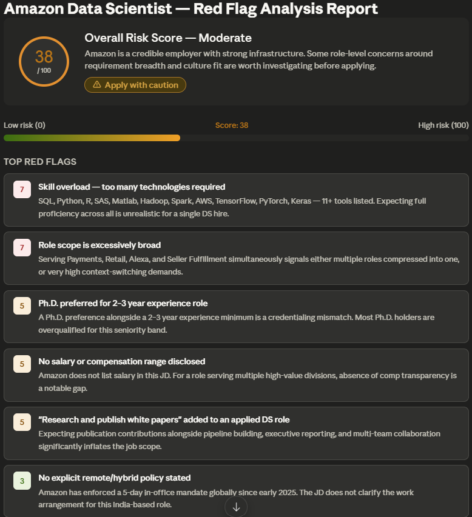
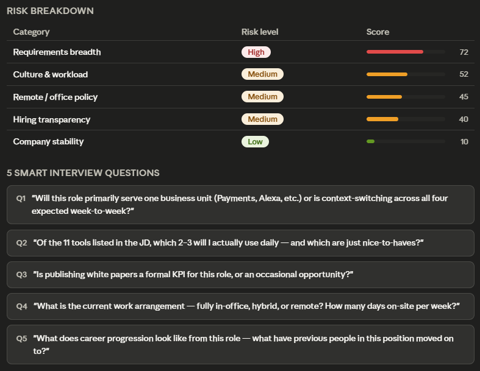

# 🚀 Day 14 – Job Red Flag Detector

## abtalks 60 Days Claude Challenge

### Using AI to Evaluate Job Opportunities and Company Risk Factors

---

# 📖 Overview

For Day 14 of the abtalks 60 Days Claude Challenge, I explored how AI can help evaluate job opportunities before applying.

The objective was to analyze a job description and company information to identify potential risks, positive signals, and overall job quality.

Instead of focusing only on getting interviews, this challenge focused on making smarter career decisions.

---

# 🎯 Challenge Objective

Use AI to:

* Analyze job descriptions
* Evaluate company information
* Detect potential red flags
* Identify positive signals
* Assess hiring quality
* Improve interview preparedness
* Generate a final risk assessment report

---

# 📸 Screenshots

## Risk Analysis Dashboard

  

---

## Red Flags & Positive Signals

  

---

# 🔍 Analysis Components

### Risk Assessment

* Overall Risk Score
* Hiring Process Evaluation
* Company Transparency Analysis
* Job Description Quality Assessment

### Positive Signals

* Growth Opportunities
* Learning Potential
* Clear Responsibilities
* Transparent Expectations
* Career Development Potential

### Red Flags

* Vague Requirements
* Unrealistic Expectations
* Missing Information
* Potential Work-Life Balance Concerns
* Compensation Transparency Issues

---

# 📊 Key Findings

The report highlighted both strengths and risks associated with the opportunity.

Rather than relying on assumptions, the analysis provided a structured way to evaluate the company and role.

---

# 📚 What I Learned

## 1. Interviews Are Two-Way Evaluations

Candidates evaluate companies just as companies evaluate candidates.

---

## 2. Job Descriptions Reveal Important Signals

The quality of a job description often reflects the quality of the hiring process.

---

## 3. Transparency Matters

Clear expectations, responsibilities, and communication are positive indicators.

---

## 4. Risk Analysis Supports Better Decisions

Understanding potential risks helps avoid investing time in poor opportunities.

---

# 💡 Biggest Insight

> A good career decision is not only about getting hired.

> It's also about choosing the right environment to grow.

---

# 🌟 Final Takeaway

This challenge taught me that job searching is not only about finding opportunities.

It is also about evaluating opportunities critically and making informed career decisions.

Using AI for risk analysis can help candidates identify both promising opportunities and potential warning signs before committing significant time and effort.

---

# 📅 Challenge Progress

* ✅ Day 1 – Getting Started with Claude
* ✅ Day 2 – Prompt Engineering
* ✅ Day 3 – Context Engineering
* ✅ Day 4 – Chain-of-Thought Prompting
* ✅ Day 5 – The Power of Context
* ✅ Day 6 – ATS Resume Optimization
* ✅ Day 7 – Claude Usage Strategy
* ✅ Day 8 – Environmental Health Analyzer
* ✅ Day 9 – NutriScope
* ✅ Day 10 – Portfolio Website Builder
* ✅ Day 11 – ATS Resume Optimization & Gap Analysis
* ✅ Day 12 – Job Search & Personal Branding Toolkit
* ✅ Day 13 – AI-Powered Job Discovery & Market Analysis
* ✅ Day 14 – Job Red Flag Detector
* 🔜 Day 15 – Coming Soon

---

### 🚀 Learning in Public

Building AI Skills • Career Readiness • Critical Thinking • Continuous Growth
