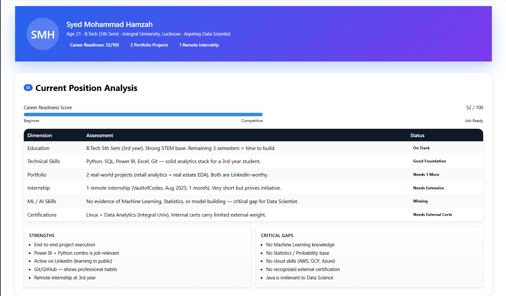
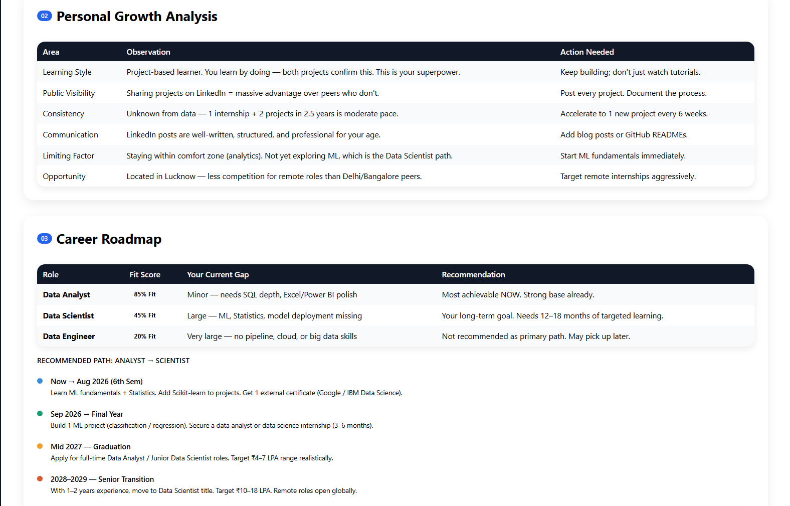
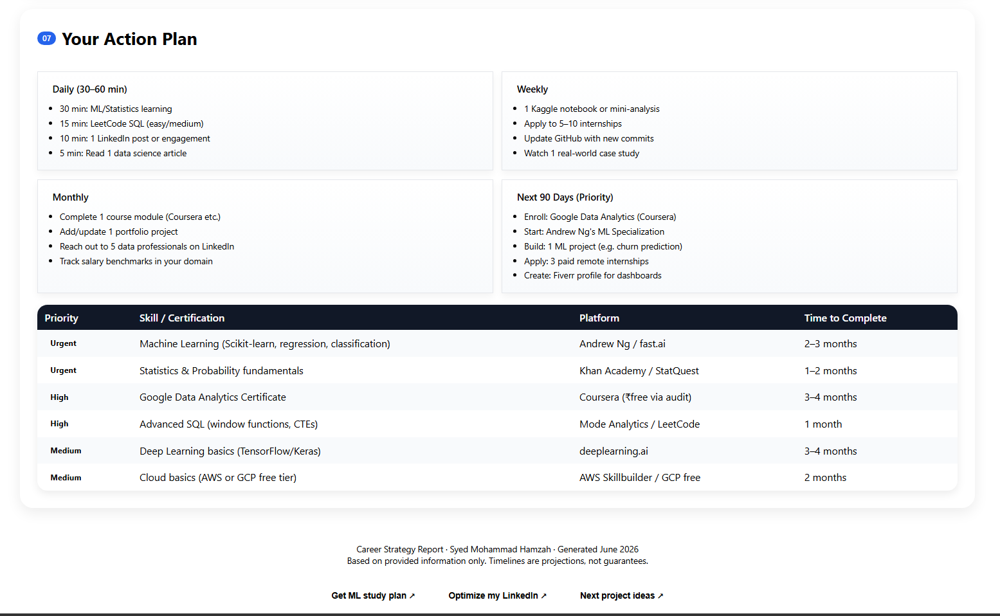

# 🚀 Day 15 – AI Career & Life Strategy Blueprint

## abtalks 60 Days Claude Challenge

### Replacing Predictions With Planning

---

# 📖 Overview

For Day 15 of the abtalks 60 Days Claude Challenge, I decided to take a different approach.

Instead of focusing on astrology-based future predictions, I used AI to analyze my current skills, career goals, learning habits, and future opportunities.

The objective was simple:

> Replace predictions with planning.

The result was a personalized Career & Life Strategy Blueprint designed to help me make better decisions and focus on actions within my control.

---

# 🎯 Challenge Objective

Use AI to:

* Analyze current skills
* Assess career readiness
* Identify growth opportunities
* Discover skill gaps
* Create a career roadmap
* Build a practical action plan

---

# 📸 Screenshots

## Current Position & Skills Analysis

  

---

## Career Roadmap & Future Opportunities

  

---

## Action Plan & Recommendations

  

---

# 🔍 Analysis Areas

### Current Position Analysis

* Education Assessment
* Skills Assessment
* Career Readiness
* Strengths & Weaknesses

### Career Strategy

* Data Analyst Path
* Data Scientist Path
* Internship Readiness
* Job Readiness

### Financial Growth Blueprint

* Income Opportunities
* Freelancing Potential
* Long-Term Career Growth

### Skill Gap Analysis

* Missing Skills
* High-Impact Learning Areas
* Future Requirements

---

# 📚 What I Learned

## 1. The Future Is Built, Not Predicted

Progress comes from consistent effort, not predictions.

---

## 2. Skill Gaps Are Opportunities

Every missing skill represents a clear learning objective.

---

## 3. Career Growth Requires Planning

Goals become achievable when broken into actionable steps.

---

## 4. AI Can Be A Strategic Advisor

AI can help identify strengths, weaknesses, and growth opportunities based on evidence rather than assumptions.

---

# 💡 Biggest Insight

> The best way to predict the future is to build it.

Instead of asking what might happen, I focused on understanding what actions I can take today to create better outcomes tomorrow.

---

# 🌟 Final Takeaway

This challenge reinforced the importance of taking ownership of personal growth.

Skills, projects, habits, and consistent learning will have a greater impact on my future than any prediction ever could.

---

# 📅 Challenge Progress

* ✅ Day 1 – Getting Started with Claude
* ✅ Day 2 – Prompt Engineering
* ✅ Day 3 – Context Engineering
* ✅ Day 4 – Chain-of-Thought Prompting
* ✅ Day 5 – The Power of Context
* ✅ Day 6 – ATS Resume Optimization
* ✅ Day 7 – Claude Usage Strategy
* ✅ Day 8 – Environmental Health Analyzer
* ✅ Day 9 – NutriScope
* ✅ Day 10 – Portfolio Website Builder
* ✅ Day 11 – ATS Resume Optimization & Gap Analysis
* ✅ Day 12 – Job Search & Personal Branding Toolkit
* ✅ Day 13 – AI-Powered Job Discovery & Market Analysis
* ✅ Day 14 – Job Red Flag Detector
* ✅ Day 15 – AI Career & Life Strategy Blueprint
* 🔜 Day 16 – Coming Soon

---

### 🚀 Learning in Public

Building AI Skills • Career Growth • Data Analytics • Continuous Improvement
