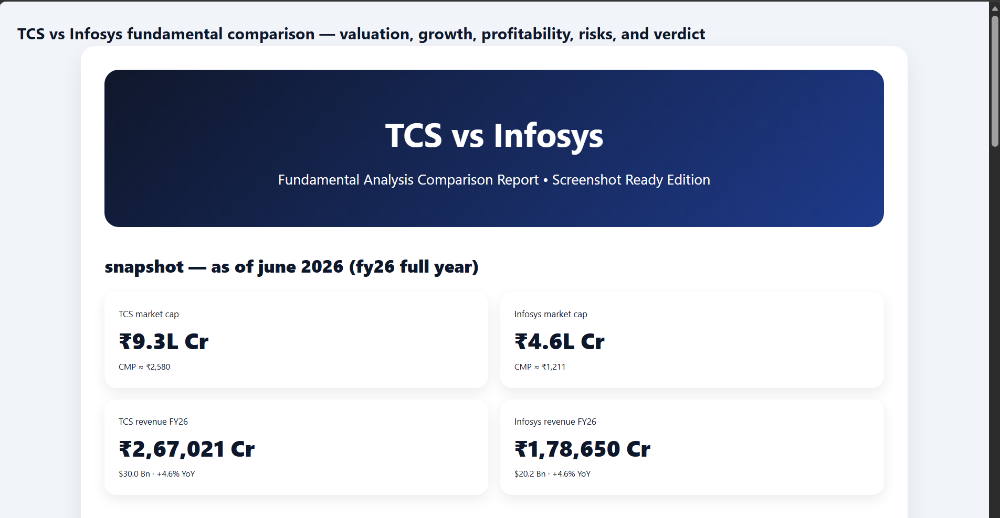
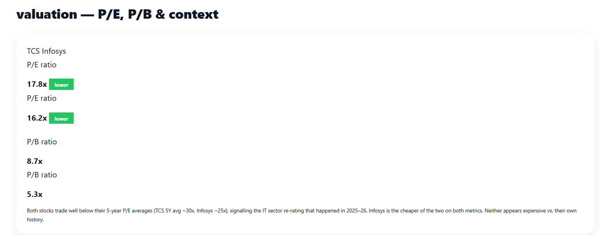
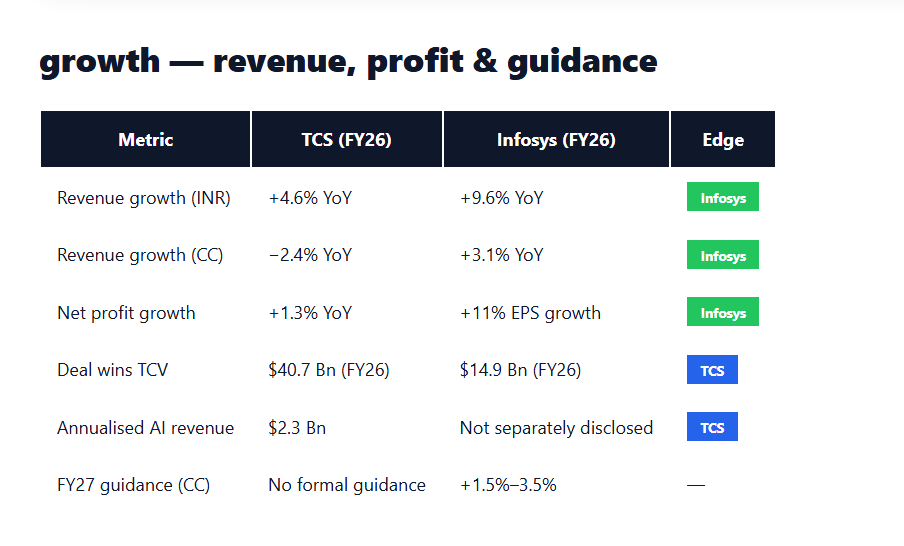
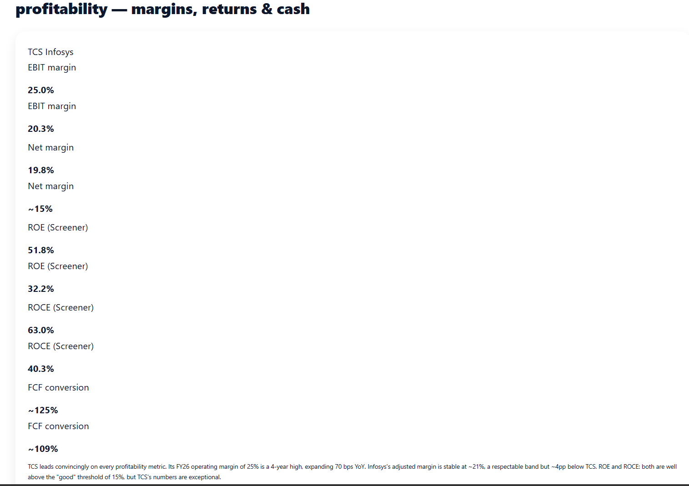
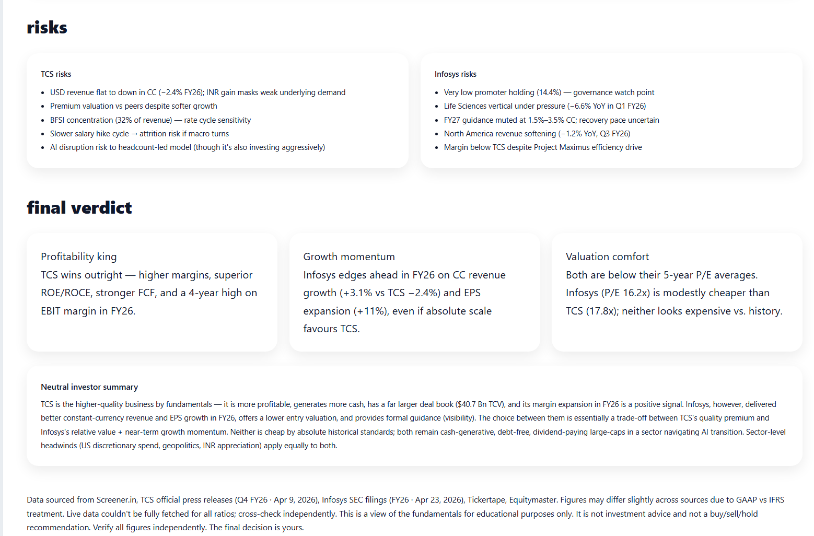

# 📈 TCS vs Infosys – Fundamental Comparison

## AI-Powered Stock Fundamental Research

### Valuation • Growth • Profitability • Risks

---

# 📖 Overview

This project compares two leading Indian IT companies, TCS and Infosys, using a structured fundamental analysis framework.

The comparison focuses on:

- Valuation
- Growth
- Profitability
- Risks
- Business Quality
- Cash Generation

The objective is not to identify a winner, but to understand the strengths, weaknesses, and trade-offs between both businesses.

---

# 📸 Report Screenshots

## Dashboard Overview

  

---

## Valuation & Growth Analysis

  

  

---

## Profitability & Risk Analysis

  

---

## Final Verdict

  

---

# 🔍 Key Findings

## TCS

### Strengths

- Industry-leading profitability
- Strong free cash flow generation
- Superior ROE and ROCE
- Large deal pipeline
- Strong operational efficiency

### Watch Points

- Slower recent growth
- Higher valuation relative to peers
- Dependence on BFSI segment

---

## Infosys

### Strengths

- Better recent revenue growth
- Strong EPS growth
- Lower valuation
- Improved operational momentum

### Watch Points

- Lower margins than TCS
- Muted forward guidance
- Slower performance in some business segments

---

# 📊 Comparison Summary

| Category         | TCS       | Infosys |
| ---------------- | --------- | ------- |
| Valuation        | Good      | Better  |
| Growth           | Moderate  | Strong  |
| Profitability    | Excellent | Strong  |
| ROE / ROCE       | Excellent | Strong  |
| Cash Flow        | Excellent | Strong  |
| Business Quality | Excellent | Strong  |

---

# 💡 Biggest Insight

> Great investing starts with understanding businesses, not stock prices.

The comparison highlighted how two companies operating in the same industry can excel in different areas.

TCS demonstrates exceptional business quality and profitability, while Infosys shows stronger recent growth and lower valuation.

---

# 📚 What I Learned

### 1. Growth and Quality Are Different

A company can grow faster while another generates better returns on capital.

### 2. Profitability Matters

Margins, ROE, and ROCE reveal business strength that revenue growth alone cannot.

### 3. Risks Matter

Every company has risks, regardless of size or reputation.

### 4. Context Matters

No single metric tells the whole story.

---

# ⚠ Disclaimer

This report is for educational purposes only.

It is not investment advice and does not contain any buy, sell, or hold recommendation.

Always verify financial information independently before making decisions.

---

### 🚀 Learning in Public

Financial Analysis • Business Research • AI-Powered Insights • Continuous Learning
