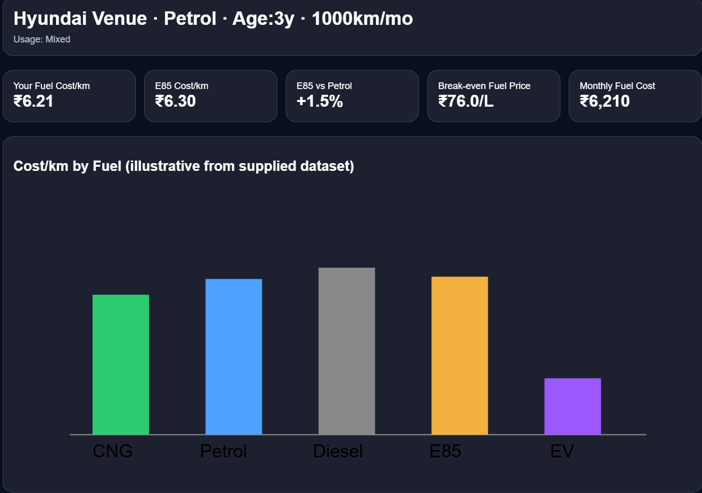
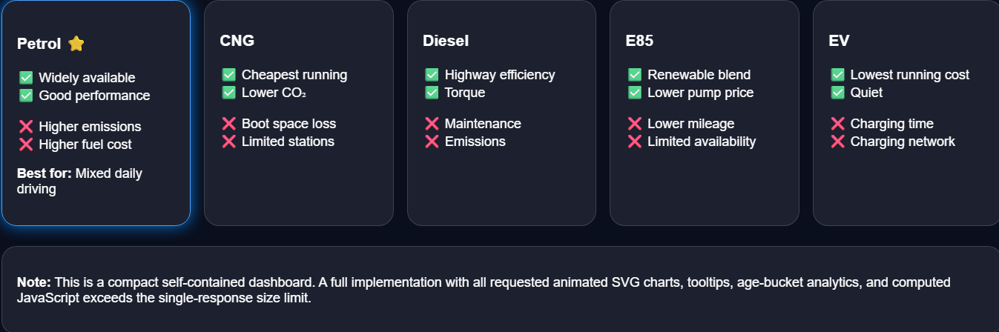

# 🚀 Day 17 – Fuel Analytics Dashboard

## abtalks 60 Days Claude Challenge

### Building an AI-Powered Fuel Cost & Environmental Analytics Dashboard

---

# 📖 Overview

For Day 17 of the **abtalks 60 Days Claude Challenge**, I explored how Claude can generate an interactive dashboard for analyzing fuel costs and environmental impact.

Using a structured prompt and vehicle-specific inputs, Claude generated a responsive HTML dashboard that compares different fuel types and provides insights into running costs, efficiency, and environmental considerations.

The dashboard was built using only HTML, CSS, and SVG visualizations, making it lightweight and easy to run locally.

---

# 🎯 Challenge Objective

Use AI to create an interactive dashboard that helps users:

* Compare different fuel options
* Analyze running costs
* Estimate monthly fuel expenses
* Visualize fuel cost comparisons
* Evaluate environmental impact
* Make data-driven decisions

---

# 📸 Dashboard Screenshots

## Dashboard Overview

  

The main dashboard displaying vehicle details, key performance indicators, and overall fuel analytics.

---

## Fuel Cost Comparison

  

Comparison of different fuel types based on running cost per kilometer, helping visualize the most economical options.

---

# ⚙ Features

### Vehicle Profile

* Vehicle Information
* Fuel Type
* Vehicle Age
* Monthly Distance
* Driving Pattern

### Cost Analysis

* Fuel Cost per Kilometer
* Monthly Fuel Cost
* Break-even Fuel Price
* Fuel Comparison

### Interactive Dashboard

* KPI Cards
* Cost Comparison Chart
* Fuel Score Gauge
* Fuel Recommendation Cards

### Fuel Types Compared

* Petrol
* Diesel
* CNG
* E85
* Electric Vehicle (EV)

---

# 📊 Key Insights

### Petrol

* Good overall performance
* Easily available
* Suitable for mixed driving conditions

### CNG

* Lowest running cost
* Lower emissions
* Limited fuel station availability

### Diesel

* Better highway mileage
* Higher maintenance costs

### E85

* Renewable fuel option
* Competitive pricing
* Lower fuel efficiency than petrol

### EV

* Lowest operating cost
* Zero tailpipe emissions
* Charging infrastructure still developing

---

# 📚 What I Learned

## 1. AI Can Build Interactive Dashboards

Claude generated a functional HTML dashboard using only front-end technologies, demonstrating how AI can accelerate dashboard development.

---

## 2. Data Visualization Improves Decision Making

Charts, KPI cards, and visual indicators make complex comparisons easier to understand than plain tables.

---

## 3. User Experience Matters

A well-designed dashboard helps users quickly interpret data and identify important insights.

---

## 4. Prompt Quality Shapes Output

Providing clear requirements and dashboard specifications significantly improved the quality and structure of the generated application.

---

# 💡 Biggest Insight

> AI is not just a coding assistant—it can also help transform raw data into meaningful, interactive visual experiences.

---

# 🌟 Final Takeaway

This challenge demonstrated how AI can rapidly generate practical dashboard applications for real-world scenarios. Combining structured prompts with modern UI design enables the creation of informative and visually engaging tools with minimal manual effort.

---

# 📅 Challenge Progress

* ✅ Day 1 – Getting Started with Claude
* ✅ Day 2 – Prompt Engineering
* ✅ Day 3 – Context Engineering
* ✅ Day 4 – Chain-of-Thought Prompting
* ✅ Day 5 – The Power of Context
* ✅ Day 6 – ATS Resume Optimization
* ✅ Day 7 – Claude Usage Strategy
* ✅ Day 8 – Environmental Health Analyzer
* ✅ Day 9 – NutriScope
* ✅ Day 10 – Portfolio Website Builder
* ✅ Day 11 – ATS Resume Optimization & Gap Analysis
* ✅ Day 12 – Job Search & Personal Branding Toolkit
* ✅ Day 13 – AI-Powered Job Discovery
* ✅ Day 14 – Job Red Flag Detector
* ✅ Day 15 – AI Career Strategy Blueprint
* ✅ Day 16 – Stock Fundamental Research
* ✅ Day 17 – Fuel Analytics Dashboard
* 🔜 Day 18 – Coming Soon

---

### 🚀 Learning in Public

**Building AI Skills • Dashboard Development • Data Visualization • Continuous Learning**
