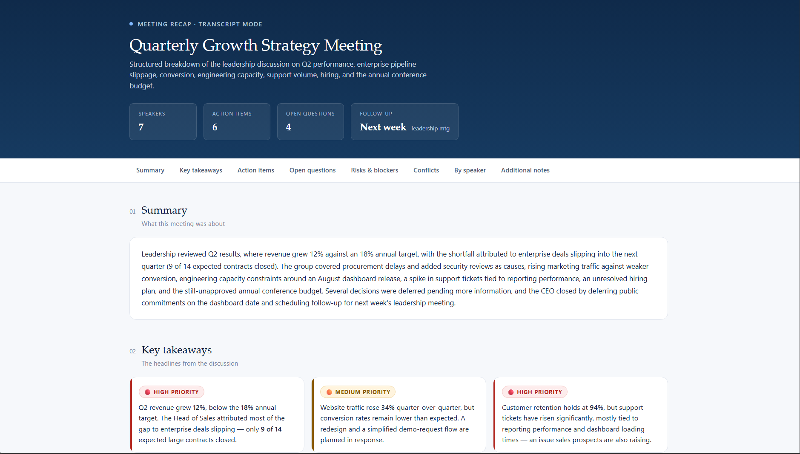
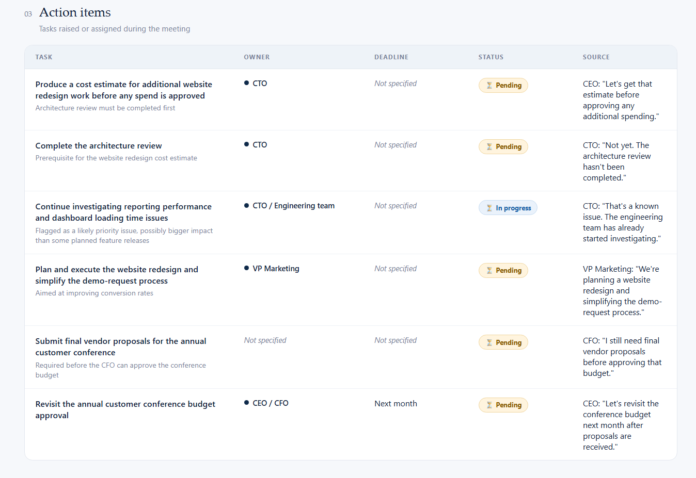
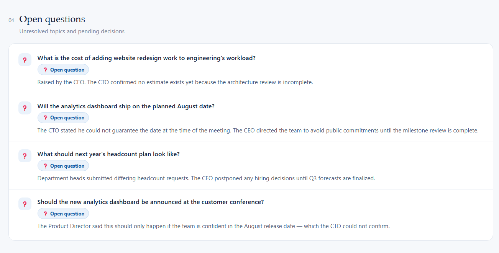
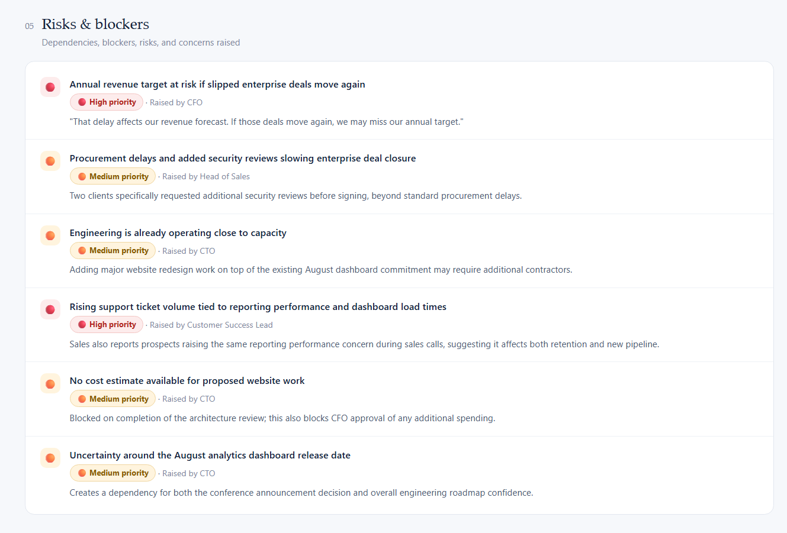
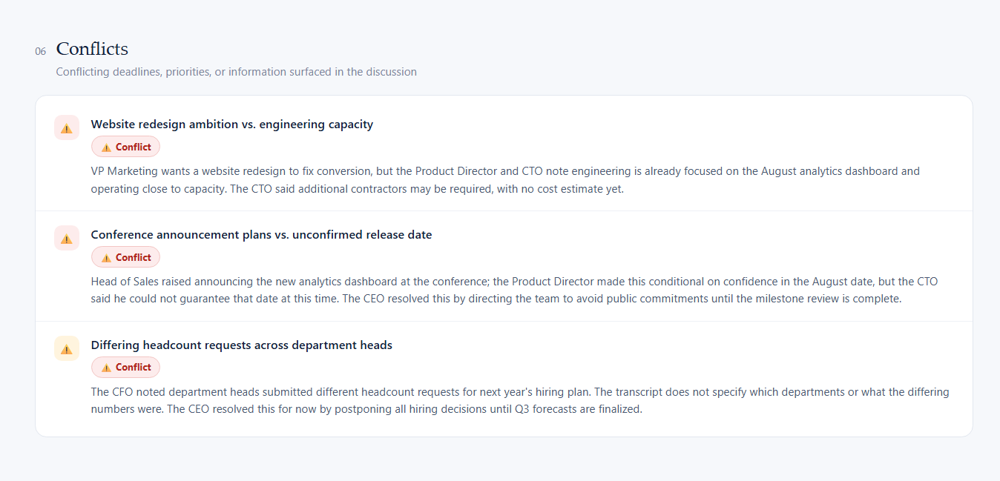
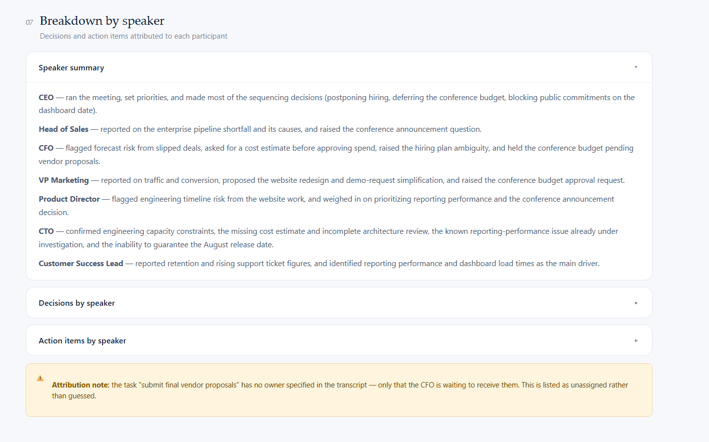

# 🚀 Day 18 – AI Meeting Intelligence Dashboard

## abtalks 60 Days Claude Challenge

### Transforming Meeting Transcripts into Actionable Business Insights

---

# 📖 Overview

For **Day 18** of the **abtalks 60 Days Claude Challenge**, I built an **AI Meeting Intelligence Dashboard** using Claude.

The application transforms lengthy meeting transcripts into a structured and easy-to-understand dashboard, helping teams quickly identify summaries, action items, risks, blockers, unresolved questions, and speaker-wise decisions.

Instead of manually reviewing pages of meeting notes, users receive an organized executive-level overview that improves decision-making and follow-up planning.

> **Meetings create information. AI turns that information into actionable insights.**

---

# 🎯 Challenge Objective

Build an AI-powered meeting analysis application that can:

- Generate concise meeting summaries
- Extract key discussion points
- Identify action items and ownership
- Detect risks, blockers, and conflicts
- Highlight unresolved questions
- Organize insights by speaker
- Create a professional executive dashboard

---

# 🌐 Live Demo

## 🚀 Try the Application

**🔗 Netlify**

`PASTE_NETLIFY_LINK_HERE`

---

# 💻 GitHub Repository

**🔗 Repository**

`PASTE_GITHUB_REPOSITORY_LINK_HERE`

---

# 📄 Project Files

### 📥 HTML Application

**🔗 [AI Meeting Intelligence Dashboard](./index.html)**

---

# 📸 Screenshots

## Dashboard Overview

---

## Action Items

---

## Open Questions

---

## Risks & Blockers

---

## Conflict Analysis

---

## Speaker Breakdown

---

# ✨ Features

- 📝 AI-Generated Meeting Summary
- 📌 Key Takeaways Extraction
- ✅ Action Item Tracking
- 👥 Speaker-wise Discussion Breakdown
- ❓ Open Questions Identification
- ⚠️ Risks & Blockers Detection
- 🔄 Conflict Analysis
- 📊 Executive Dashboard
- 📱 Fully Responsive Layout
- 🎨 Clean Professional Interface

---

# 📊 Dashboard Sections

### Executive Summary

A concise overview highlighting the most important outcomes from the meeting.

### Key Takeaways

Extracts the major discussion points and business insights.

### Action Items

Automatically identifies tasks, owners, deadlines, and current status.

### Open Questions

Lists unresolved topics that require future discussion or clarification.

### Risks & Blockers

Highlights operational risks, dependencies, and potential challenges.

### Conflict Analysis

Detects conflicting priorities, decisions, or viewpoints discussed during the meeting.

### Speaker Breakdown

Summarizes each participant's contributions, decisions, and responsibilities.

---

# 📚 What I Learned

## 1. Meetings Generate Valuable Data

Business meetings contain important decisions, but extracting meaningful insights manually can be time-consuming.

---

## 2. AI Can Improve Productivity

Automatically summarizing discussions and organizing action items helps teams focus on execution instead of documentation.

---

## 3. Structure Improves Decision-Making

Presenting information in categorized sections such as risks, action items, and conflicts makes complex discussions easier to understand.

---

## 4. User Experience Matters

A clean dashboard with intuitive navigation makes large amounts of information much more accessible than traditional meeting transcripts.

---

# 💡 Biggest Insight

> **The value of a meeting isn't in the conversation itself—it's in the actions that follow. AI helps bridge that gap by transforming discussions into clear, actionable outcomes.**

---

# 🌟 Final Takeaway

This project demonstrated how AI can simplify business communication by converting lengthy meeting transcripts into structured, actionable dashboards.

By combining intelligent information extraction with an intuitive user interface, the application helps teams save time, improve collaboration, and make better decisions.

---

# 📅 Challenge Progress

- ✅ Day 1 – Getting Started with Claude
- ✅ Day 2 – Prompt Engineering
- ✅ Day 3 – Context Engineering
- ✅ Day 4 – Chain-of-Thought Prompting
- ✅ Day 5 – The Power of Context
- ✅ Day 6 – ATS Resume Optimization
- ✅ Day 7 – Claude Usage Strategy
- ✅ Day 8 – Environmental Health Analyzer
- ✅ Day 9 – NutriScope
- ✅ Day 10 – Portfolio Website Builder
- ✅ Day 11 – ATS Resume Optimization & Gap Analysis
- ✅ Day 12 – Job Search & Personal Branding Toolkit
- ✅ Day 13 – AI-Powered Job Discovery & Market Analysis
- ✅ Day 14 – Job Red Flag Detector
- ✅ Day 15 – AI Career & Life Strategy Blueprint
- ✅ Day 16 – Stock Fundamental Research
- ✅ Day 17 – Fuel Analytics Dashboard
- ✅ Day 18 – AI Meeting Intelligence Dashboard
- ⏳ Days 19–21 – Uploading Soon
- ✅ Day 22 – AI Startup Validation Report
- ✅ Day 23 – Customer & MVP Blueprint
- ✅ Day 24 – Business Strategy & Investment Review
- ✅ Day 25 – AI Shark Tank Simulator
- ✅ Day 26 – Prior Authorization Workflow Simulator
- ✅ Day 27 – The Path to Approval
- 🔜 Day 28 – Coming Soon

---

### 🚀 Learning in Public

**Building AI Skills • Meeting Intelligence • Business Productivity • Information Extraction • Web Development • Continuous Improvement**
