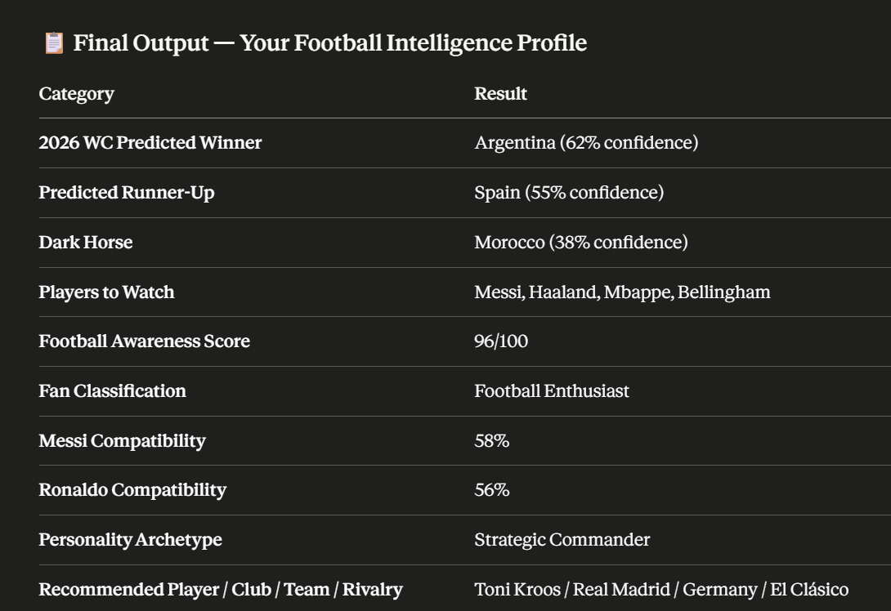

# ⚽ Day 19 – Football Intelligence Hub

## abtalks 60 Days Claude Challenge

### Exploring Football Knowledge, Predictions & Personality with AI

---

# 📖 Overview

For **Day 19** of the **abtalks 60 Days Claude Challenge**, I built an interactive **Football Intelligence Hub** using Claude.

The application combines sports analytics, football knowledge assessment, and personality analysis into one engaging AI experience. It predicts the **FIFA World Cup 2026**, evaluates football knowledge through an adaptive quiz, and matches users with legendary football personalities based on their traits and decision-making style.

Instead of simply answering football questions, the AI creates a personalized **Football Intelligence Profile** backed by structured reasoning and interactive assessments.

> **Football isn't just about watching matches—it's about understanding the game.**

---

# 🎯 Challenge Objective

Build an AI-powered football intelligence experience that can:

- Assess the user's football knowledge level
- Predict the FIFA World Cup 2026 outcome
- Generate confidence-based tournament analysis
- Conduct an adaptive Football IQ Quiz
- Calculate a Football Awareness Score
- Compare personality traits with Messi and Ronaldo
- Generate a personalized Football Intelligence Profile

# 📸 Screenshots

## World Cup Prediction Report

---

# ✨ Features

- ⚽ FIFA World Cup 2026 Prediction
- 📊 Confidence-Based Tournament Analysis
- 🧠 Adaptive Football IQ Quiz
- 📈 Football Awareness Score
- 🏅 Fan Classification System
- 🐐 Messi vs Ronaldo Personality Match
- 🎭 Football Personality Archetype
- 🌍 Recommended Player, Club & National Team
- 📋 Personalized Football Intelligence Profile
- 📱 Responsive Modern Interface

---

# 🏆 Experience Breakdown

### Stage 1 — FIFA World Cup 2026 Prediction

Analyzes historical performance, current trends, squad strength, and player quality to predict:

- World Cup Winner
- Runner-Up
- Dark Horse Nation
- Players to Watch

Each prediction includes supporting reasoning and confidence scores.

---

### Stage 2 — Football IQ Quiz

An adaptive quiz evaluates football knowledge using beginner, intermediate, and advanced questions before generating:

- Football Awareness Score
- Fan Classification
- Knowledge Strengths
- Areas for Improvement

---

### Stage 3 — Messi vs Ronaldo Personality Match

Instead of asking direct preference questions, the AI analyzes personality traits such as:

- Leadership
- Creativity
- Discipline
- Competitiveness
- Teamwork
- Decision Making

It then generates:

- Messi Compatibility
- Ronaldo Compatibility
- Football Personality Archetype
- Recommended Player
- Recommended Club
- Recommended National Team
- Recommended Rivalry

---

# 📚 What I Learned

## 1. AI Can Personalize Learning

Instead of delivering generic football information, AI adapts explanations and questions based on the user's knowledge level.

---

## 2. Sports Analytics Goes Beyond Statistics

Historical data, player quality, tactical trends, and tournament context can all contribute to meaningful predictions.

---

## 3. Personality Can Enhance Engagement

Matching users with football legends based on behavioral traits makes the experience more interactive and memorable.

---

## 4. Interactive Applications Improve User Experience

Combining quizzes, predictions, and personalized insights transforms a simple application into an engaging learning platform.

---

# 💡 Biggest Insight

> **The best sports experiences aren't just about predicting results—they're about helping fans understand the game, discover their strengths, and connect with football on a deeper level.**

---

# 🌟 Final Takeaway

This project demonstrated how AI can combine sports analytics, education, and personality assessment into a single interactive experience. By blending predictions, quizzes, and personalized recommendations, the Football Intelligence Hub creates an engaging way for fans to learn more about football while exploring their own football identity.

---

# 📅 Challenge Progress

- ✅ Day 1 – Getting Started with Claude
- ✅ Day 2 – Prompt Engineering
- ✅ Day 3 – Context Engineering
- ✅ Day 4 – Chain-of-Thought Prompting
- ✅ Day 5 – The Power of Context
- ✅ Day 6 – ATS Resume Optimization
- ✅ Day 7 – Claude Usage Strategy
- ✅ Day 8 – Environmental Health Analyzer
- ✅ Day 9 – NutriScope
- ✅ Day 10 – Portfolio Website Builder
- ✅ Day 11 – ATS Resume Optimization & Gap Analysis
- ✅ Day 12 – Job Search & Personal Branding Toolkit
- ✅ Day 13 – AI-Powered Job Discovery & Market Analysis
- ✅ Day 14 – Job Red Flag Detector
- ✅ Day 15 – AI Career & Life Strategy Blueprint
- ✅ Day 16 – Stock Fundamental Research
- ✅ Day 17 – Fuel Analytics Dashboard
- ✅ Day 18 – AI Meeting Intelligence Dashboard
- ✅ Day 19 – Football Intelligence Hub
- ⏳ Days 20–21 – Uploading Soon
- ✅ Day 22 – AI Startup Validation Report
- ✅ Day 23 – Customer & MVP Blueprint
- ✅ Day 24 – Business Strategy & Investment Review
- ✅ Day 25 – AI Shark Tank Simulator
- ✅ Day 26 – Prior Authorization Workflow Simulator
- ✅ Day 27 – The Path to Approval
- 🔜 Day 28 – Coming Soon

---

### 🚀 Learning in Public

**Building AI Skills • Sports Analytics • Football Intelligence • Personality Assessment • Interactive Web Applications • Continuous Improvement**
