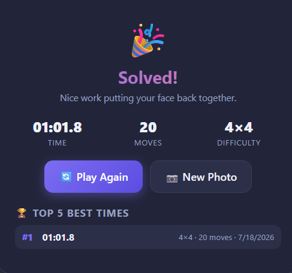
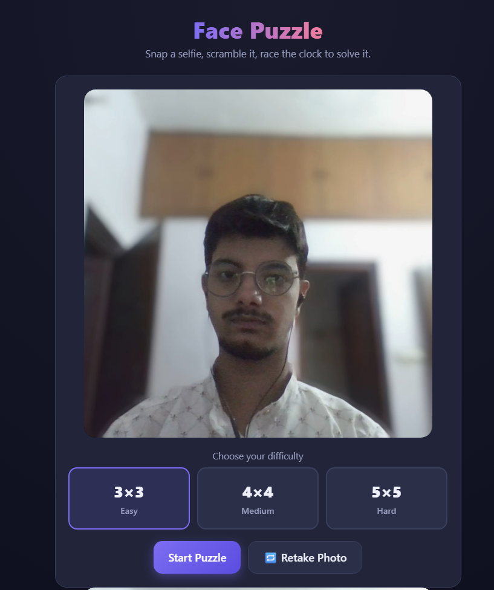
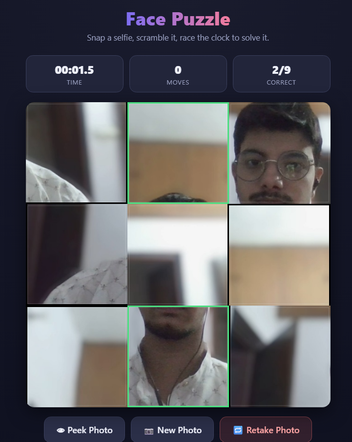

# Day 20 – Face Puzzle Game

## Overview

For **Day 20** of the **ABTalks 60 Days Claude Challenge**, I built an interactive **Face Puzzle Game** using HTML, CSS, and JavaScript.

The application captures a photo using the user's webcam, converts it into a playable puzzle, and challenges users to solve it as quickly as possible while tracking their performance.

---

## Note

This project was originally assigned as **Day 20** of the **ABTalks 60 Days Claude Challenge**.

Between **18 June and 21 June**, I was away on a personal trip. Before leaving, I had already completed **Day 17**, **Day 18**, and **Day 19**, but **Day 20** and **Day 21** remained unfinished.

After returning, I continued progressing through the challenge to stay aligned with the current day's tasks. Instead of publishing LinkedIn posts for these older projects weeks later—which would not accurately reflect my challenge timeline—I chose to complete and document them here in my GitHub repository.

This repository serves as a complete record of every project I built during the challenge, including those completed after my trip.

---

## Challenge Objective

Build a complete browser-based face puzzle game that:

- Captures a selfie using the webcam
- Generates a solvable puzzle
- Supports multiple difficulty levels
- Tracks time, moves, and puzzle progress
- Stores best scores locally
- Works smoothly across desktop and mobile devices

---

## Features

- 📷 Webcam photo capture
- 🧩 Puzzle generation (3×3, 4×4, 5×5)
- 🖱️ Drag-and-drop controls
- 📱 Touch gesture support for mobile devices
- ⏱️ Live timer
- 🔢 Move counter
- ✅ Correct tile indicator
- 🏆 Local leaderboard (Top 5 Best Times)
- 💾 Local Storage support
- 🔄 Retake Photo
- 🎮 Play Again
- 📸 New Photo
- 🌙 Responsive modern UI

---

## How It Works

1. Grant camera permission.
2. Capture a selfie.
3. Select your preferred difficulty.
4. The image is automatically divided into puzzle pieces.
5. The puzzle is scrambled into a solvable configuration.
6. Drag or touch tiles to swap their positions.
7. Complete the puzzle as quickly as possible.
8. Your best scores are automatically saved locally.

---

## What I Learned

Building this project helped me gain practical experience with:

- HTML5 Canvas API
- Browser Camera API (`getUserMedia`)
- Image slicing and rendering
- Drag-and-drop interactions
- Touch event handling
- Game state management
- Timer implementation
- Local Storage
- Responsive UI development

The most challenging part was ensuring the puzzle remained solvable while delivering a smooth user experience across both desktop and mobile devices.

---

## Screenshots

### Camera Capture & Difficulty Selection

---

### Puzzle Gameplay

---

### Results Screen & Leaderboard

---

## Technologies Used

- HTML5
- CSS3
- Vanilla JavaScript
- Canvas API
- MediaDevices API (`getUserMedia`)
- Local Storage

---

## Key Takeaways

- Modern browser APIs enable rich interactive applications without external frameworks.
- Camera-based web applications require careful permission handling and responsive UI design.
- Managing puzzle state, timers, and user interactions strengthened my JavaScript fundamentals.
- Small UX enhancements like move counters, leaderboards, and multiple difficulty levels significantly improve user engagement.

---

## Challenge Progress

**Day 20 / 60 ✅**

Learning by building real-world projects, one day at a time.

---

**Built during the ABTalks 60 Days Claude Challenge**
