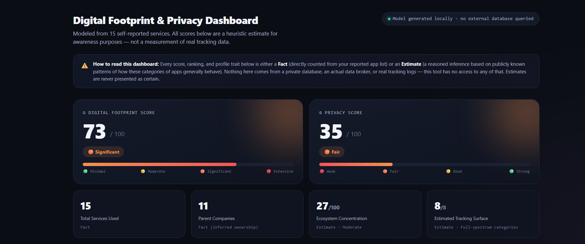
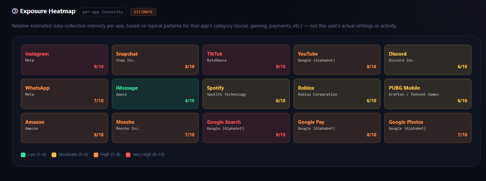
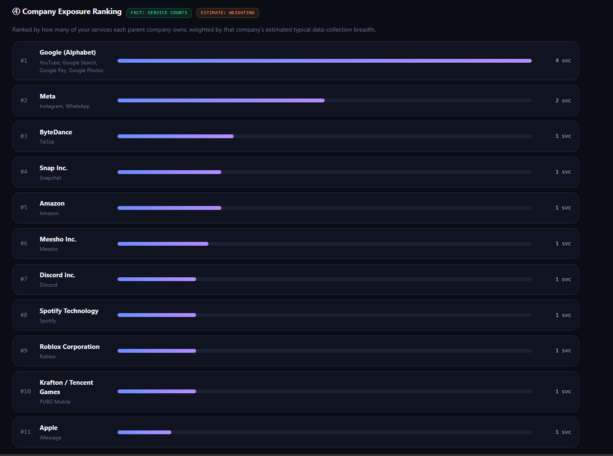
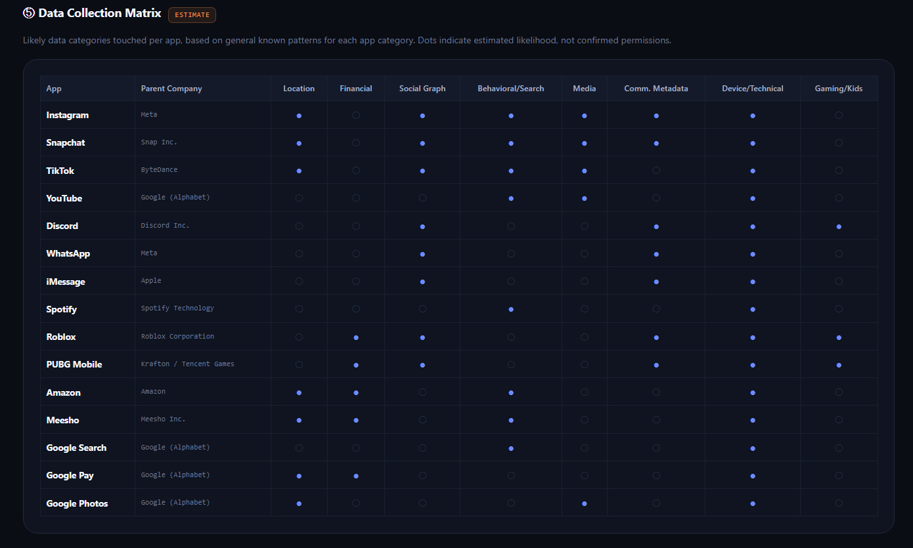
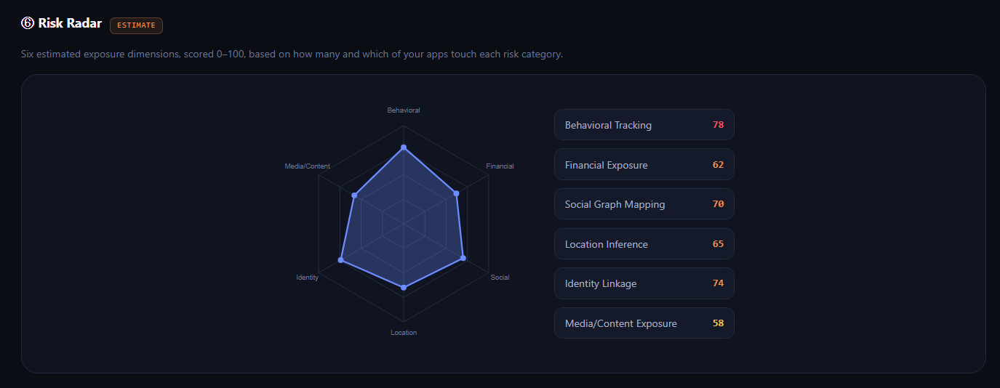
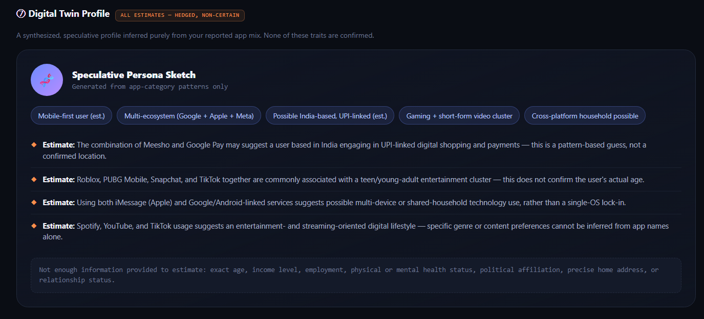
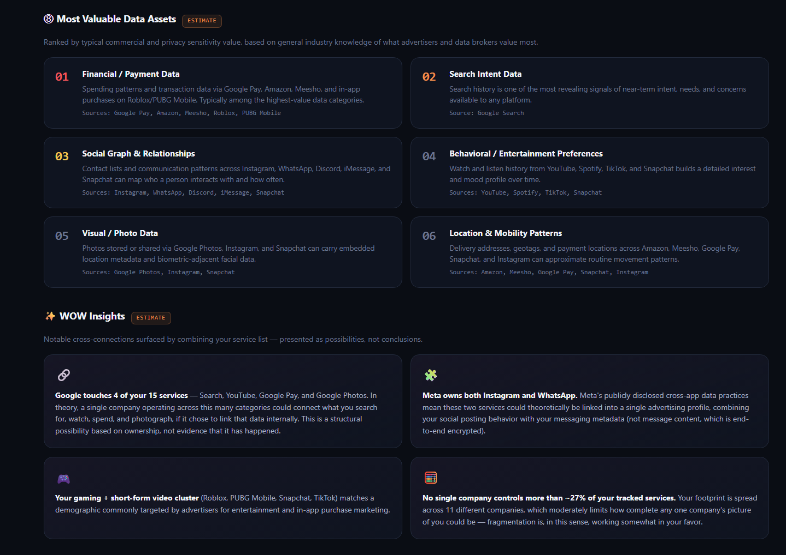
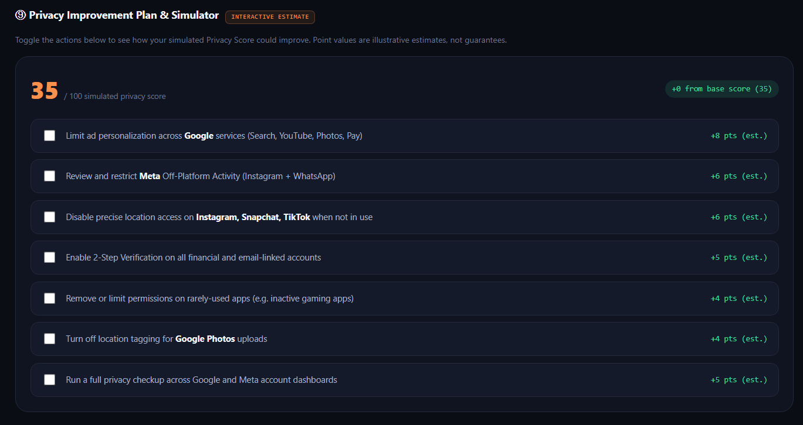
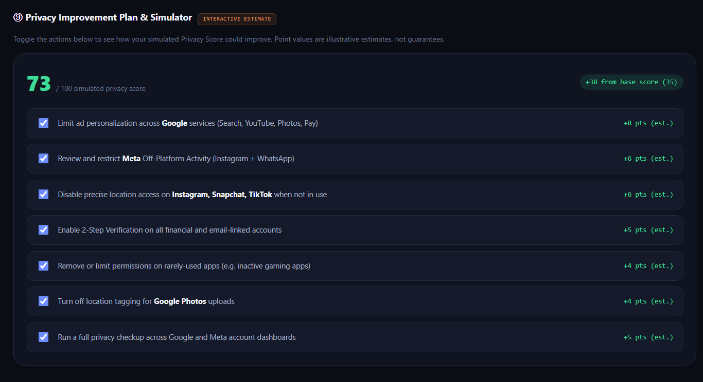
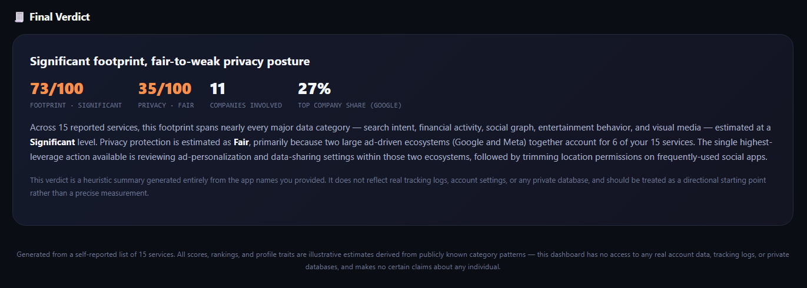

# Day 21 – Digital Footprint & Privacy Dashboard

## Overview

For **Day 21** of the **ABTalks 60 Days Claude Challenge**, I built a **Digital Footprint & Privacy Dashboard** that transforms a user's reported app usage into an interactive cybersecurity-style dashboard.

The application demonstrates how publicly known information about popular applications can be combined with heuristic models to estimate a person's digital exposure while clearly separating **Facts** from **Estimates**.

> **Important:** This dashboard does **not** access private databases, tracking logs, or personal account information. Every inference is clearly marked as an estimate for educational and awareness purposes.

---

## Note

This project was originally assigned as **Day 21** of the **ABTalks 60 Days Claude Challenge**.

Between **18 June and 21 June**, I was away on a personal trip. Before leaving, I had already completed **Day 17**, **Day 18**, and **Day 19**, but **Day 20** and **Day 21** remained unfinished.

After returning, I continued progressing through the challenge to stay aligned with the current day's tasks. Instead of publishing LinkedIn posts for these older projects weeks later—which would not accurately reflect my challenge timeline—I chose to complete and document them here in my GitHub repository.

This repository serves as a complete record of every project I built during the challenge, including those completed after my trip.

---

## Challenge Objective

Build a premium privacy dashboard that:

- Separates Facts from Estimates
- Estimates digital exposure from reported applications
- Visualizes privacy risks
- Identifies ecosystem concentration
- Explains why certain services collect different categories of information
- Suggests actionable privacy improvements

---

## Features

- 🔐 Digital Footprint Score
- 🛡️ Privacy Score
- 🔥 Exposure Heatmap
- 🏢 Company Exposure Ranking
- 📊 Data Collection Matrix
- 📡 Risk Radar
- 👤 Digital Twin Profile (Estimated)
- 💎 Most Valuable Data Assets
- ✨ WOW Insights
- 📈 Privacy Improvement Simulator
- 📄 Final Privacy Verdict
- ⚠️ Clear separation between Facts and Estimates
- 🎨 Premium cybersecurity dashboard UI

---

## Dashboard Sections

### 1. Dashboard Overview

Displays:

- Digital Footprint Score
- Privacy Score
- Total Services
- Parent Companies
- Ecosystem Concentration
- Estimated Tracking Surface

---

### 2. Exposure Heatmap

Visualizes the estimated data collection intensity for every application based on publicly known patterns.

---

### 3. Company Exposure Ranking

Ranks parent companies based on the number of services used and estimated ecosystem influence.

---

### 4. Data Collection Matrix

Maps which categories of information each application may typically access.

Examples include:

- Location
- Financial
- Media
- Social Graph
- Device Information
- Behavioral Data

---

### 5. Risk Radar

Displays estimated exposure across multiple privacy dimensions including:

- Behavioral Tracking
- Identity Linkage
- Financial Exposure
- Location
- Social Graph
- Media Consumption

---

### 6. Digital Twin Profile

Generates a speculative profile using only publicly known patterns.

Every statement is clearly labeled as an **Estimate** and avoids making any certain claims.

---

### 7. Most Valuable Data Assets & WOW Insights

Highlights which categories of personal information generally hold the greatest value and surfaces interesting cross-platform insights.

---

### 8. Privacy Improvement Simulator

Interactive checklist showing how recommended privacy actions could improve the simulated privacy score.

**Before**

**After**

---

### 9. Final Verdict

Summarizes the overall digital footprint while clearly explaining that all estimates are heuristic rather than factual.

---

## What I Learned

Working on this project helped me understand:

- Digital privacy fundamentals
- Data visualization techniques
- Privacy-first dashboard design
- How to communicate uncertainty responsibly
- Separating factual information from inferred estimates
- Risk scoring methodologies
- UX design for cybersecurity products
- Building premium dashboards using only HTML, CSS, and JavaScript

One of the biggest lessons from this project was that **good privacy tools should educate users without creating unnecessary fear or making unsupported claims.**

---

## Technologies Used

- HTML5
- CSS3
- Vanilla JavaScript
- SVG Charts
- Responsive Design
- Interactive UI Components

---

## Disclaimer

This application is built **for educational purposes only**.

It does **not**:

- Access private databases
- Track user activity
- Read account information
- Inspect browsing history
- Analyze real device permissions

All behavioral traits, scores, rankings, and insights marked as **Estimates** are heuristic interpretations derived only from the reported list of applications and publicly available knowledge.

---

## Challenge Progress

**Day 21 / 60 ✅**

Building practical AI-powered projects and learning through real-world experimentation.

---

**Built during the ABTalks 60 Days Claude Challenge**
