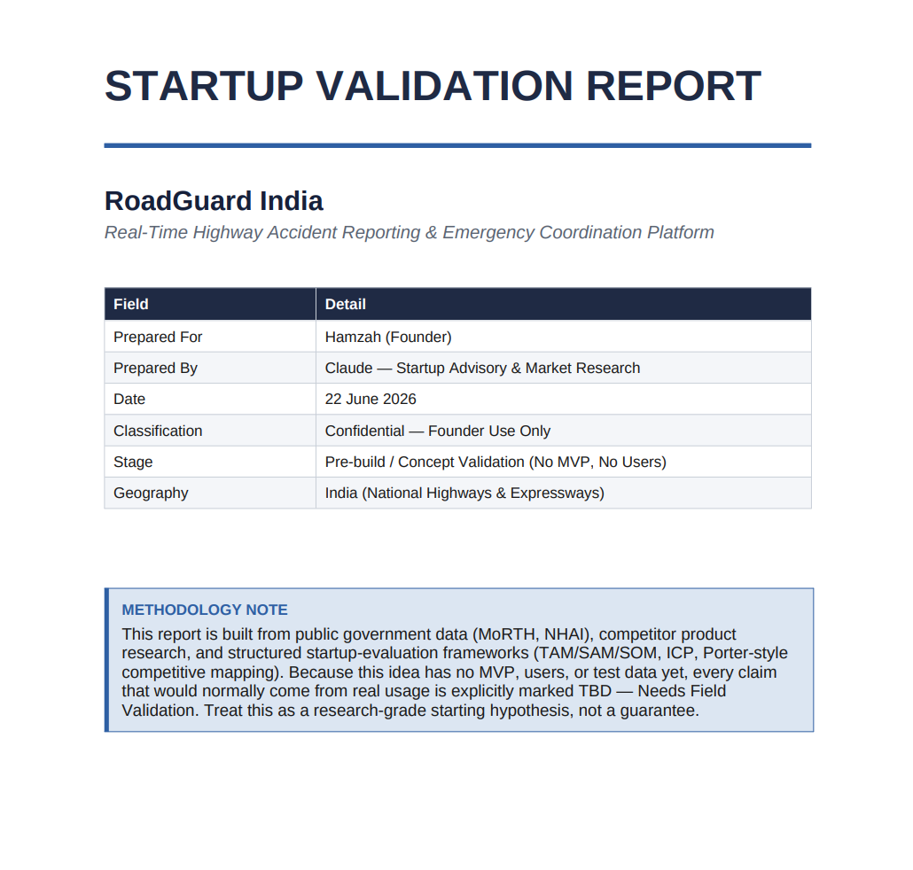
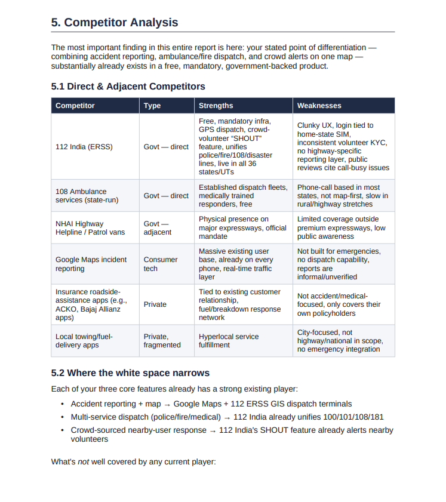
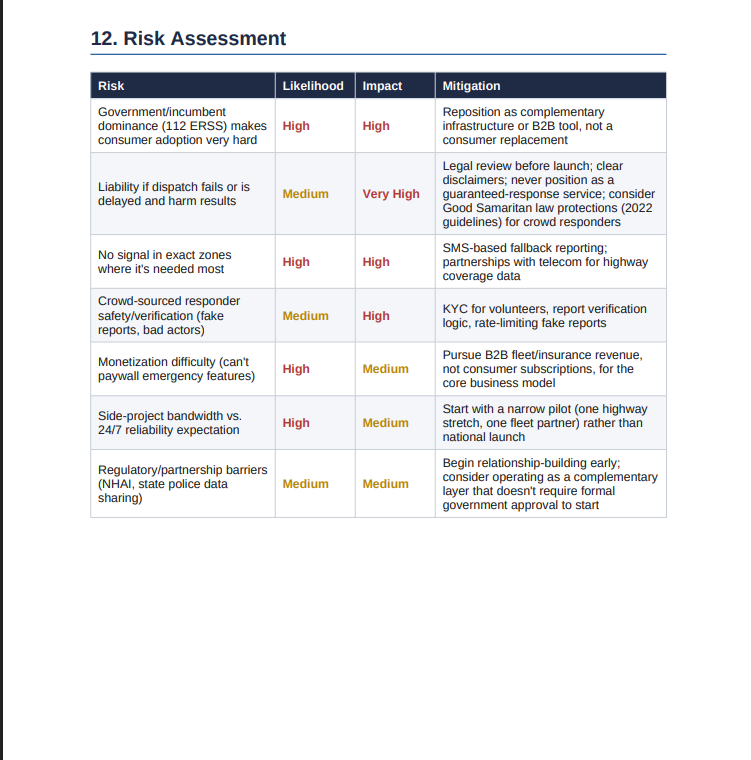

# 🚀 Day 22 – AI Startup Validation Report

## abtalks 60 Days Claude Challenge

### Validating a Startup Idea Before Building It

---

# 📖 Overview

For **Day 22** of the **abtalks 60 Days Claude Challenge**, I explored how AI can help entrepreneurs validate startup ideas before investing months of effort into building them.

Using Claude, I generated a detailed Startup Validation Report for my startup idea **RoadGuard India**—an AI-powered highway safety and emergency coordination platform.

Instead of simply approving the idea, Claude analyzed the market, competitors, customer needs, risks, and business opportunities while providing practical recommendations for improvement.

The objective was simple:

> Validate before you build.

---

# 🎯 Challenge Objective

Use AI to:

* Analyze Founder–Market Fit
* Validate the Startup Problem
* Calculate TAM, SAM & SOM
* Analyze Competitors
* Identify Market Gaps
* Define Customer Persona & ICP
* Assess Business Risks
* Generate a Go / No-Go Recommendation
* Build a 30-Day Validation Roadmap

---

# 📄 Startup Validation Report

## Complete PDF Report

📥 **Download the Complete Startup Validation Report**

➡️ [RoadGuard India Validation Report (PDF)](./RoadGuard_India_Validation_Report.pdf)

****

# 📸 Screenshots

## Startup Validation Dashboard

  

---

## Market & Competitor Analysis

  

---

## Risk Assessment & Final Recommendation

  

---

# 🔍 Analysis Areas

### Startup Validation

* Founder–Market Fit
* Problem Validation
* Business Opportunity
* Product-Market Fit

### Market Analysis

* TAM, SAM & SOM
* Competitor Analysis
* Market Gap Analysis
* Industry Insights

### Customer Research

* Customer Persona
* Ideal Customer Profile (ICP)
* Customer Pain Points
* Value Proposition

### Business Strategy

* Risk Assessment
* Go / No-Go Recommendation
* 30-Day Action Plan
* Growth Opportunities

---

# 📚 What I Learned

## 1. Validate Before Building

A startup idea should be tested with real market insights before investing time and money into development.

---

## 2. Competition Creates Opportunities

Understanding existing competitors helps identify gaps where your product can truly stand out.

---

## 3. AI Can Challenge Your Assumptions

Rather than simply agreeing with my idea, Claude highlighted potential weaknesses, risks, and areas that required further validation.

---

## 4. Customer Research Is Essential

Even the best product idea needs validation from real users to ensure it solves a meaningful problem.

---

# 💡 Biggest Insight

> Great startups aren't built on assumptions—they're built on validated problems and continuous customer feedback.

Instead of asking whether my idea was "good," I learned to ask whether it solved a real problem better than existing solutions.

---

# 🌟 Final Takeaway

This challenge completely changed the way I think about startups.

Before writing code or designing an MVP, it's essential to validate the market, understand the competition, and gather customer feedback.

AI can act as a valuable thinking partner by helping founders ask better questions, identify risks, and refine ideas before building.

---

# 📅 Challenge Progress

* ✅ Day 1 – Getting Started with Claude
* ✅ Day 2 – Prompt Engineering
* ✅ Day 3 – Context Engineering
* ✅ Day 4 – Chain-of-Thought Prompting
* ✅ Day 5 – The Power of Context
* ✅ Day 6 – ATS Resume Optimization
* ✅ Day 7 – Claude Usage Strategy
* ✅ Day 8 – Environmental Health Analyzer
* ✅ Day 9 – NutriScope
* ✅ Day 10 – Portfolio Website Builder
* ✅ Day 11 – ATS Resume Optimization & Gap Analysis
* ✅ Day 12 – Job Search & Personal Branding Toolkit
* ✅ Day 13 – AI-Powered Job Discovery & Market Analysis
* ✅ Day 14 – Job Red Flag Detector
* ✅ Day 15 – AI Career & Life Strategy Blueprint
* ✅ Day 16 – Stock Fundamental Research
* ✅ Day 17 – Fuel Analytics Dashboard
* ⏳ Days 18–21 – Uploading Soon
* ✅ Day 22 – AI Startup Validation Report
* 🔜 Day 23 – Coming Soon

---

### 🚀 Learning in Public

Building AI Skills • Startup Validation • Entrepreneurship • Product Thinking • Continuous Improvement
