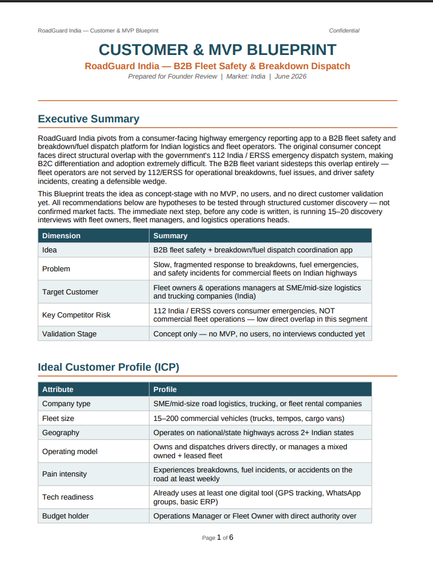
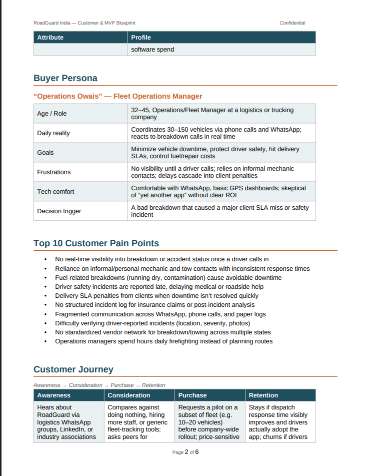
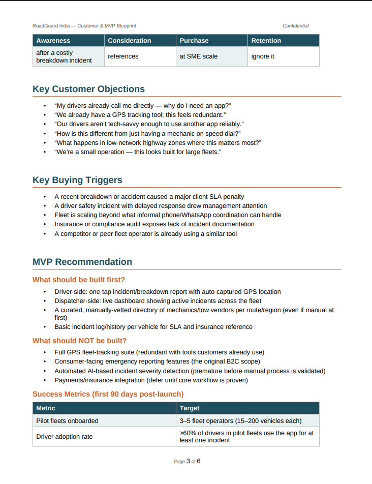
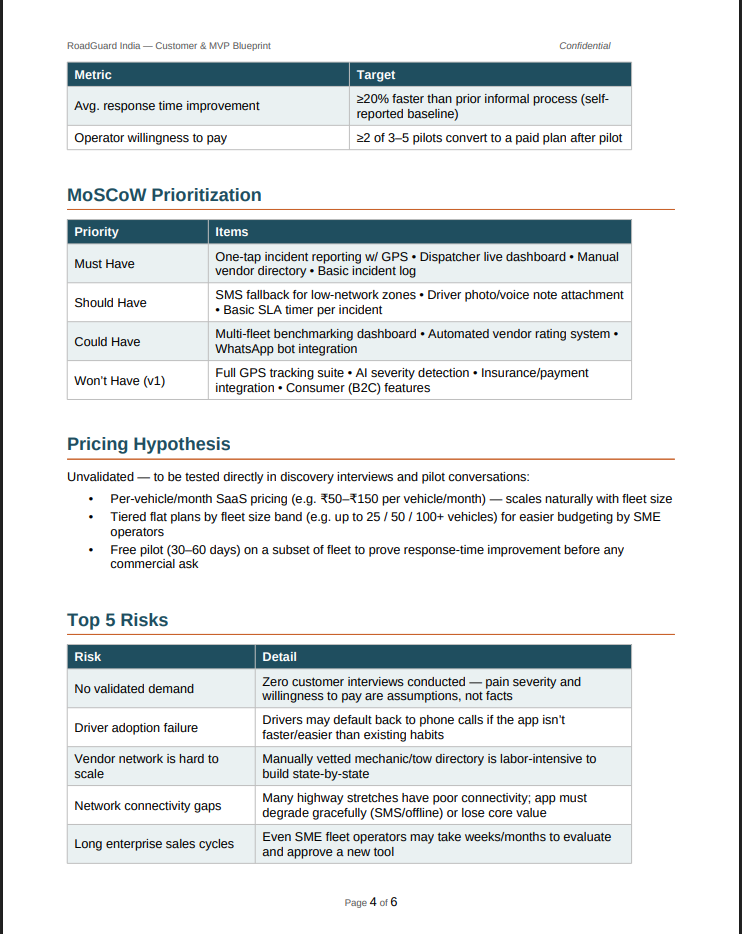
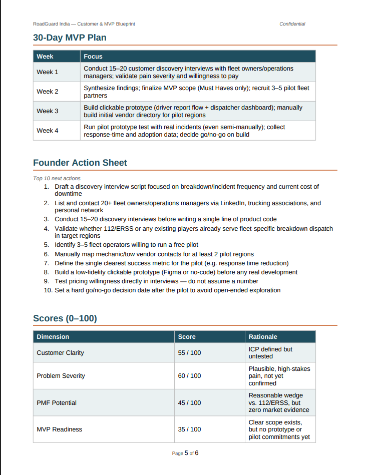
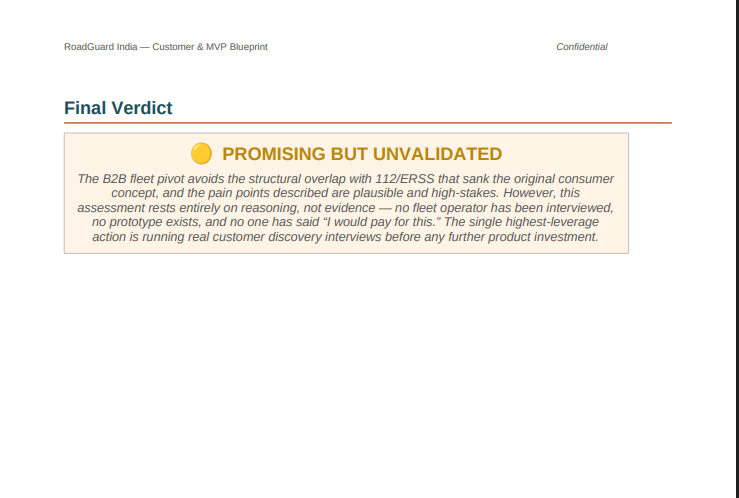

# 🚀 Day 23 – Customer & MVP Blueprint

## abtalks 60 Days Claude Challenge

### From Startup Validation to Customer Validation

---

# 📖 Overview

For **Day 23** of the **abtalks 60 Days Claude Challenge**, I continued refining my startup idea by shifting the focus from **idea validation** to **customer validation**.

Building on the Startup Validation Report from Day 22, this challenge helped me identify the ideal customer, understand their pain points, prioritize features, and define a practical MVP roadmap for **RoadGuard India**.

> **Build the right product for the right customer.**

---

# 🎯 Challenge Objective

Use AI to:

* Define the Ideal Customer Profile (ICP)
* Create a Buyer Persona
* Identify Customer Pain Points
* Map the Customer Journey
* Recommend the MVP
* Prioritize Features using MoSCoW
* Build a Pricing Strategy
* Assess Risks
* Create a 30-Day MVP Plan

---

# 📄 Customer & MVP Blueprint

## 📥 Complete Report

**👉 [View the Complete Customer & MVP Blueprint (PDF)](./RoadGuard_India_Customer_MVP_Blueprint.pdf)**

---

# 📸 Screenshots

## Executive Summary & Ideal Customer Profile

---

## Buyer Persona & Customer Journey

---

## MVP Recommendation & Success Metrics

---

## MoSCoW Prioritization, Pricing & Top Risks

---

## 30-Day MVP Plan & Founder Action Sheet

---

## Final Verdict

---

# 🔍 Analysis Areas

## Customer Research

* Ideal Customer Profile (ICP)
* Buyer Persona
* Customer Journey
* Customer Pain Points

## Product Strategy

* MVP Recommendation
* Success Metrics
* MoSCoW Prioritization
* Pricing Hypothesis

## Business Planning

* Top 5 Risks
* Founder Action Sheet
* 30-Day MVP Roadmap
* Product-Market Fit Analysis

---

# 📚 What I Learned

## 1. Customers Come Before Features

A successful product starts by understanding customer problems before writing code.

---

## 2. MVP Means Focus

An MVP isn't the smallest product you can build.

It's the smallest product that solves a meaningful customer problem.

---

## 3. Prioritization Is Critical

The MoSCoW framework showed me how to separate essential features from ideas that can wait for future releases.

---

## 4. AI Can Guide Product Strategy

Claude helped organize customer research, feature prioritization, and MVP planning into a structured product blueprint.

---

# 💡 Biggest Insight

> **The best MVP isn't the one with the most features—it's the one that solves one important problem exceptionally well.**

---

# 🌟 Final Takeaway

This challenge reinforced that startups should begin with customer understanding, validation, and prioritization before development.

Building the right product for the right customer is far more valuable than building a feature-rich application.

---

# 📅 Challenge Progress

* ✅ Day 1 – Getting Started with Claude
* ✅ Day 2 – Prompt Engineering
* ✅ Day 3 – Context Engineering
* ✅ Day 4 – Chain-of-Thought Prompting
* ✅ Day 5 – The Power of Context
* ✅ Day 6 – ATS Resume Optimization
* ✅ Day 7 – Claude Usage Strategy
* ✅ Day 8 – Environmental Health Analyzer
* ✅ Day 9 – NutriScope
* ✅ Day 10 – Portfolio Website Builder
* ✅ Day 11 – ATS Resume Optimization & Gap Analysis
* ✅ Day 12 – Job Search & Personal Branding Toolkit
* ✅ Day 13 – AI-Powered Job Discovery & Market Analysis
* ✅ Day 14 – Job Red Flag Detector
* ✅ Day 15 – AI Career & Life Strategy Blueprint
* ✅ Day 16 – Stock Fundamental Research
* ✅ Day 17 – Fuel Analytics Dashboard
* ⏳ Days 18–21 – Uploading Soon
* ✅ Day 22 – AI Startup Validation Report
* ✅ Day 23 – Customer & MVP Blueprint
* 🔜 Day 24 – Coming Soon

---

### 🚀 Learning in Public

**Building AI Skills • Product Management • Customer Research • Startup Validation • MVP Development • Continuous Improvement**
