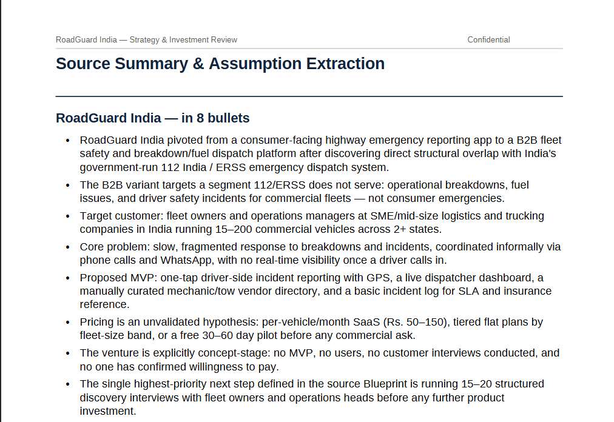
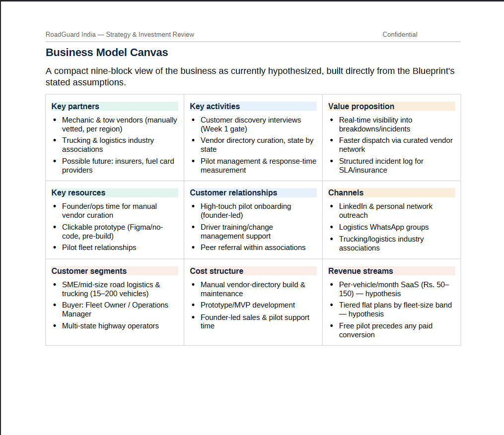
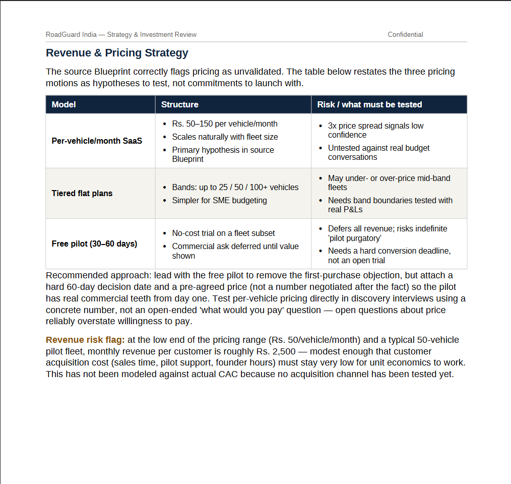
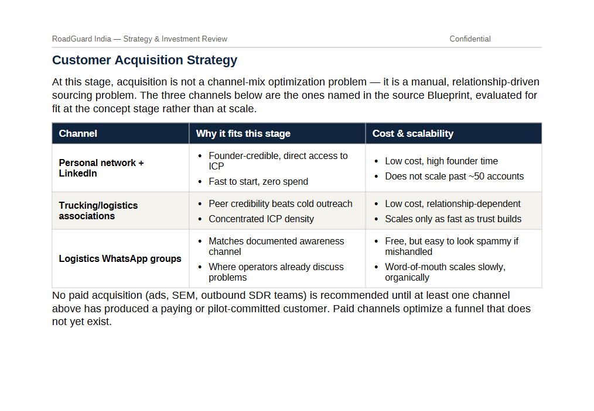
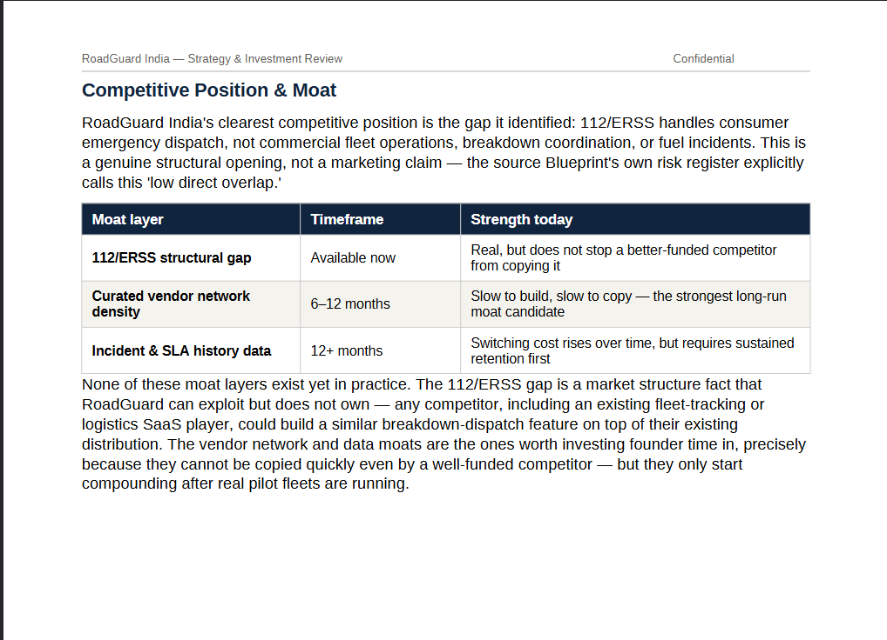
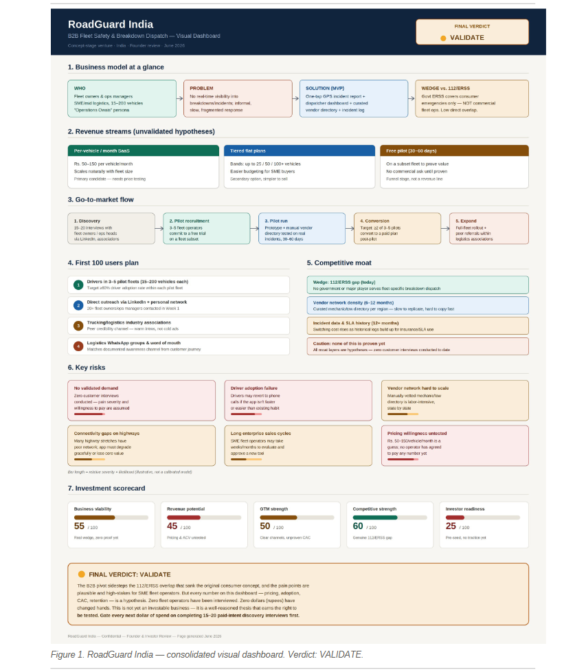
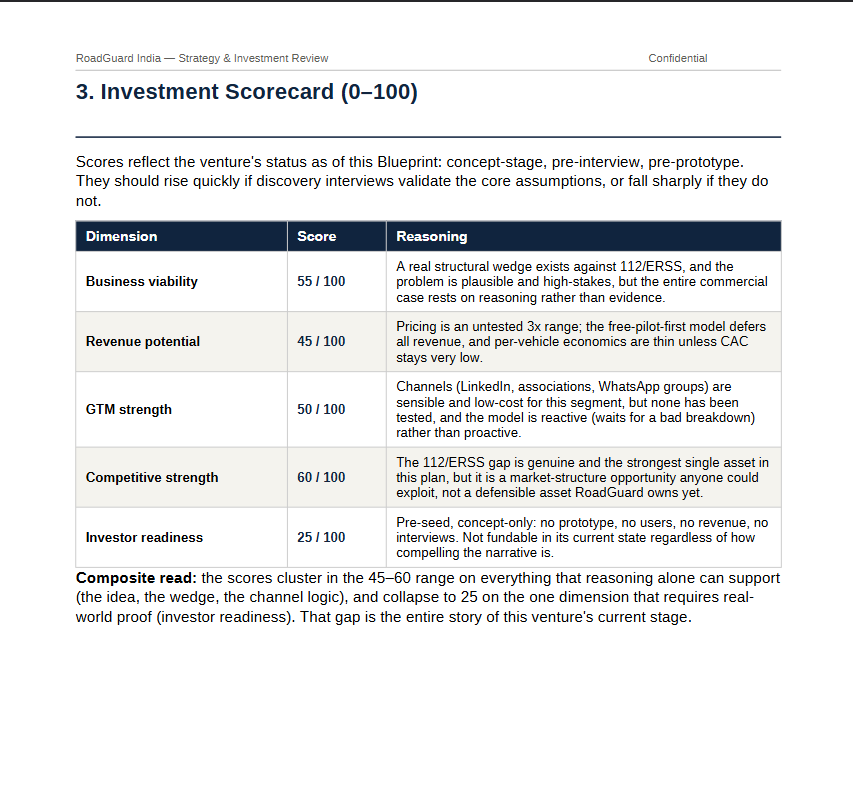

# 🚀 Day 24 – Business Strategy & Investment Review

## abtalks 60 Days Claude Challenge

### From Customer Validation to Business Validation

---

# 📖 Overview

For **Day 24** of the  **abtalks 60 Days Claude Challenge** , I moved beyond validating the customer and focused on validating the business itself.

Using my **Day 23 Customer & MVP Blueprint** as the foundation, Claude acted as an **AI Co-Founder, Growth Strategist, YC Advisor, and Business Consultant** to evaluate whether **RoadGuard India** could become a sustainable business.

Instead of evaluating features, this challenge focused on revenue, distribution, business model, competitive positioning, customer acquisition, and investment readiness.

> **A great product doesn't automatically become a great business.**

---

# 🎯 Challenge Objective

Use AI to:

* Perform a Business Reality Check
* Create a Business Model Canvas
* Build a Revenue & Pricing Strategy
* Design a Go-To-Market Strategy
* Create a Customer Acquisition Plan
* Develop the First 100 Users Strategy
* Analyze Competitive Position & Moat
* Perform Reverse SWOT Analysis
* Generate an Investment Scorecard
* Create a Founder Action Sheet

---

# 📄 Business Strategy Report

## 📥 Complete Report

👉 **[View the Complete Business Strategy &amp; Investment Review](./RoadGuard_India_Strategy_Review.pdf)**

---

# 📸 Screenshots

## Executive Summary & Business Reality Check

---

## Business Model Canvas

---

## Revenue & Pricing Strategy

---

## Customer Acquisition Strategy

---

## Competitive Position & Moat

---

## Investor Pitch & Founder Strategy

---

## Investment Scorecard

---

# 🔍 Analysis Areas

### Business Validation

* Business Reality Check
* Revenue Model
* Pricing Strategy
* Business Model Canvas

### Growth Strategy

* Go-To-Market Strategy
* Customer Acquisition
* First 100 Users Plan
* Founder Action Sheet

### Competitive Analysis

* Competitive Position
* Competitive Moat
* Reverse SWOT
* Market Risks

### Investment Readiness

* Investment Scorecard
* Sustainability Assessment
* Final Business Verdict

---

# 📚 What I Learned

## 1. A Product Isn't a Business

Having a solution is only the beginning.

A business needs customers, revenue, and repeatable growth.

---

## 2. Revenue Matters More Than Features

The report reinforced that startups survive because customers pay—not because they have many features.

---

## 3. Distribution Beats Perfection

Even an excellent product fails without an effective customer acquisition strategy.

Finding customers is just as important as building the product.

---

## 4. Validation Reduces Risk

The biggest takeaway was to validate assumptions before investing time and money into development.

---

# 💡 Biggest Insight

> **Investors don't fund assumptions—they fund evidence.**

Customer interviews, pricing validation, pilot users, and measurable traction matter far more than ambitious ideas.

---

# 🌟 Final Takeaway

This challenge taught me to think like a founder and an investor at the same time.

Before building software, I need to validate demand, understand the business model, and ensure there is a sustainable path to growth.

---

# 📅 Challenge Progress

* ✅ Day 1 – Getting Started with Claude
* ✅ Day 2 – Prompt Engineering
* ✅ Day 3 – Context Engineering
* ✅ Day 4 – Chain-of-Thought Prompting
* ✅ Day 5 – The Power of Context
* ✅ Day 6 – ATS Resume Optimization
* ✅ Day 7 – Claude Usage Strategy
* ✅ Day 8 – Environmental Health Analyzer
* ✅ Day 9 – NutriScope
* ✅ Day 10 – Portfolio Website Builder
* ✅ Day 11 – ATS Resume Optimization & Gap Analysis
* ✅ Day 12 – Job Search & Personal Branding Toolkit
* ✅ Day 13 – AI-Powered Job Discovery & Market Analysis
* ✅ Day 14 – Job Red Flag Detector
* ✅ Day 15 – AI Career & Life Strategy Blueprint
* ✅ Day 16 – Stock Fundamental Research
* ✅ Day 17 – Fuel Analytics Dashboard
* ⏳ Days 18–21 – Uploading Soon
* ✅ Day 22 – AI Startup Validation Report
* ✅ Day 23 – Customer & MVP Blueprint
* ✅ Day 24 – Business Strategy & Investment Review
* 🔜 Day 25 – Coming Soon

---

### 🚀 Learning in Public

**Building AI Skills • Startup Strategy • Business Validation • Product Management • Entrepreneurship • Continuous Improvement**
