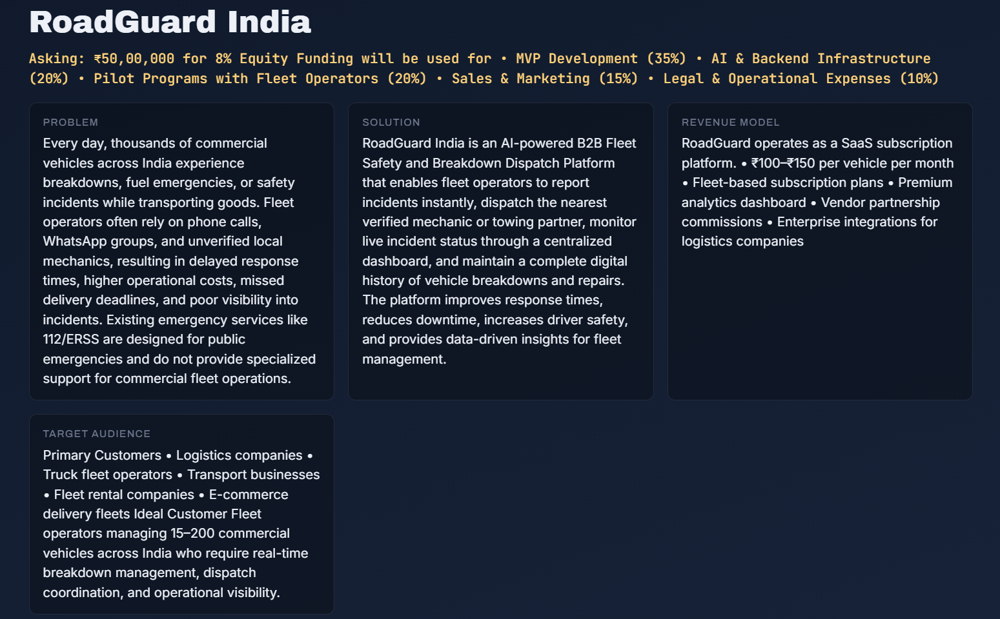
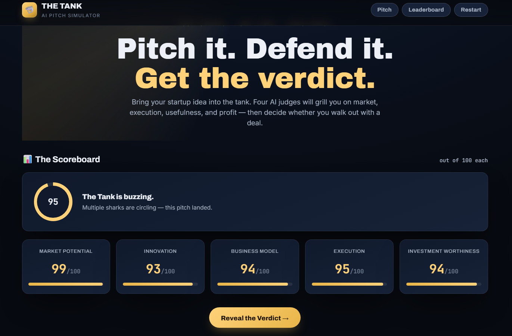
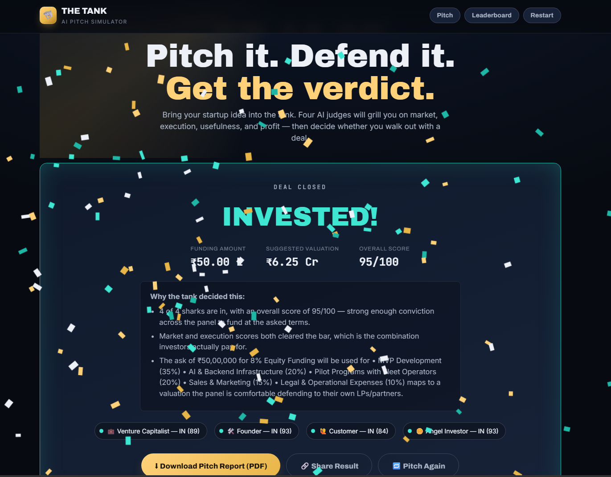

# 🚀 Day 25 – AI Shark Tank Simulator

## abtalks 60 Days Claude Challenge

### Pitching a Startup to AI Investors

---

# 📖 Overview

For **Day 25** of the  **abtalks 60 Days Claude Challenge** , I built a complete **AI Shark Tank Simulator** using Claude.

To make the experience more realistic, I pitched my own startup idea,  **RoadGuard India** , to four AI investors who evaluated it from different perspectives.

The simulator recreated the experience of presenting a startup to investors by asking challenging questions, scoring the business, and generating an investment decision.

> **Every startup begins with an idea—but investors invest in execution.**

---

# 🎯 Challenge Objective

Build an interactive AI-powered Shark Tank experience that allows users to:

* Enter a startup idea
* Present a business pitch
* Answer investor questions
* Receive startup scores
* Get an AI investment decision
* Review valuation and funding recommendations

---

# 🌐 Live Demo

### 🚀 Try the AI Shark Tank Simulator

**🔗 Netlify:**
[`LIVE DEMO`](https://the-tank.netlify.app/)

---

📄 Pitch Report

After completing the Shark Tank simulation, the application generates a downloadable Startup Pitch Report containing the startup evaluation, AI judges' feedback, scorecard, investment decision, valuation, and funding recommendation.

📥 View the Generated Pitch Report

[ `RoadGuard India – AI Shark Tank Pitch Report` ](./report.pdf)

# 📸 Screenshots

## Startup Pitch

---

## The Scorecard

---

## Final Scorecard & Investment Decision

---

# ✨ Features

* 🦈 Four AI Shark Tank Judges
* 💼 Startup Pitch Form
* 💬 Interactive Investor Questions
* 📊 Startup Scorecard
* 💰 Funding & Valuation Recommendation
* 🏆 Leaderboard
* 📄 Downloadable Pitch Report
* 🎉 Confetti Animation
* 📱 Fully Responsive Design
* 🌙 Modern Dark Theme

---

# 🦈 Meet the AI Judges

### Venture Capitalist

Focuses on market size, scalability, and investment potential.

### Founder

Evaluates execution strategy, operations, and product development.

### Customer

Analyzes customer value, usability, and real-world adoption.

### Angel Investor

Reviews profitability, revenue model, funding requirements, and long-term sustainability.

---

# 📚 What I Learned

## 1. Great Ideas Need Great Communication

A strong startup idea is valuable only if it can be explained clearly and confidently.

---

## 2. Investors Challenge Assumptions

Every assumption—from pricing to customer acquisition—must be supported with evidence and a realistic plan.

---

## 3. Feedback Improves Products

Answering investor questions helped identify gaps in the business model and highlighted areas for improvement.

---

## 4. AI Can Simulate Real Business Scenarios

Claude created an engaging environment that encouraged strategic thinking, problem-solving, and founder-level decision making.

---

# 💡 Biggest Insight

> **Investors don't invest in ideas—they invest in founders who can clearly explain how those ideas become sustainable businesses.**

---

# 🌟 Final Takeaway

This challenge combined web development, AI, entrepreneurship, and product thinking into one interactive application.

It was a fun way to practice pitching a startup while receiving constructive feedback from multiple AI perspectives.

---

# 📅 Challenge Progress

* ✅ Day 1 – Getting Started with Claude
* ✅ Day 2 – Prompt Engineering
* ✅ Day 3 – Context Engineering
* ✅ Day 4 – Chain-of-Thought Prompting
* ✅ Day 5 – The Power of Context
* ✅ Day 6 – ATS Resume Optimization
* ✅ Day 7 – Claude Usage Strategy
* ✅ Day 8 – Environmental Health Analyzer
* ✅ Day 9 – NutriScope
* ✅ Day 10 – Portfolio Website Builder
* ✅ Day 11 – ATS Resume Optimization & Gap Analysis
* ✅ Day 12 – Job Search & Personal Branding Toolkit
* ✅ Day 13 – AI-Powered Job Discovery & Market Analysis
* ✅ Day 14 – Job Red Flag Detector
* ✅ Day 15 – AI Career & Life Strategy Blueprint
* ✅ Day 16 – Stock Fundamental Research
* ✅ Day 17 – Fuel Analytics Dashboard
* ⏳ Days 18–21 – Uploading Soon
* ✅ Day 22 – AI Startup Validation Report
* ✅ Day 23 – Customer & MVP Blueprint
* ✅ Day 24 – Business Strategy & Investment Review
* ✅ Day 25 – AI Shark Tank Simulator
* 🔜 Day 26 – Coming Soon

---

### 🚀 Learning in Public

**Building AI Skills • Entrepreneurship • Startup Pitching • Product Thinking • Web Development • Continuous Improvement**
