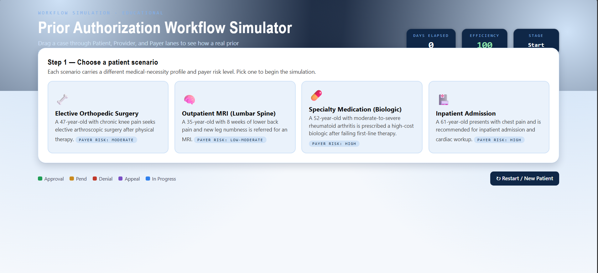
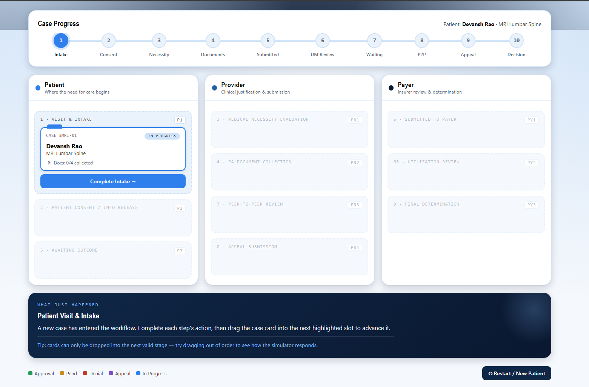
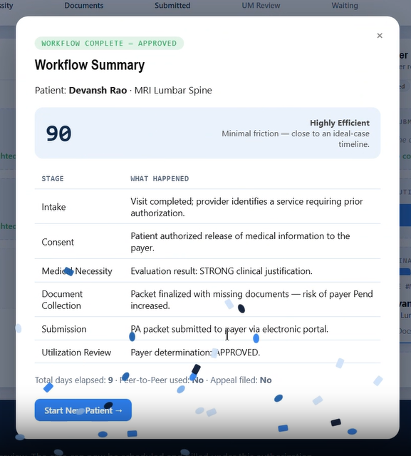

# 🚀 Day 26 – Prior Authorization Workflow Simulator

## abtalks 60 Days Claude Challenge

### Simulating Real-World Healthcare Insurance Workflows

---

# 📖 Overview

For **Day 26** of the  **abtalks 60 Days Claude Challenge** , I built an interactive **Prior Authorization Workflow Simulator** using Claude.

The application recreates how insurance authorization requests move through the healthcare system—from the patient visit to the final payer decision.

Rather than reading about the workflow, users can experience it through an engaging drag-and-drop simulation with educational explanations at every stage.

> **Learning complex workflows becomes easier when you can interact with them.**

---

# 🎯 Challenge Objective

Build a complete simulator that allows users to:

* Select different patient scenarios
* Move cases through Patient, Provider, and Payer stages
* Collect required documentation
* Evaluate medical necessity
* Submit authorization requests
* Handle Approval, Pend, Denial, Appeal, and Peer-to-Peer Review
* Track progress, efficiency, and elapsed days

---

# 📸 Screenshots

## Interactive Workflow

---

## Document Collection

---

## Result

---

# ✨ Features

* 🏥 Multiple Patient Scenarios
* 🖱️ Drag & Drop Workflow
* 📋 Prior Authorization Document Collection
* 🩺 Medical Necessity Evaluation
* 📈 Progress Tracker
* ⏳ Days Elapsed Counter
* ⚡ Efficiency Score
* ✅ Approval, Pend, Denial & Appeal Simulation
* 🎉 Celebration Animation
* 📚 Educational Workflow Explanations
* 📱 Responsive Modern UI

---

# 📚 What I Learned

## 1. Healthcare Workflows Are Highly Structured

Every insurance request follows a defined sequence of reviews and validations before treatment approval.

---

## 2. Documentation Is Critical

Missing documentation is one of the biggest reasons for delays in prior authorization.

---

## 3. Interactive Learning Improves Understanding

Building a simulator made it easier to understand complex healthcare processes than simply reading documentation.

---

## 4. AI Accelerates Product Development

Claude helped transform a complex healthcare workflow into an interactive educational application.

---

# 💡 Biggest Insight

> Great software doesn't just process information—it helps people understand complex systems through interaction.

---

# 🌟 Final Takeaway

This challenge demonstrated how AI can be used to build educational simulations that combine software engineering, healthcare knowledge, and user-centered design into a practical learning experience.

---

# 📅 Challenge Progress

* ✅ Day 1 – Getting Started with Claude
* ✅ Day 2 – Prompt Engineering
* ✅ Day 3 – Context Engineering
* ✅ Day 4 – Chain-of-Thought Prompting
* ✅ Day 5 – The Power of Context
* ✅ Day 6 – ATS Resume Optimization
* ✅ Day 7 – Claude Usage Strategy
* ✅ Day 8 – Environmental Health Analyzer
* ✅ Day 9 – NutriScope
* ✅ Day 10 – Portfolio Website Builder
* ✅ Day 11 – ATS Resume Optimization & Gap Analysis
* ✅ Day 12 – Job Search & Personal Branding Toolkit
* ✅ Day 13 – AI-Powered Job Discovery & Market Analysis
* ✅ Day 14 – Job Red Flag Detector
* ✅ Day 15 – AI Career & Life Strategy Blueprint
* ✅ Day 16 – Stock Fundamental Research
* ✅ Day 17 – Fuel Analytics Dashboard
* ⏳ Days 18–21 – Uploading Soon
* ✅ Day 22 – AI Startup Validation Report
* ✅ Day 23 – Customer & MVP Blueprint
* ✅ Day 24 – Business Strategy & Investment Review
* ✅ Day 25 – AI Shark Tank Simulator
* ✅ Day 26 – Prior Authorization Workflow Simulator
* 🔜 Day 27 – Coming Soon

---

### 🚀 Learning in Public

**Building AI Skills • HealthTech • Workflow Automation • Web Development • JavaScript • Continuous Improvement**
