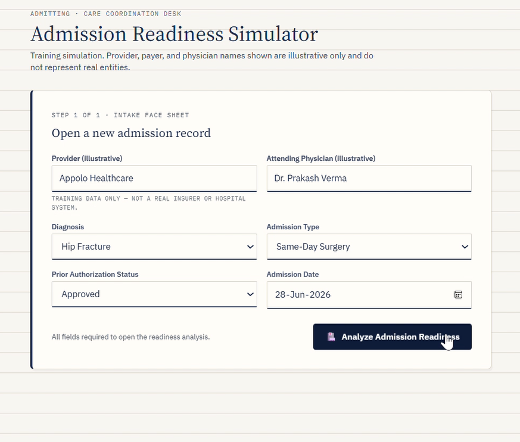
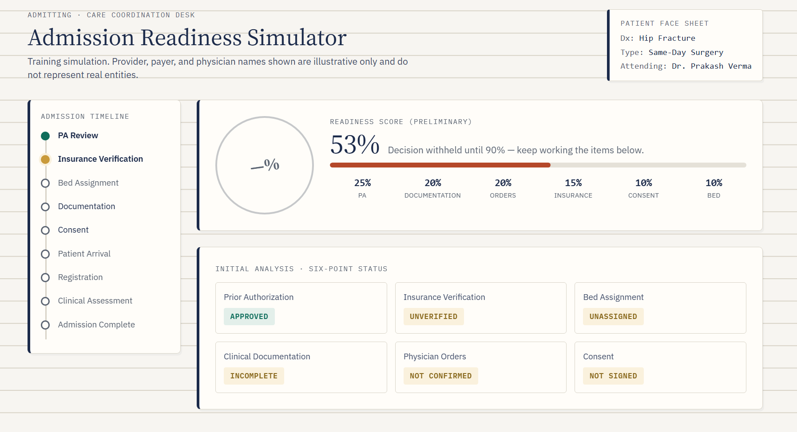
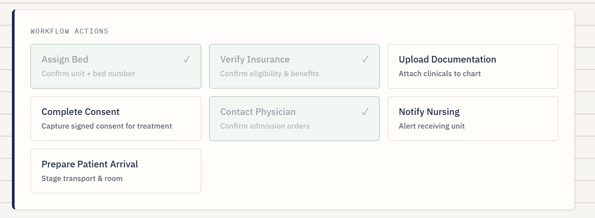
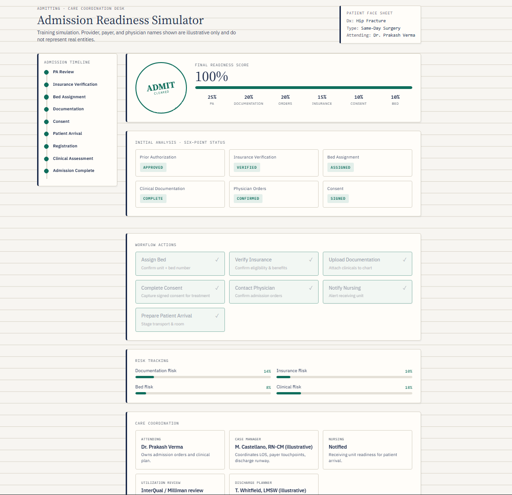

# 🏥 Day 28 – Admission Readiness Simulator

## abtalks 60 Days Claude Challenge

### Simulating Hospital Admission Readiness with AI

---

# 📖 Overview

For **Day 28** of the **abtalks 60 Days Claude Challenge**, I built an interactive **Admission Readiness Simulator** using Claude.

This application simulates the workflow followed by hospital care coordination teams before admitting a patient. It evaluates admission readiness by analyzing key administrative and clinical checkpoints such as prior authorization, insurance verification, physician orders, documentation, consent, bed assignment, and patient readiness.

The simulator provides a realistic dashboard that demonstrates how multiple healthcare processes work together to ensure safe and efficient patient admissions.

> **A successful hospital admission depends on preparation, coordination, and timely decision-making—not just clinical care.**

---

# 🎯 Challenge Objective

Build an AI-powered healthcare workflow simulator that can:

- Create a new patient admission record
- Evaluate admission readiness
- Simulate real hospital coordination workflows
- Track documentation and authorization status
- Calculate an overall readiness score
- Identify operational risks
- Assist care coordination teams before patient admission

---

# 📄 Project Files

### 📥 HTML Application

**🔗 [Admission Readiness Simulator](./index.html)**

---

# 📸 Screenshots

## Admission Intake Form

---

## Admission Readiness Dashboard

---

## Workflow Actions

---

## Care Coordination Panel

---

# ✨ Features

- 🏥 Interactive Patient Admission Form
- 📊 Admission Readiness Score
- 📋 Six-Point Readiness Analysis
- 🩺 Prior Authorization Workflow
- 📑 Documentation Verification
- 🛏️ Bed Assignment Tracking
- 💳 Insurance Verification
- ✍️ Consent Management
- 👨‍⚕️ Physician Order Confirmation
- 📈 Risk Tracking Dashboard
- 👥 Care Coordination Panel
- ✅ Final Admission Decision
- 📱 Responsive Modern Interface

---

# 🏥 Workflow Simulation

The simulator recreates several important hospital admission processes, including:

### Patient Intake

Create an admission record with provider information, diagnosis, physician details, admission type, authorization status, and admission date.

---

### Admission Readiness Analysis

The application evaluates multiple readiness criteria and generates an overall admission score before allowing final admission.

---

### Prior Authorization Management

Simulates different authorization scenarios including:

- Approved
- Pending
- Denied
- Appeal Workflow

---

### Workflow Coordination

Hospital teams complete essential operational tasks such as:

- Insurance Verification
- Documentation Upload
- Consent Collection
- Bed Assignment
- Physician Confirmation
- Nursing Notification
- Patient Arrival Preparation

---

### Risk Assessment

The simulator continuously evaluates operational risks including:

- Documentation Risk
- Insurance Risk
- Clinical Risk
- Bed Availability Risk

---

### Final Admission Decision

Once all required conditions are satisfied, the simulator determines whether the patient is ready for admission and presents a final readiness summary.

---

# 📚 What I Learned

## 1. Hospital Admissions Require Team Coordination

Patient admissions involve collaboration between physicians, nursing staff, insurance teams, utilization review, and care coordinators.

---

## 2. Small Delays Affect the Entire Workflow

Missing documentation, pending insurance verification, or incomplete authorizations can delay patient admission and impact hospital efficiency.

---

## 3. AI Can Simplify Complex Healthcare Processes

Interactive simulations make it easier to understand complicated healthcare workflows while improving learning and decision-making.

---

## 4. Dashboards Improve Operational Visibility

Visual indicators, readiness scores, and workflow tracking help healthcare professionals quickly identify bottlenecks and prioritize tasks.

---

# 💡 Biggest Insight

> **Efficient healthcare isn't just about treating patients—it's about ensuring every process is coordinated before care begins.**

---

# 🌟 Final Takeaway

This project helped me understand how administrative workflows play a critical role in modern healthcare. By combining interactive dashboards, workflow management, and AI-assisted simulations, the Admission Readiness Simulator demonstrates how technology can support faster, safer, and more organized patient admissions.

---

# 📅 Challenge Progress

- ✅ Day 1 – Getting Started with Claude
- ✅ Day 2 – Prompt Engineering
- ✅ Day 3 – Context Engineering
- ✅ Day 4 – Chain-of-Thought Prompting
- ✅ Day 5 – The Power of Context
- ✅ Day 6 – ATS Resume Optimization
- ✅ Day 7 – Claude Usage Strategy
- ✅ Day 8 – Environmental Health Analyzer
- ✅ Day 9 – NutriScope
- ✅ Day 10 – Portfolio Website Builder
- ✅ Day 11 – ATS Resume Optimization & Gap Analysis
- ✅ Day 12 – Job Search & Personal Branding Toolkit
- ✅ Day 13 – AI-Powered Job Discovery & Market Analysis
- ✅ Day 14 – Job Red Flag Detector
- ✅ Day 15 – AI Career & Life Strategy Blueprint
- ✅ Day 16 – Stock Fundamental Research
- ✅ Day 17 – Fuel Analytics Dashboard
- ✅ Day 18 – AI Meeting Intelligence Dashboard
- ✅ Day 19 – Football Intelligence Hub
- ⏳ Days 20–21 – Uploading Soon
- ✅ Day 22 – AI Startup Validation Report
- ✅ Day 23 – Customer & MVP Blueprint
- ✅ Day 24 – Business Strategy & Investment Review
- ✅ Day 25 – AI Shark Tank Simulator
- ✅ Day 26 – Prior Authorization Workflow Simulator
- ✅ Day 27 – Clinical Decision Intelligence Dashboard
- ✅ Day 28 – Admission Readiness Simulator
- 🔜 Day 29 – Coming Soon

---

### 🚀 Learning in Public

**Building AI Skills • Healthcare Technology • Workflow Automation • Dashboard Design • Interactive Simulations • Product Development • Continuous Improvement**
