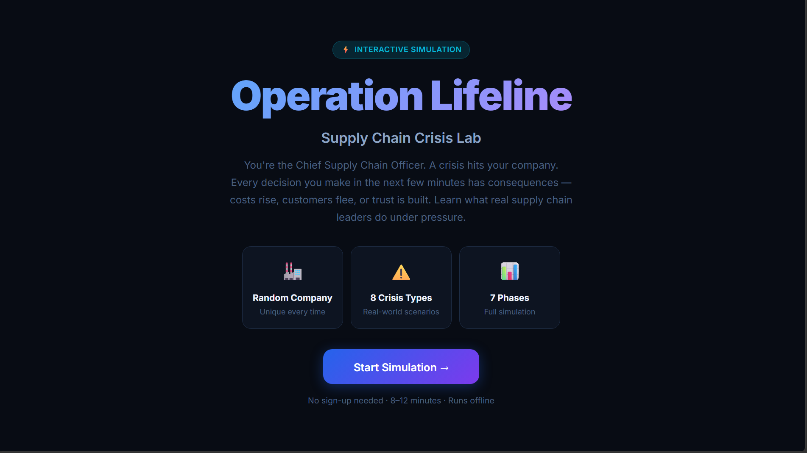
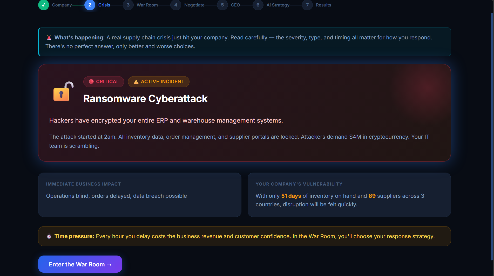
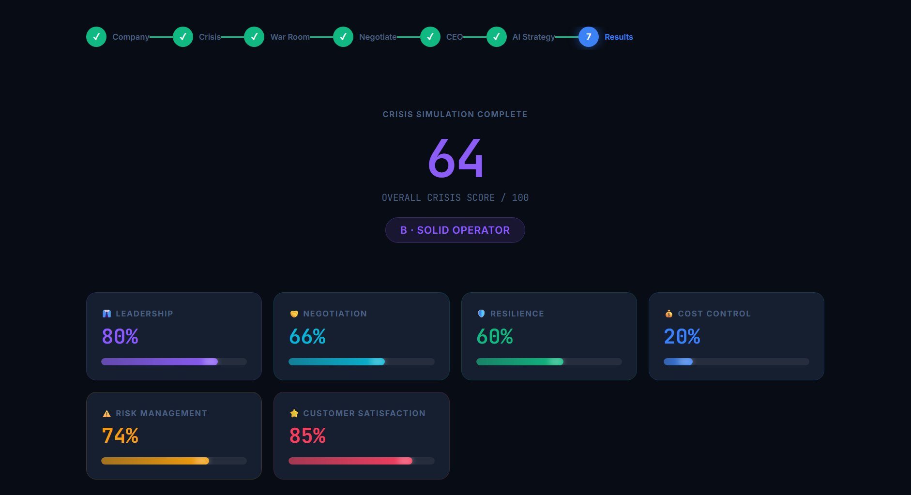
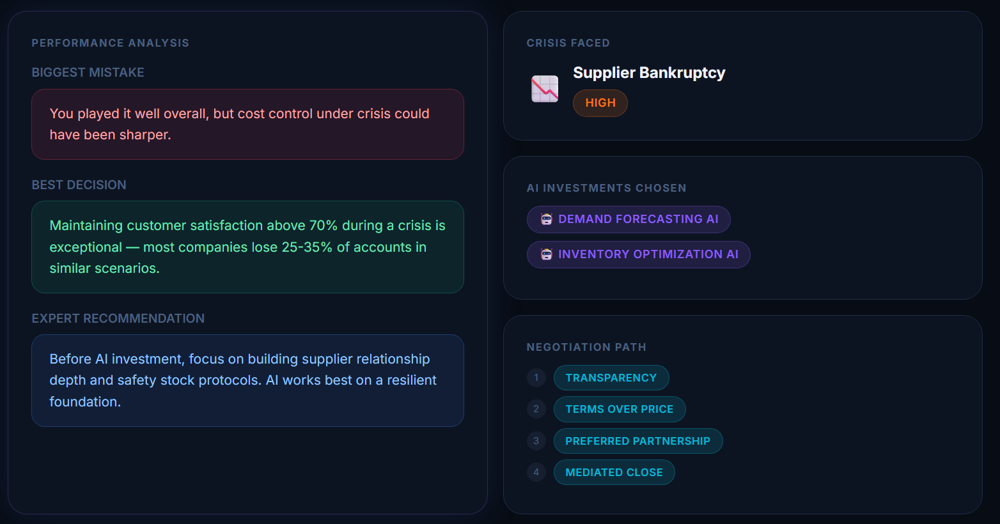
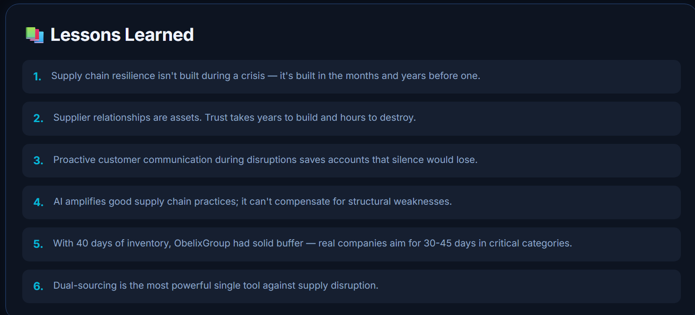

# 🏭 Operation Lifeline: Supply Chain Crisis Lab

## Day 29 — abtalks 60 Days Claude Challenge

> An interactive business simulation where you become the Chief Supply Chain Officer responsible for navigating a company through a major supply chain crisis.

---

# 📖 Overview

For **Day 29** of the **abtalks 60 Days Claude Challenge**, I built **Operation Lifeline: Supply Chain Crisis Lab** using Claude AI.

This project transforms supply chain management into an interactive learning experience.

Instead of reading theory, players make real business decisions while responding to unpredictable crises such as supplier bankruptcies, factory fires, cyberattacks, shipping delays, port strikes, floods, geopolitical conflicts, and raw material shortages.

Every decision has measurable consequences across cost, inventory, customer satisfaction, profitability, delivery speed, and organizational resilience.

The goal wasn't just to build a dashboard.

It was to build a simulator that teaches users *why* each decision matters.

---

# 🎯 Challenge Goal

Create an educational simulation that helps beginners understand:

- Supply Chain Management
- Crisis Leadership
- Risk Management
- Executive Decision Making
- Supplier Negotiation
- AI in Supply Chains

through an engaging interactive experience.

# 📸 Screenshots

## Welcome Screen

---

## Crisis Dashboard

---

## Executive Results

---

## Performance Analysis

---

## Lessons Learned

---

# 🎮 Simulation Flow

## 1. Welcome

Start your journey as the Chief Supply Chain Officer.

---

## 2. Company Generation

Every playthrough creates a completely fictional company including:

- Industry
- Revenue
- Employees
- Suppliers
- Warehouses
- Factories
- Lead Time
- Inventory Days
- Operating Countries

---

## 3. Crisis Generation

A random crisis is generated from scenarios including:

- Factory Fire
- Supplier Bankruptcy
- Cyberattack
- Port Strike
- Shipping Delay
- Flood
- Political Conflict
- Raw Material Shortage

Each crisis includes:

- Business impact
- Urgency level
- Operational consequences

---

## 4. War Room

Choose three response strategies.

Every decision changes:

- Cost
- Inventory
- Profit
- Delivery Speed
- Customer Satisfaction

---

## 5. Supplier Negotiation

Participate in four rounds of negotiations.

Each choice affects:

- Trust
- Lead Time
- Pricing
- Overall Negotiation Score

---

## 6. CEO Boardroom

Answer executive-level leadership questions that simulate difficult business decisions.

---

## 7. AI Strategy

Choose two AI investments including:

- Demand Forecasting AI
- Inventory Optimization AI
- Supplier Risk Monitoring
- Warehouse Vision
- Procurement Copilot

Learn how AI improves resilience rather than replacing strategic thinking.

---

## 8. Executive Dashboard

Receive a complete performance report including:

- Overall Crisis Score
- Leadership
- Negotiation
- Resilience
- Cost Control
- Risk Management
- Customer Satisfaction

Along with:

- Biggest Mistake
- Best Decision
- Expert Recommendation
- Lessons Learned

---

# ✨ Features

- 🎲 Random company generation
- 🌍 Multiple industries
- ⚠️ Eight crisis scenarios
- 🧠 Decision-based gameplay
- 📈 Animated metrics
- 🤝 Supplier negotiation system
- 👔 Executive leadership assessment
- 🤖 AI investment planning
- 📊 Personalized performance dashboard
- 📚 Educational explanations before every decision
- 🔁 Replay with different outcomes
- 📱 Responsive interface
- 🌙 Premium enterprise-inspired dark theme

---

# 💡 What I Learned

Building this simulator taught me several important lessons beyond coding.

## Supply Chains Are Complex Systems

Small disruptions can create ripple effects across inventory, transportation, customers, and profitability.

---

## Leadership Is About Trade-offs

There are rarely perfect decisions.

Most executive decisions involve balancing cost, speed, resilience, and customer expectations.

---

## Relationships Matter

Strong supplier relationships often outperform aggressive negotiations during a crisis.

---

## AI Is an Enabler

AI helps organizations forecast demand, optimize inventory, detect supplier risks, and improve procurement—but it cannot replace good business strategy.

---

## UX Can Teach

A well-designed interface can help users understand difficult concepts through interaction rather than lengthy explanations.

---

# 🛠️ Built With

- Claude AI
- HTML
- CSS
- JavaScript
- React (CDN)
- Babel

---

# 📚 Key Takeaway

> "The strongest supply chains aren't the cheapest—they're the most resilient."

Technology can help organizations respond faster, but resilience is built through preparation, collaboration, and informed decision-making.

---

# 📅 Challenge Progress

- ✅ Days 1–28 Completed
- ✅ Day 29 – Operation Lifeline: Supply Chain Crisis Lab
- 🚀 Day 30 Coming Soon...

---

## Learning in Public 🚀

Every project in this challenge pushes me to explore a new problem domain while improving my skills in AI prompting, frontend development, product thinking, UX design, and software engineering.

Thanks for following along! ⭐