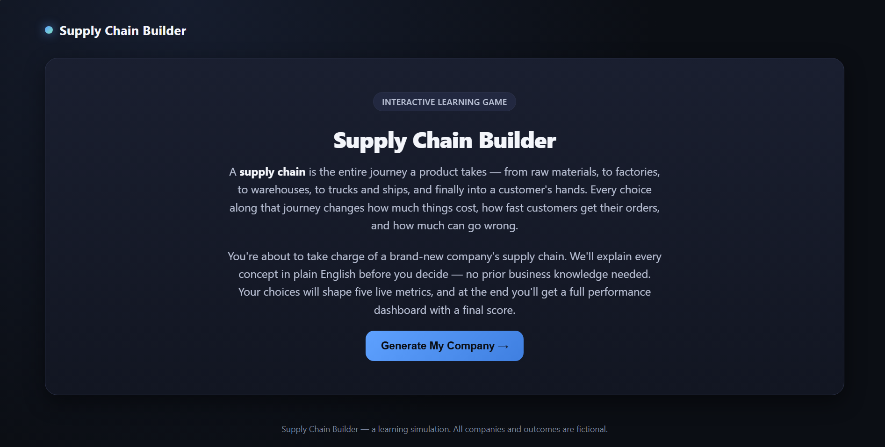
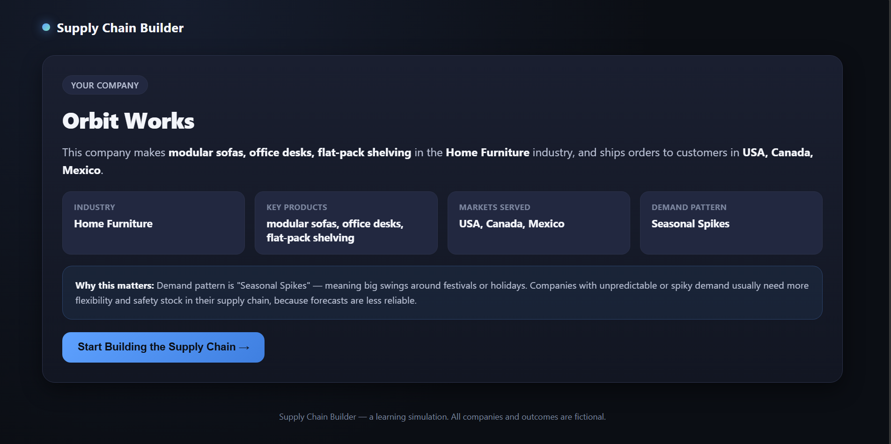
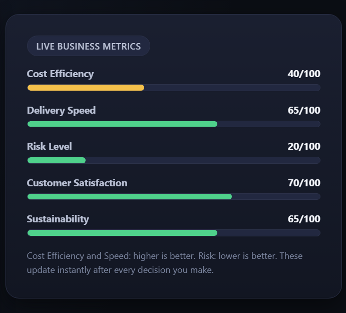
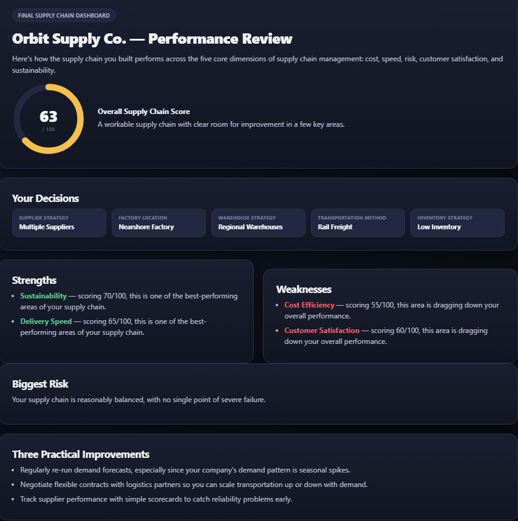

# 🚀 Day 30 – Supply Chain Builder

## abtalks 60 Days Claude Challenge

### Learn Supply Chain Management Through Interactive Decision-Making

---

# 📖 Overview

For **Day 30** of the **abtalks 60 Days Claude Challenge**, I built **Supply Chain Builder**, a beginner-friendly interactive web application using **React, HTML, CSS, and JavaScript**.

Instead of learning supply chain concepts through lengthy articles, this simulator allows users to **build and optimize a company's supply chain** by making real business decisions and instantly seeing their impact on key operational metrics.

Every playthrough generates a **new fictional company**, making each simulation unique while teaching the trade-offs involved in designing an efficient supply chain.

---

# 🎯 Challenge Objective

Build an interactive application that teaches users how supply chains work by allowing them to:

* Generate a random company profile
* Build a complete supply chain
* Understand every business decision
* Track live business metrics
* Optimize overall performance
* Review a final performance dashboard

---

# 📸 Screenshots

## Welcome Screen

---

## Company Generation & Supply Chain Decisions

---

## Live Business Metrics

---

## Final Performance Dashboard

---

# ✨ Features

* 🏭 Random company generation
* 📦 Interactive supply chain builder
* 📖 Beginner-friendly explanations before every decision
* 🚚 Supplier, factory, warehouse, transportation & inventory planning
* 📊 Live business metrics
* ⚖️ Real-time decision trade-offs
* 📈 Overall Supply Chain Score
* 💡 Strengths & weaknesses analysis
* ⚠️ Biggest business risk detection
* ✅ Personalized improvement recommendations
* 🔄 Replay with a new company every time
* 📱 Responsive enterprise dashboard

---

# 🧠 What I Learned

## 1. Every Supply Chain Decision Has Trade-Offs

Improving one business metric often affects another. Fast delivery usually increases cost, while reducing cost may increase risk.

---

## 2. There Is No Perfect Supply Chain

The goal isn't maximizing one metric—it's finding the right balance between cost, speed, resilience, sustainability, and customer satisfaction.

---

## 3. Learning Through Simulation Is Powerful

Interactive decision-making makes complex business concepts much easier to understand than traditional learning methods.

---

## 4. AI Can Create Practical Learning Experiences

Claude helped generate an application that transforms supply chain theory into a hands-on simulation, making learning more engaging and intuitive.

---

# 💡 Biggest Insight

> **A successful supply chain isn't the cheapest or the fastest—it's the one that balances efficiency, resilience, and customer value.**

---

# 🛠️ Tech Stack

* React (CDN)
* HTML5
* CSS3
* JavaScript (ES6)
* Claude AI

---

# 📅 Challenge Progress

* ✅ Day 1 – Getting Started with Claude
* ✅ Day 2 – Prompt Engineering
* ✅ Day 3 – Context Engineering
* ✅ Day 4 – Chain-of-Thought Prompting
* ✅ Day 5 – The Power of Context
* ✅ Day 6 – ATS Resume Optimization
* ✅ Day 7 – Claude Usage Strategy
* ✅ Day 8 – Environmental Health Analyzer
* ✅ Day 9 – NutriScope
* ✅ Day 10 – Portfolio Website Builder
* ✅ Day 11 – ATS Resume Optimization & Gap Analysis
* ✅ Day 12 – Job Search & Personal Branding Toolkit
* ✅ Day 13 – AI-Powered Job Discovery & Market Analysis
* ✅ Day 14 – Job Red Flag Detector
* ✅ Day 15 – AI Career & Life Strategy Blueprint
* ✅ Day 16 – Stock Fundamental Research
* ✅ Day 17 – Fuel Analytics Dashboard
* ✅ Day 18 – Meeting Intelligence Analyzer
* ✅ Day 19 – Football Intelligence Hub
* ✅ Day 20 – Uploading Soon
* ✅ Day 21 – Uploading Soon
* ✅ Day 22 – AI Startup Validation Report
* ✅ Day 23 – Customer & MVP Blueprint
* ✅ Day 24 – Business Strategy & Investment Review
* ✅ Day 25 – AI Shark Tank Simulator
* ✅ Day 26 – Prior Authorization Workflow Simulator
* ✅ Day 27 – Executive Meeting Intelligence Dashboard
* ✅ Day 28 – Admission Readiness Simulator
* ✅ Day 29 – Operation Lifeline: Supply Chain Crisis Lab
* ✅ Day 30 – Supply Chain Builder
* 🔜 Day 31 – Coming Soon...

---

## 🚀 Learning in Public

**Artificial Intelligence • Supply Chain Management • Business Simulation • React • Frontend Development • Problem Solving • Continuous Learning**