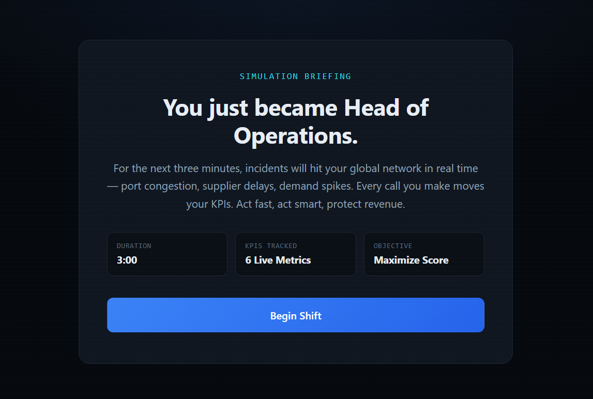
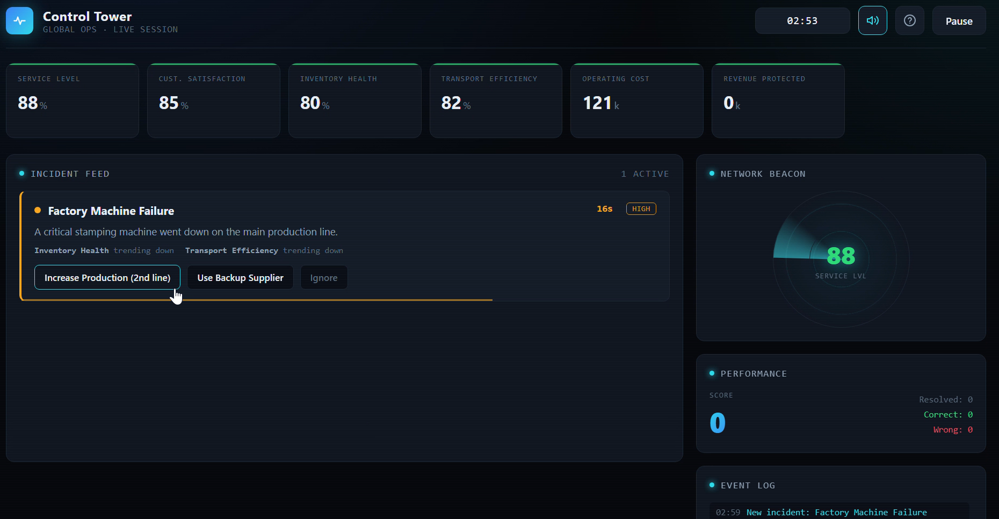
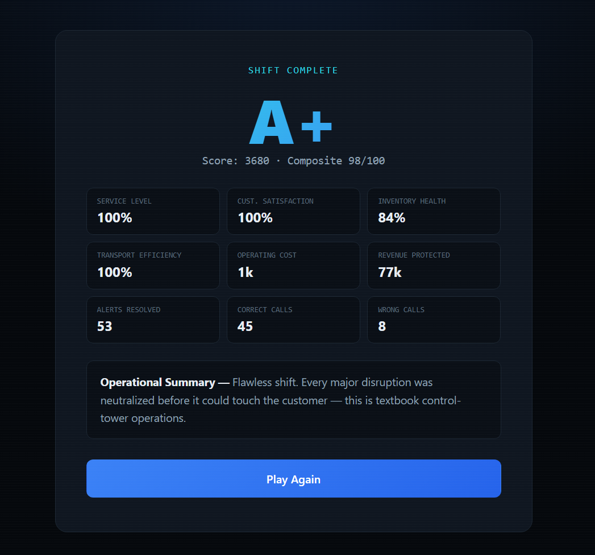

# 🚀 Day 31 – AI Supply Chain Control Tower

## 📌 Overview

For Day 31 of the **60 Days Claude AI Challenge**, I built an **AI Supply Chain Control Tower**—a real-time operations simulator that places the user in the role of a **Head of Operations**.

The objective is to respond quickly to supply chain disruptions, make strategic decisions, and protect key business metrics before time runs out.

---

# ✨ Features

- 🚨 Live Incident Feed
- ⏱️ 3-Minute Real-Time Simulation
- 📊 Live KPI Dashboard
- 🎯 Decision-Based Scoring
- 📈 Performance Analytics
- 📋 Event Log
- 📡 Network Monitoring
- 🌙 Premium Enterprise Dashboard
- 🔄 Replayable Experience
- 📱 Fully Responsive Design

---

# 🛠️ Technologies Used

- HTML
- CSS
- JavaScript
- React (CDN)
- Claude AI

---

# 📸 Screenshots

## 🚀 Simulation Briefing

---

## 📊 Live Control Tower Dashboard

---

## 🏆 Final Performance Dashboard

---

# 💡 Key Learnings

- Real-time operational decisions directly influence business performance.
- A single supply chain disruption can affect multiple KPIs simultaneously.
- Monitoring dashboards help prioritize incidents more effectively.
- Balancing cost, customer satisfaction, inventory, and service levels is essential during disruptions.
- Building interactive simulations is an engaging way to understand real-world supply chain operations.

---

# 📂 Project Files

- 📄 index.html
- 📄 day31.md
- 📸 Screenshots
- 🎥 Demo Video

---

# 🎯 Skills Strengthened

- Prompt Engineering
- Frontend Development
- React Fundamentals
- UI/UX Design
- Supply Chain Operations
- Decision-Based Simulation Design
- Business KPI Analysis

---

## ✅ Challenge Progress

**Day:** 31/60

Thirty-one days in, and every challenge continues to teach me something new. From prompt engineering to building interactive applications, this journey is helping me grow one project at a time.

Looking forward to Day 32! 🚀

---

### #60DaysClaudeAIChallenge

**Learning • Building • Improving Every Day**
