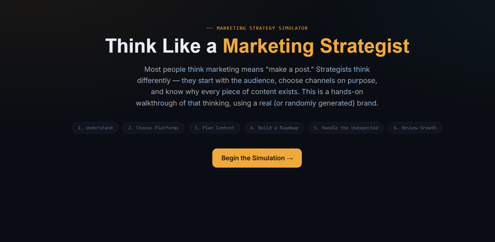
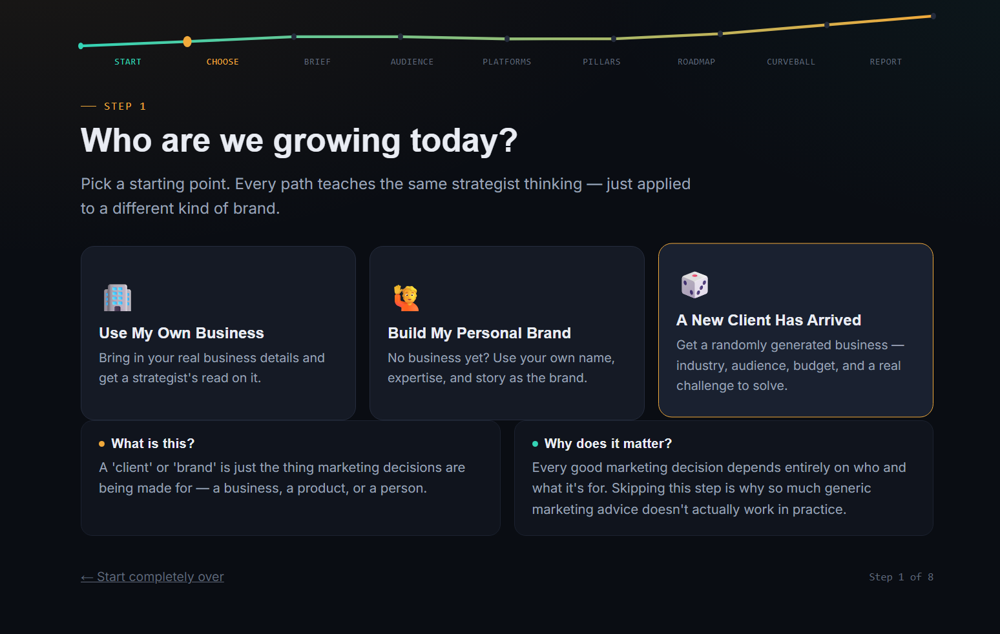
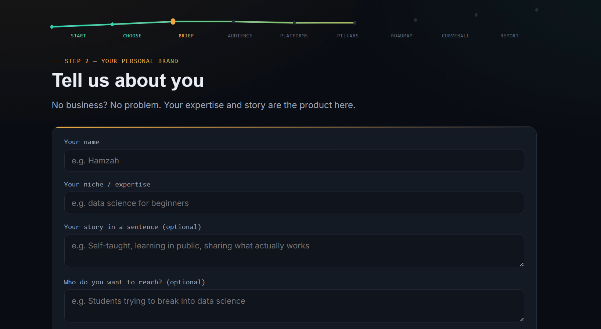
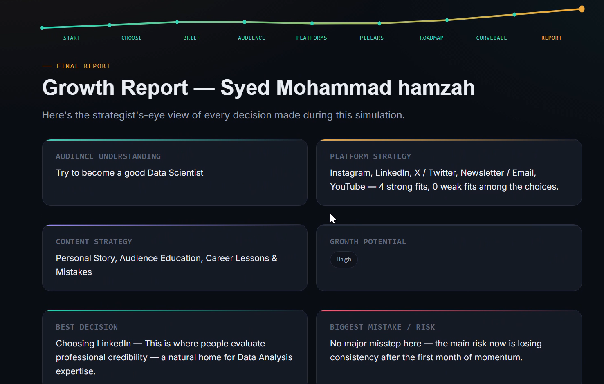

# 🚀 Day 32 – Think Like a Marketing Strategist

## 📌 Overview

For Day 32 of the **60 Days Claude AI Challenge**, I built **Think Like a Marketing Strategist: Grow This Brand**, an interactive learning application that teaches beginners how marketers actually think.

Instead of simply generating marketing content, the simulator walks users through creating a complete marketing strategy—from understanding the audience to selecting platforms, planning content, handling unexpected marketing events, and reviewing a final growth report.

Every major step also includes a **"How to Ask Claude"** section to help users improve their prompt engineering skills while learning marketing strategy.

---

# ✨ Features

- 🏢 Use Your Own Business
- 🙋 Build Your Personal Brand
- 🎲 Random Business Generator
- 👥 Audience Research & Brand Positioning
- 📱 Platform Selection with Explanations
- 📝 Content Pillar Strategy
- 📅 30-Day Marketing Roadmap
- ⚡ Marketing Curveball Simulation
- 📊 Personalized Growth Report
- 🤖 Prompt Engineering Cards
- 🌙 Modern Responsive UI
- 🔄 Replayable Experience

---

# 🛠️ Technologies Used

- HTML
- CSS
- JavaScript
- React (CDN)
- Claude AI

---

# 📸 Screenshots

## 🚀 Welcome Screen

---

## 🎯 Choose Your Marketing Journey

---

## 📝 Build Your Personal Brand

---

## 📊 Final Growth Report

---

# 💡 Key Learnings

- Successful marketing begins with understanding the audience before creating content.
- Different social media platforms serve different business goals.
- Personal branding is built through consistency, authenticity, and a clear niche.
- Strategic content pillars help maintain long-term audience engagement.
- Prompt engineering can be used to build interactive educational applications that teach real-world skills.
- Combining React with thoughtful UX creates engaging learning experiences.

---

# 📂 Project Files

- 📄 index.html
- 📄 day32.md
- 📸 Screenshots
- 🎥 Demo Video

---

# 🎯 Skills Strengthened

- Prompt Engineering
- Marketing Strategy
- Personal Branding
- React Fundamentals
- UI/UX Design
- Product Thinking
- Frontend Development
- Educational Application Design

---

## ✅ Challenge Progress

**Day:** 32/60

Thirty-two days into the challenge, and every project pushes me to think beyond coding. This challenge is helping me combine AI, product thinking, design, and real-world business concepts into interactive applications that make learning engaging and practical.

Looking forward to Day 33! 🚀

---

### #60DaysClaudeAIChallenge

**Learning • Building • Improving Every Day**
