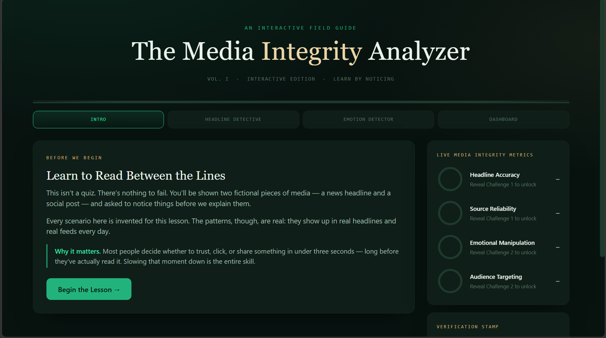
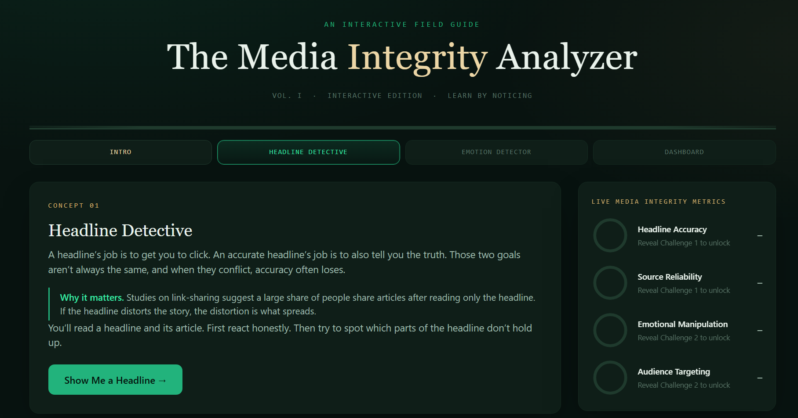
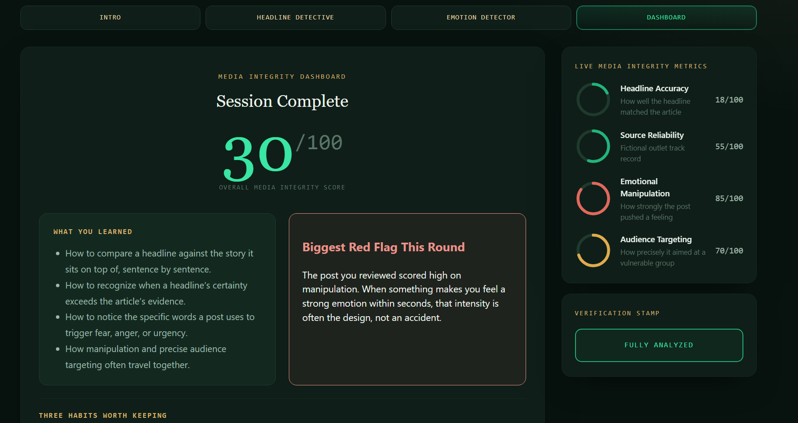

# 📰 Day 33 – The Media Integrity Analyzer

## 📌 Overview

For Day 33 of the **60 Days Claude AI Challenge**, I built **The Media Integrity Analyzer**, an interactive educational web application that teaches users how to recognize misleading headlines, emotional manipulation, and persuasive techniques commonly used across digital media.

Rather than telling users what to believe, the application encourages them to slow down, analyze information critically, and identify patterns often found in clickbait articles and social media posts.

Every scenario inside the application is fictional but designed around real-world media literacy concepts.

---

# ✨ Features

- 📰 Interactive Headline Detective
- ❤️ Emotion Detection Challenge
- 📊 Live Media Integrity Metrics
- 🎯 Audience Targeting Analysis
- 🧠 Clickbait Detection
- 📖 Educational Explanations
- 📈 Final Media Integrity Dashboard
- 🔄 Replayable Learning Experience
- 🌙 Modern Responsive UI
- ⚛️ Built with React (CDN)

---

# 🛠️ Technologies Used

- HTML
- CSS
- JavaScript
- React (CDN)
- Claude AI

---

# 🎯 Learning Objectives

The application teaches users to:

- Compare headlines with their actual stories
- Identify exaggerated language
- Detect emotional manipulation
- Understand audience targeting
- Recognize clickbait techniques
- Develop stronger media literacy skills
- Think critically before sharing online content

---

# 📸 Screenshots

## 🏠 Welcome Screen

---

## 📰 Headline Detective

---

## 📊 Media Integrity Dashboard

---

# 💡 Key Learnings

- Not every headline accurately represents the article.
- Emotional language is often used to increase engagement.
- Viral content frequently relies on urgency and curiosity.
- Strong digital literacy requires questioning information before sharing it.
- Interactive educational tools make complex concepts easier to understand.
- Prompt engineering can be used to create meaningful learning experiences beyond traditional AI chat applications.

---

# 📂 Project Structure

- 📄 index.html
- 📄 day33.md
- 📸 Screenshots
- 🎥 Demo Video

---

# 🚀 Skills Strengthened

- Prompt Engineering
- React Fundamentals
- UI/UX Design
- Educational Application Design
- Critical Thinking
- Media Literacy
- Frontend Development
- Product Thinking

---

# 📈 Challenge Progress

**Day:** 33/60

This project focused on using AI to create an educational experience that encourages users to think critically about the information they consume every day. It reinforced how technology can be used not only to build applications but also to promote digital awareness and responsible media consumption.

---

## 📸 Images Used

---

### #60DaysClaudeAIChallenge

**Learning • Building • Improving Every Day**
