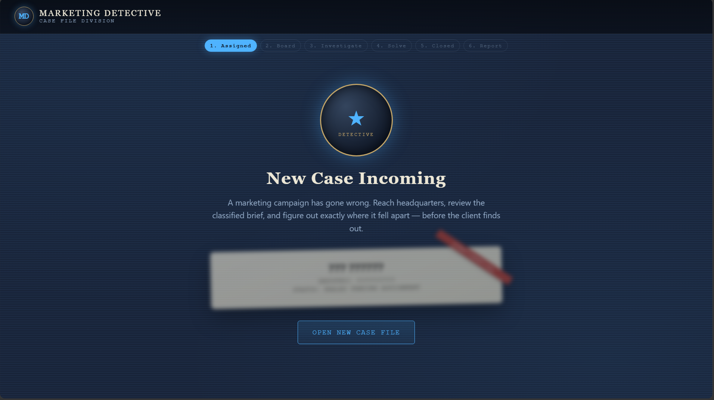
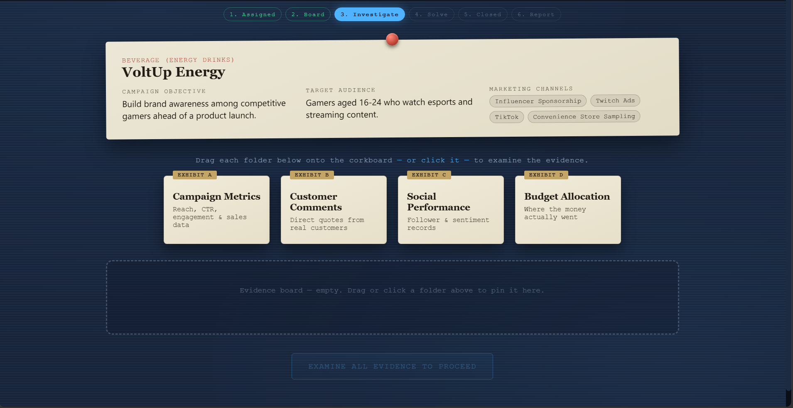
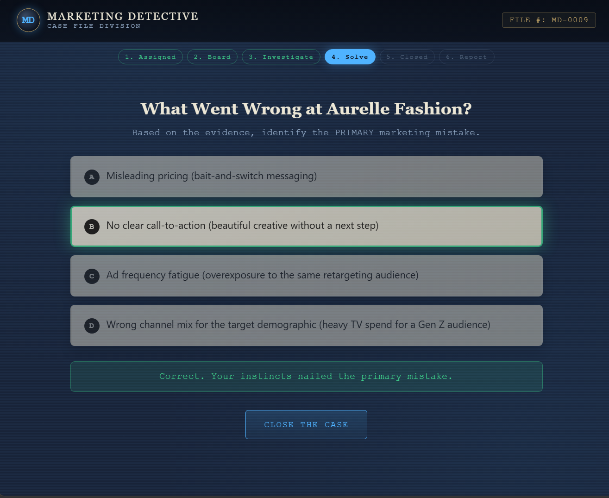
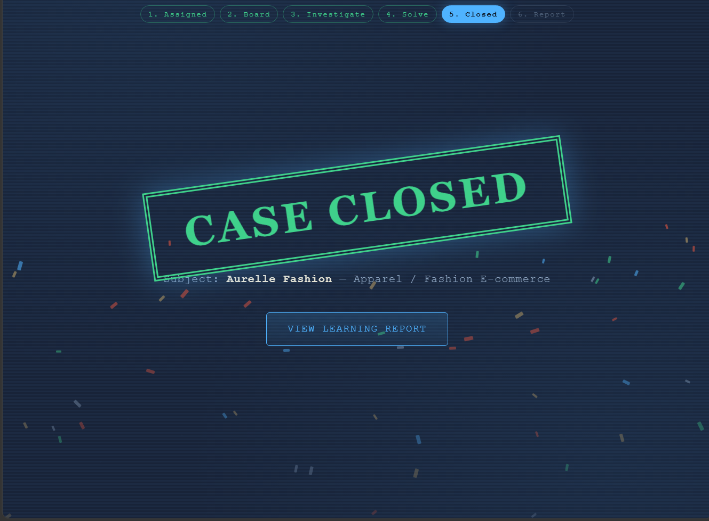
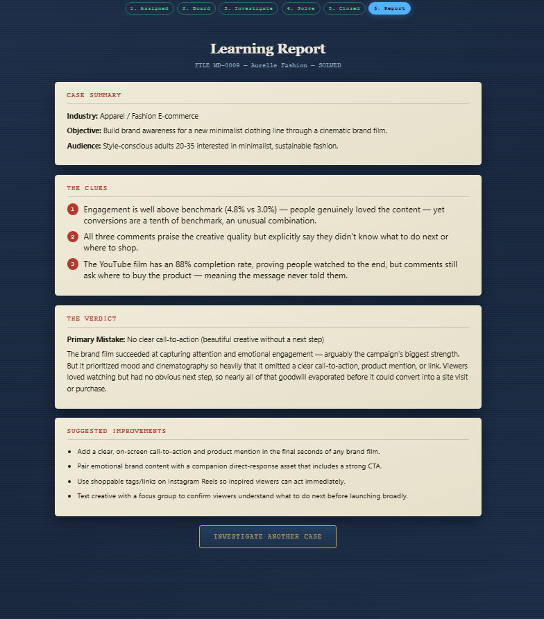

# 🕵️ Day 34 – Marketing Detective

## Overview

For Day 34 of the **60 Days Claude AI Challenge**, I built **Marketing Detective**, an interactive detective-style learning application that transforms marketing analysis into an investigation game.

Instead of reading case studies, users become detectives who analyze campaign data, inspect evidence, identify the marketing mistake, and generate a final learning report.

Every new game randomly loads a different fictional marketing campaign, making each investigation unique.

---

# Features

- 🕵️ Detective-themed interface
- 📂 Random marketing case generation
- 📊 Campaign metrics analysis
- 💬 Customer comment investigation
- 📱 Social media performance review
- 💰 Budget allocation breakdown
- 📌 Interactive evidence board
- 🎯 Solve the marketing mystery
- 🎉 Case Closed animation
- 📖 Detailed learning report
- 📱 Responsive design

---

# Technologies Used

- HTML5
- CSS3
- JavaScript
- Claude AI

---

# Key Learnings

- Marketing decisions should always be supported by data.
- Customer feedback provides valuable business insights.
- Interactive learning creates a better educational experience.
- UI and storytelling can make complex topics enjoyable.
- Marketing is about solving customer problems.

---

# Screenshots

## Case Assignment

---

## Investigation Board

---

## Solving the Case

---

## Case Closed

---

## Learning Report

---

# Skills Practiced

- Prompt Engineering
- JavaScript
- UI/UX Design
- Interactive Web Development
- Marketing Strategy
- Problem Solving
- Storytelling Through Design

---

# Challenge Progress

**Day 34 / 60**

Today's project focused on combining frontend development with marketing education by creating an interactive detective experience that makes learning more engaging and memorable.

---

⭐ Thank you for visiting this project!

#60DaysClaudeAIChallenge
