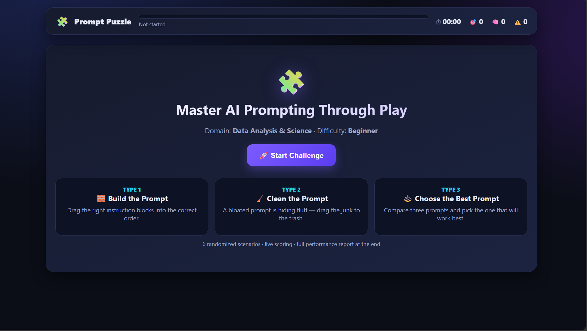
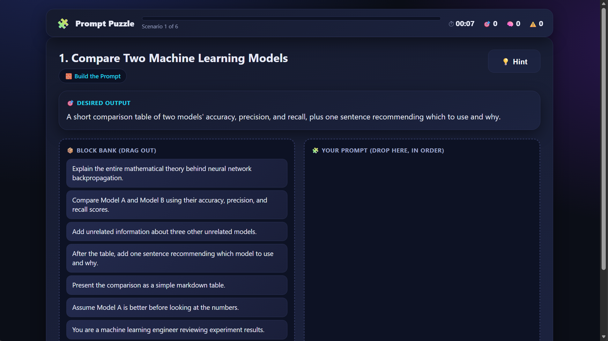
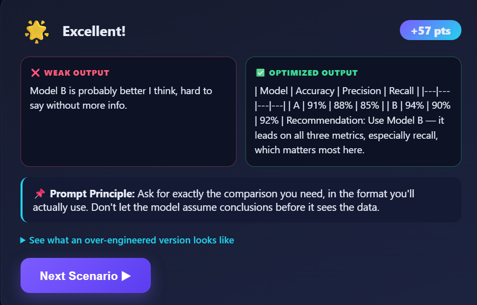
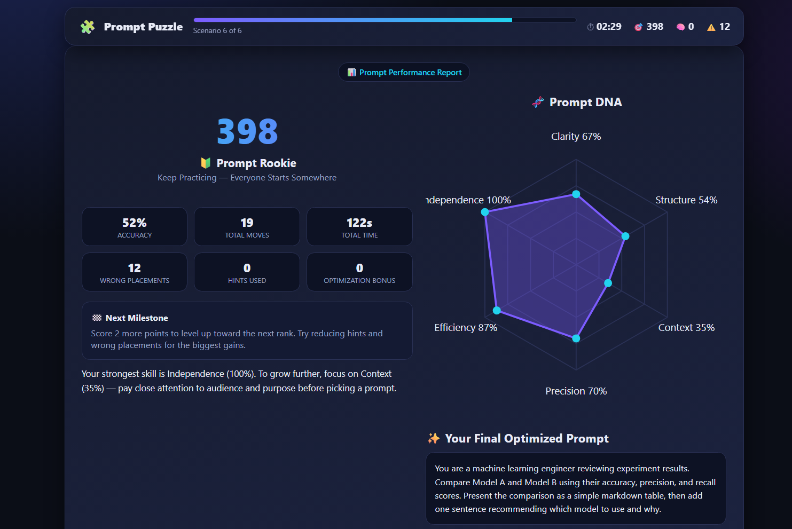

# 🧩 Day 35 – Prompt Puzzle: Master AI Prompting Through Play

## 📖 Overview

For **Day 35** of the **60 Days Claude AI Challenge**, I built **Prompt Puzzle**, an interactive browser-based game that teaches Prompt Engineering through hands-on problem solving.

Instead of reading documentation, users improve their prompting skills by solving realistic AI prompting challenges, receiving immediate feedback, and tracking their progress with a detailed Prompt Performance Report.

The entire application works offline inside a single HTML file.

---

# ✨ Features

- 🧩 Interactive Prompt Engineering Game
- 🎮 Three Different Challenge Modes
  - Build the Prompt
  - Clean the Prompt
  - Choose the Best Prompt
- 🎲 Randomized Scenarios
- 📊 Live Scoring System
- ⏱ Time Tracking
- 🎯 Accuracy Tracking
- 🧠 Hint System
- ⚠ Wrong Placement Counter
- ⭐ Optimization Bonus
- 📈 Prompt Performance Report
- 🧬 Prompt DNA Visualization
- 🎉 Animated Results Screen
- 🔄 Replay with New Scenarios
- 📱 Fully Responsive Design
- 💻 Works Completely Offline

---

# 🎮 Gameplay

### 1️⃣ Start Challenge

Select your preferred learning path and begin the Prompt Puzzle journey.

---

### 2️⃣ Build the Prompt

Arrange instruction blocks into the correct order to create an effective AI prompt.

---

### 3️⃣ Learn from Feedback

Compare weak AI responses with optimized outputs and understand the prompt engineering principles behind better results.

---

### 4️⃣ Prompt Performance Report

Review your Prompt Score, Prompt DNA, personalized feedback, and final optimized prompt.

---

# 🛠 Technologies Used

- HTML5
- CSS3
- JavaScript
- Claude AI

---

# 📚 Key Learnings

- Prompt Engineering is about clarity rather than complexity.
- Well-structured prompts consistently produce better AI outputs.
- Defining audience, context, and expected format significantly improves responses.
- Interactive learning makes prompt engineering easier to understand and practice.
- Immediate feedback accelerates learning and skill improvement.

---

# 💡 Skills Practiced

- Prompt Engineering
- UI/UX Design
- Frontend Development
- JavaScript
- Drag and Drop Interfaces
- Game Design
- Instructional Design
- User Experience Design
- Interactive Learning Systems

---

# 🚀 Challenge Progress

**Day 35 / 60**

Today's goal was to transform prompt engineering from passive learning into an engaging, game-based experience where users learn by solving practical AI challenges.

---

⭐ Thanks for checking out this project!

#60DaysClaudeAIChallenge
