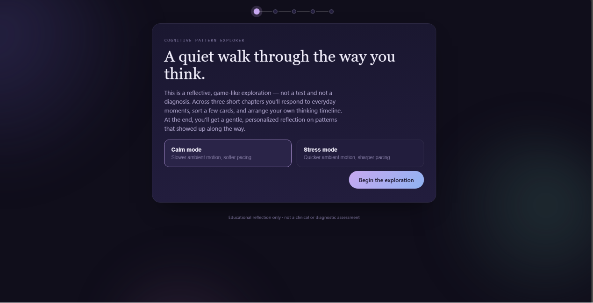
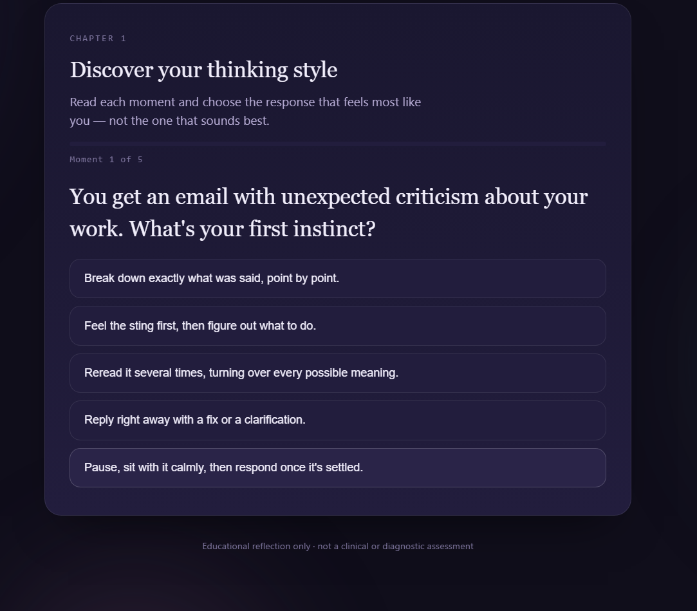
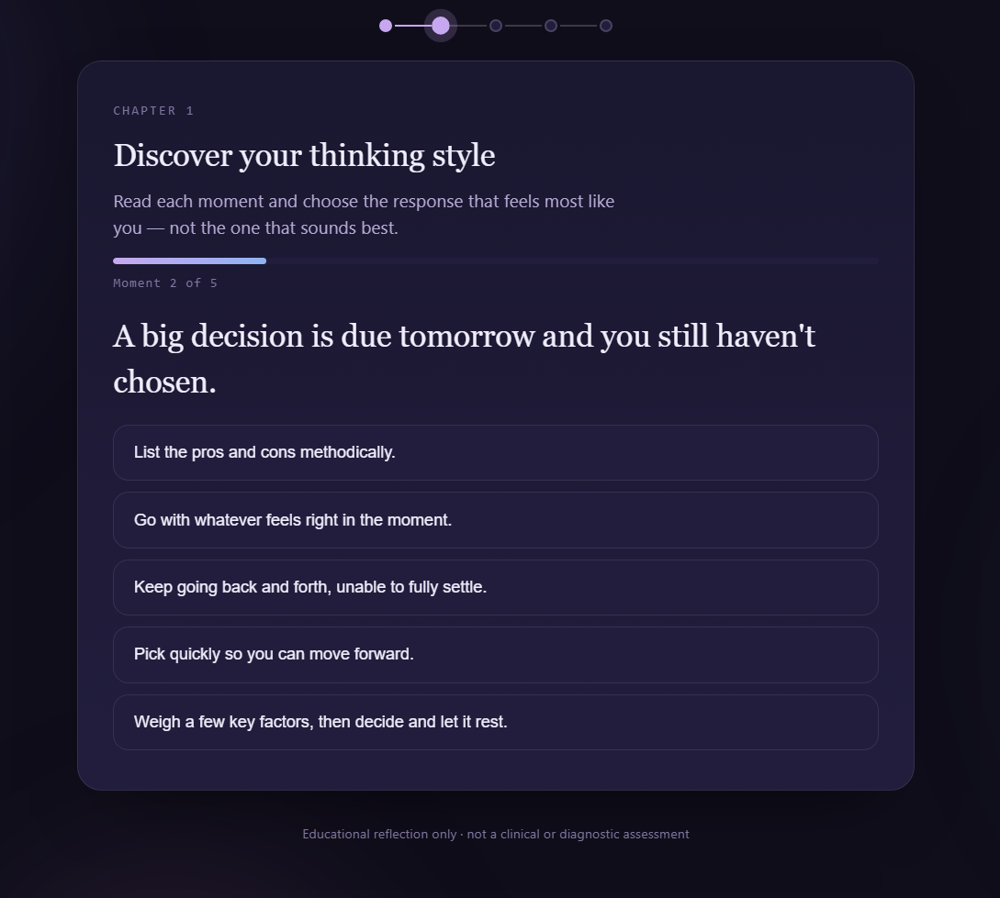
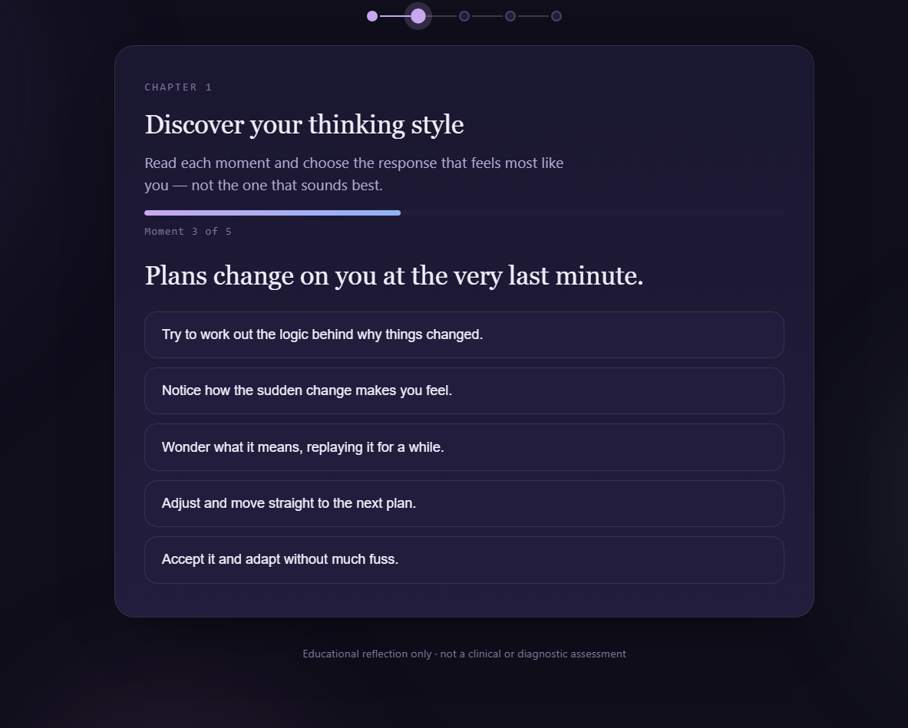
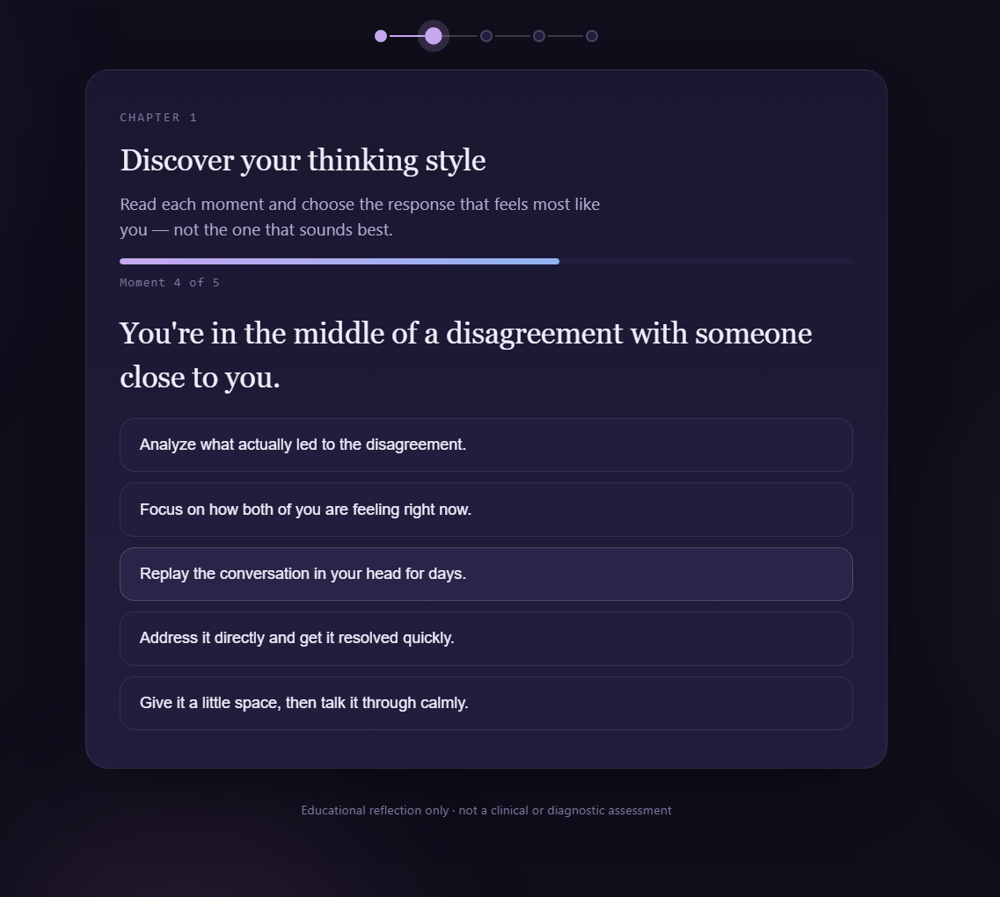
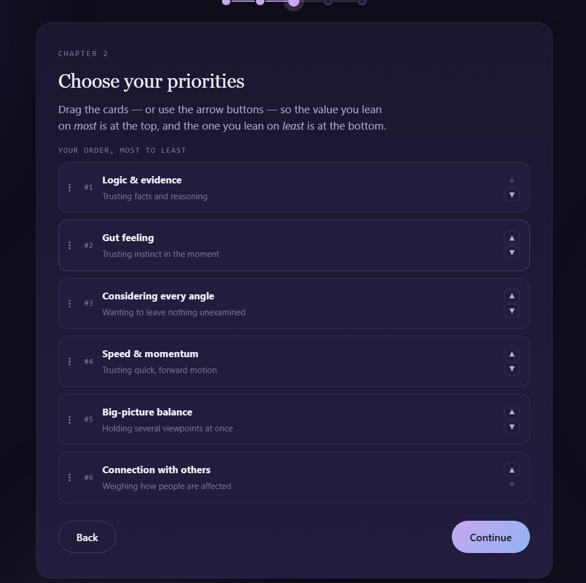
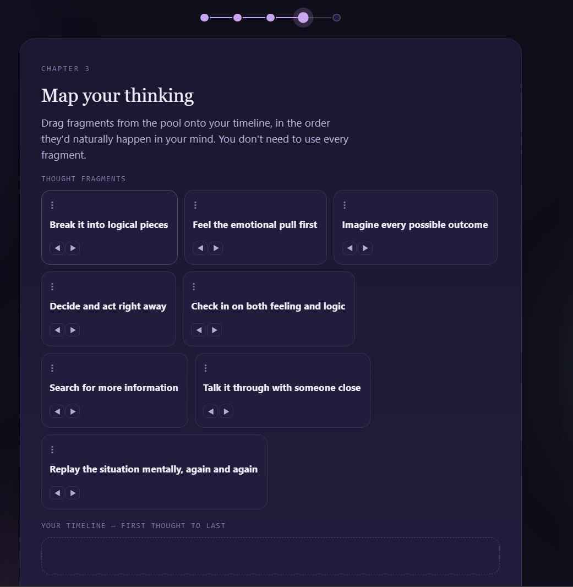
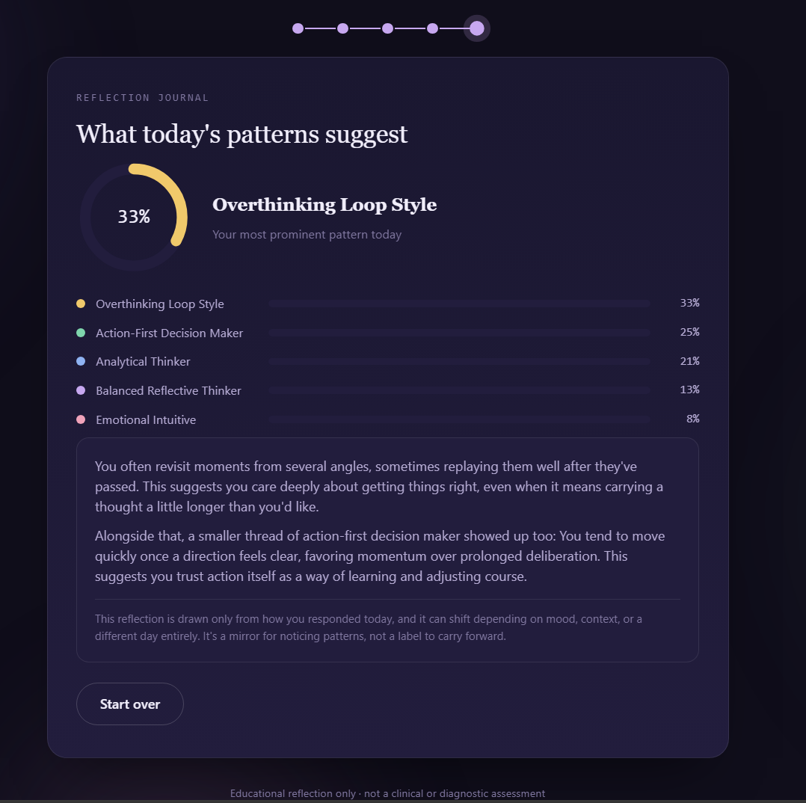

# 🧠 Day 36 – Cognitive Pattern Explorer

## 📖 Overview

For **Day 36** of the **60 Days Claude AI Challenge**, I built **Cognitive Pattern Explorer**, an interactive reflection experience that encourages users to explore how they naturally think and make decisions.

Rather than functioning as a personality test or diagnostic assessment, the application guides users through a series of interactive activities designed to promote self-awareness and thoughtful reflection.

The entire application works offline inside a single HTML file.

---

# ✨ Features

- 🧠 Interactive Reflection Experience
- 📖 Three Guided Chapters
- 🎯 Scenario-Based Decision Making
- 📝 Everyday Reflection Questions
- 📊 Dynamic Progress Indicators
- 🧩 Drag-and-Drop Activities
- 📋 Priority Ranking System
- 🧠 Thought Timeline Builder
- 📈 Personalized Reflection Journal
- 🎨 Premium Minimal UI
- 🌙 Calm & Stress Interaction Modes
- ✨ Smooth Micro-interactions
- 📱 Responsive Design
- 💻 Fully Offline Support

---

# 🎮 Application Walkthrough

## 1️⃣ Welcome Screen

Choose between **Calm Mode** or **Stress Mode** before beginning the reflection journey.

---

## 2️⃣ Chapter 1 – Discover Your Thinking Style

Respond to realistic everyday situations by selecting the response that best reflects how you naturally think.

---

## 3️⃣ Chapter 2 – Choose Your Priorities

Rank your decision-making values from most important to least important using interactive drag-and-drop controls.

---

## 4️⃣ Chapter 3 – Map Your Thinking

Build your own thinking timeline by arranging thought fragments in the order they naturally occur.

---

## 5️⃣ Reflection Journal

Receive a personalized reflection summarizing your dominant thinking patterns with visual insights and gentle feedback.

---

# 🛠 Technologies Used

- HTML5
- CSS3
- Vanilla JavaScript
- Claude AI

---

# 📚 What I Learned

- Designing thoughtful user experiences goes beyond visual design.
- Reflection tools should encourage awareness instead of labeling users.
- Small UI details like typography, spacing, and animation significantly improve user engagement.
- Interactive storytelling can make educational experiences feel more immersive.
- Building offline-first applications improves accessibility and portability.

---

# 💡 Skills Practiced

- Frontend Development
- UI Design
- UX Design
- Instructional Design
- Interaction Design
- JavaScript
- Responsive Web Design
- Human-Centered Design
- Prompt Engineering

---

# 🚀 Challenge Progress

**Day 36 / 60**

Today's goal was to create a calm, interactive experience that helps users reflect on their thinking patterns through engaging activities rather than traditional assessments.

---

⭐ Thanks for checking out this project!

If you enjoyed it, feel free to ⭐ the repository and share your feedback.

#60DaysClaudeAIChallenge
