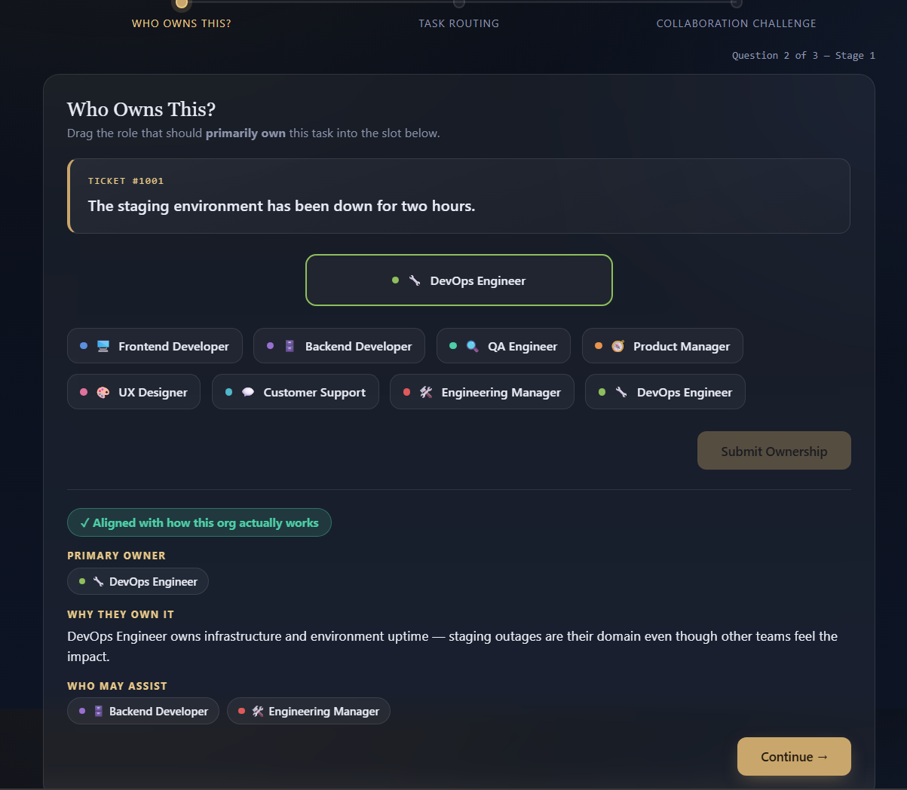
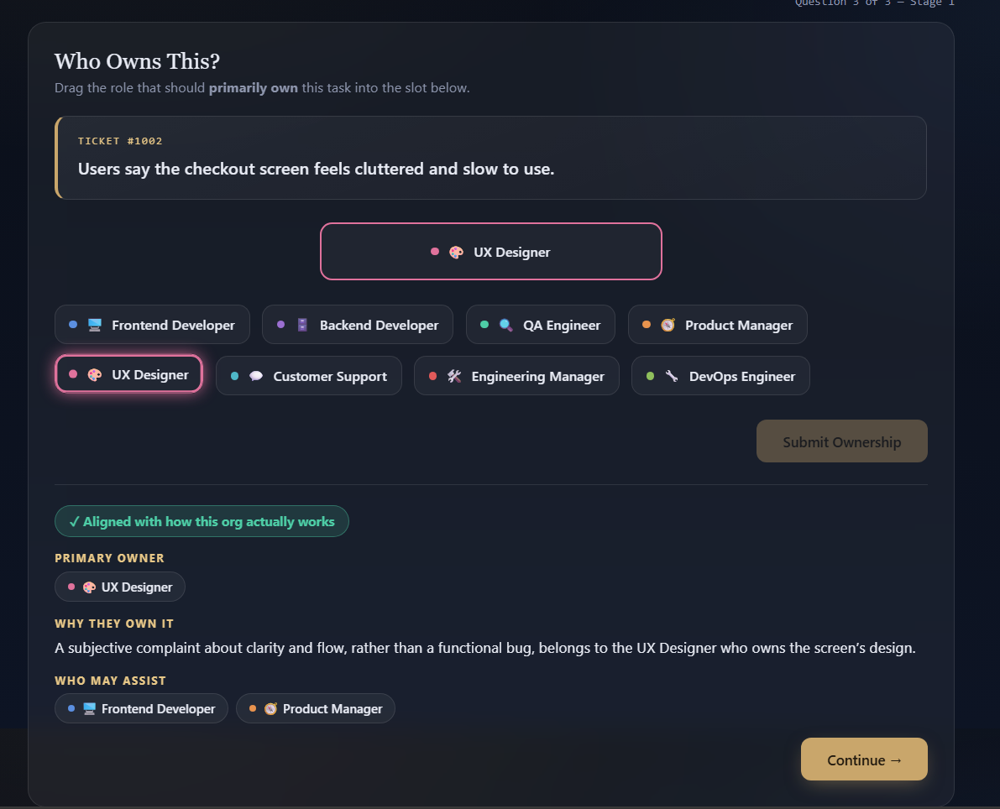
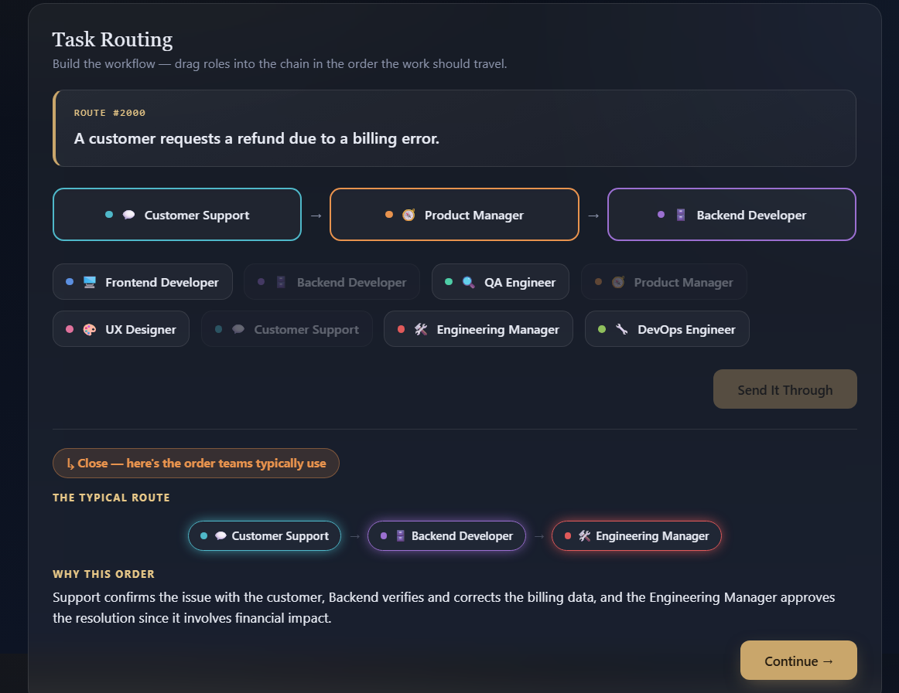
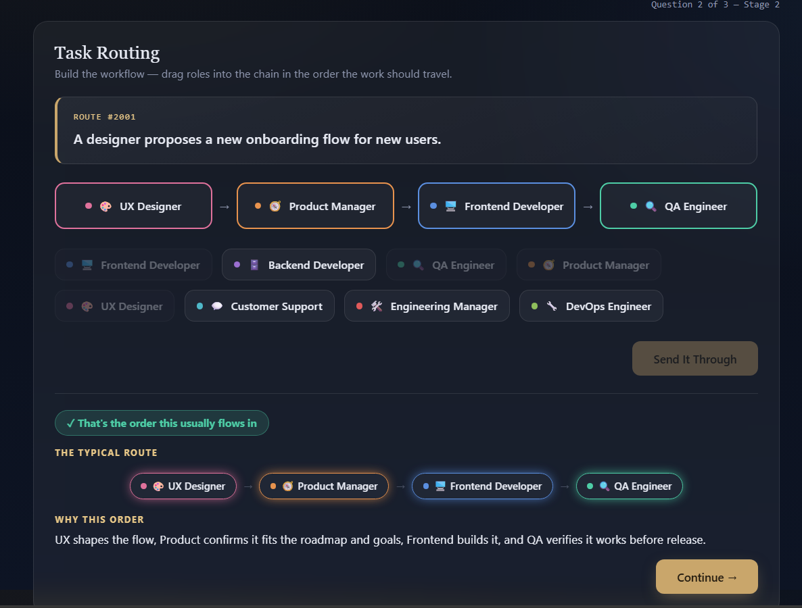
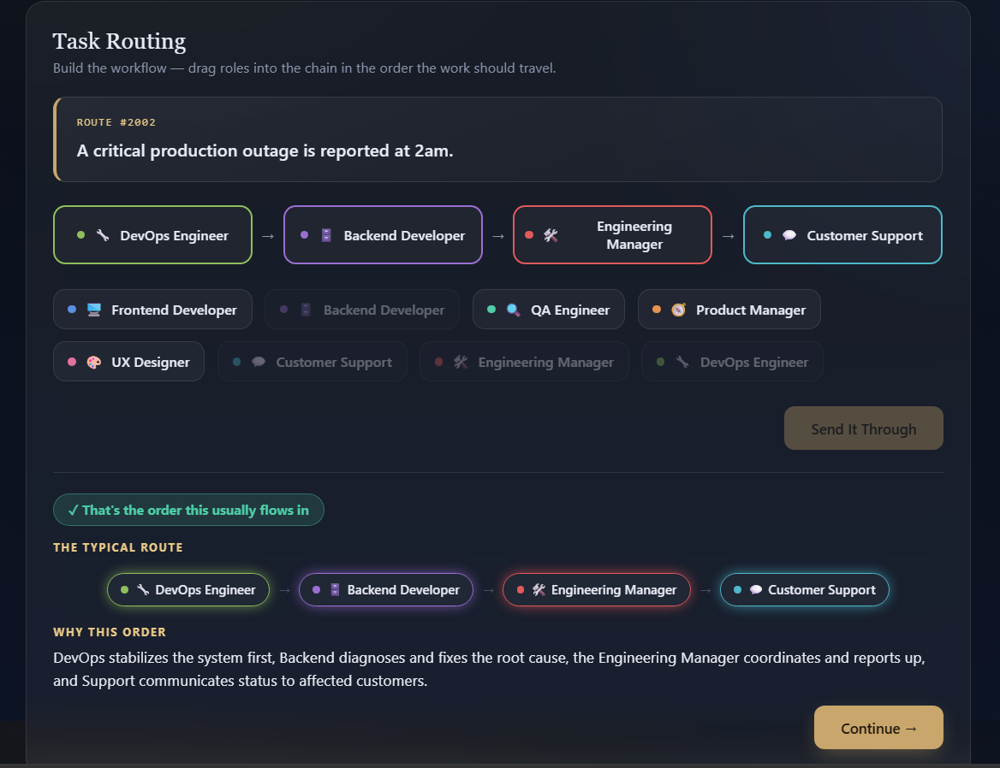
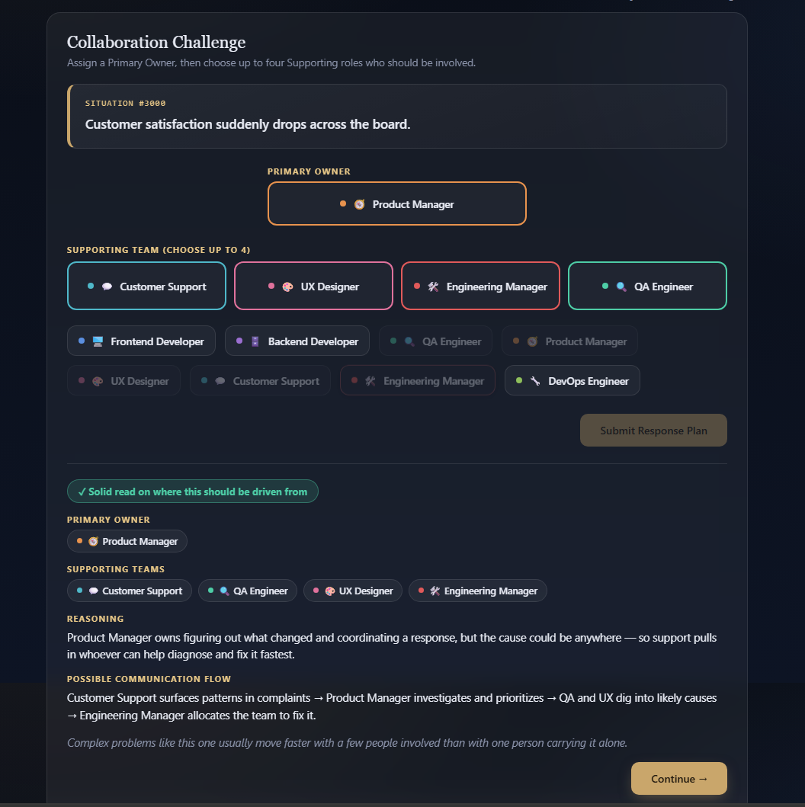
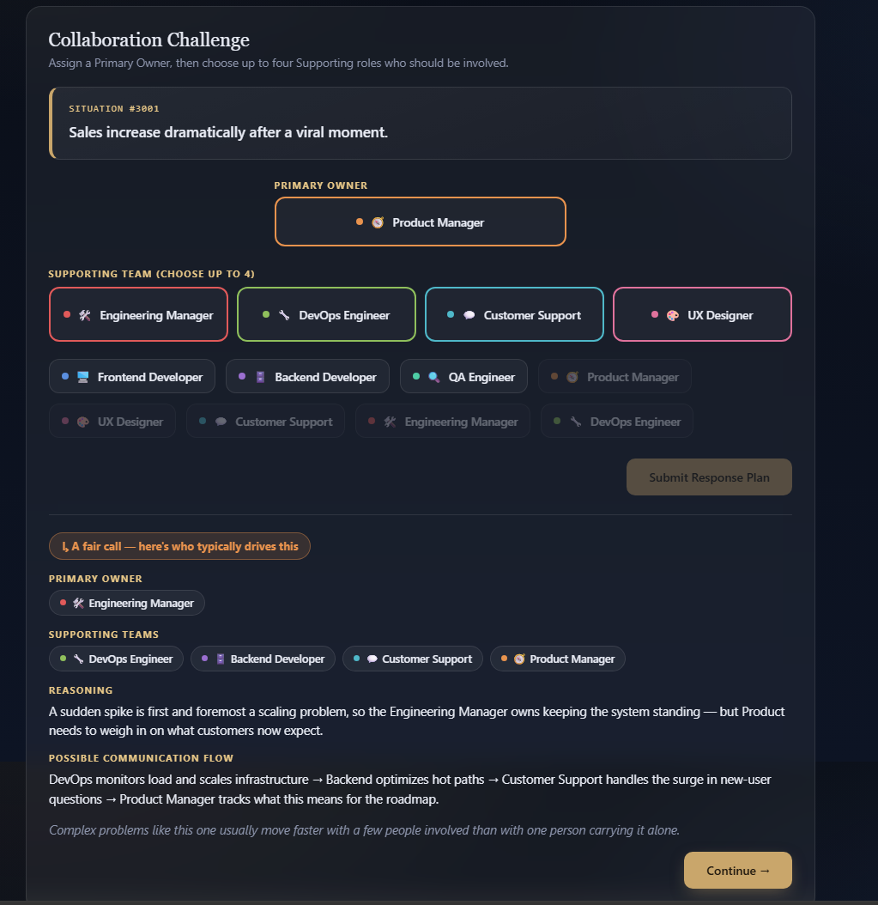
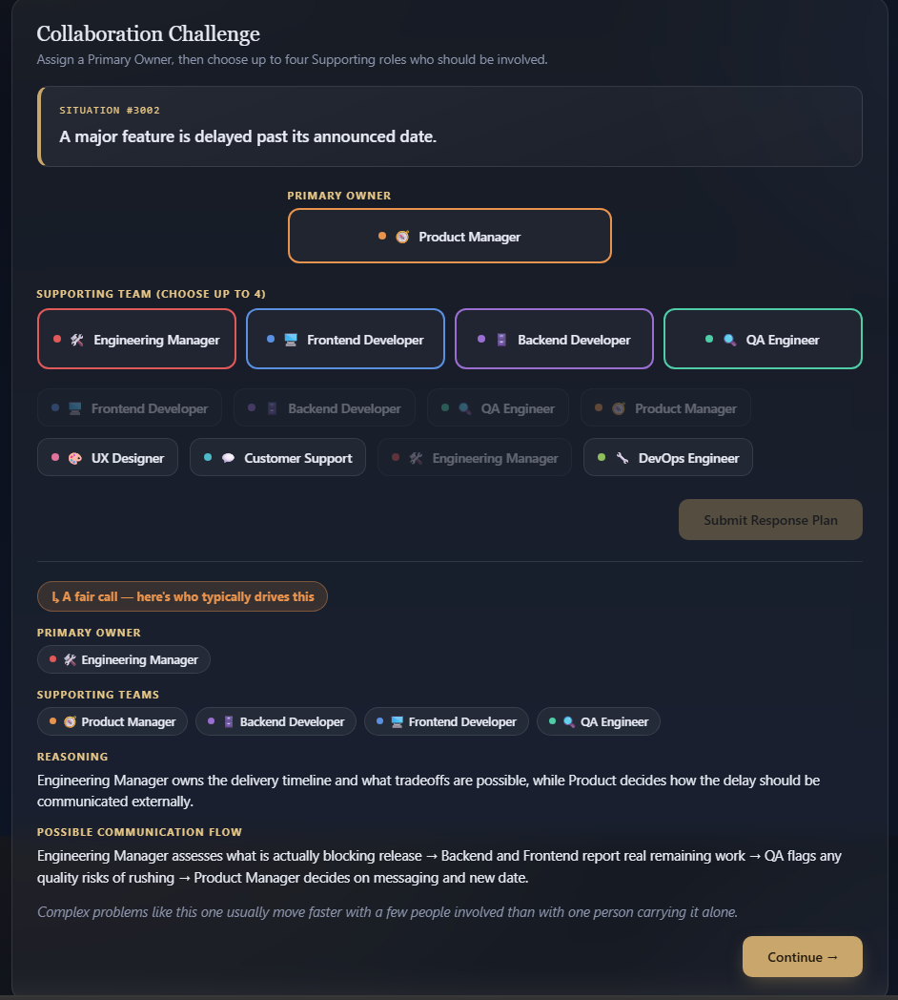

# 🚀 Day 37 – Task Compass

### Learn How Work Flows Through Real Organizations

Welcome to **Day 37** of my **60 Days Claude AI Challenge by ABTalks**!

Today's challenge was different from building a typical web application. Instead of focusing on algorithms or CRUD operations, I built an **interactive educational simulation** that teaches one of the most overlooked skills in software engineering:

> **How work actually moves through an organization.**

Many aspiring developers know what different roles do, but few understand **who owns a problem, how tasks move between teams, and why collaboration is essential.**

That's exactly what **Task Compass** aims to teach.

---

## 🎯 Project Overview

**Task Compass** is a single-page interactive learning experience that simulates how real organizations handle work.

Rather than giving lectures, it lets users make decisions, compare them with real-world workflows, and understand the reasoning behind them.

---

# ✨ Features

## 🧩 Stage 1 — Who Owns This?

Players receive realistic workplace situations and identify the team that should primarily own the task.

Examples include:

- Password reset confusion
- Staging environment outage
- Checkout UX issue

Each decision includes:

- ✅ Primary Owner
- 🤝 Supporting Teams
- 💡 Why that ownership makes sense

---

## 🔄 Stage 2 — Task Routing

Not every task belongs to a single person.

Players build the workflow by arranging teams in the order work naturally moves through an organization.

Scenarios include:

- Billing issues
- Product features
- Production incidents

The application then explains why that workflow is commonly followed in real companies.

---

## 🤝 Stage 3 — Collaboration Challenge

Large business problems require teamwork.

Players assign:

- 🎯 Primary Owner
- 👥 Supporting Teams

After submission the simulator explains:

- Why that ownership works
- Supporting departments
- Communication flow
- Organizational reasoning

---

# 💡 Key Learning

One of the biggest lessons from this challenge was:

> **Ownership creates accountability, but collaboration creates solutions.**

Real organizations succeed because responsibilities are clear while teams work together to solve complex problems.

---

# 🛠 Skills Practiced

- HTML
- CSS
- Vanilla JavaScript
- Drag & Drop Interfaces
- UI/UX Design
- Educational Game Design
- Workflow Visualization
- Organizational Thinking
- Frontend Development

---

# 📸 Project Screenshots

## Stage 1 — Ownership Decisions

### Scenario: Staging Environment Outage

---

### Scenario: Checkout UX Issue

---

## Stage 2 — Task Routing

### Customer Billing Workflow

---

### Product Feature Workflow

---

### Production Outage Workflow

---

## Stage 3 — Collaboration Challenges

### Customer Satisfaction Drops

---

### Sales Suddenly Increase

---

### Feature Delay Management

---

# 📚 What I Learned

This project reminded me that building software isn't only about writing code.

It's also about understanding:

- how teams communicate,
- how responsibilities are shared,
- and how organizations solve problems together.

Great products are rarely built by one person—they're built through effective collaboration.

---

## 🙌 Acknowledgements

Special thanks to **ABTalks** for another creative challenge that encouraged me to think beyond traditional web development and explore organizational design through interactive learning.

---

### 🚀 Day 37 / 60 Complete

**Building • Learning • Sharing Every Day**
