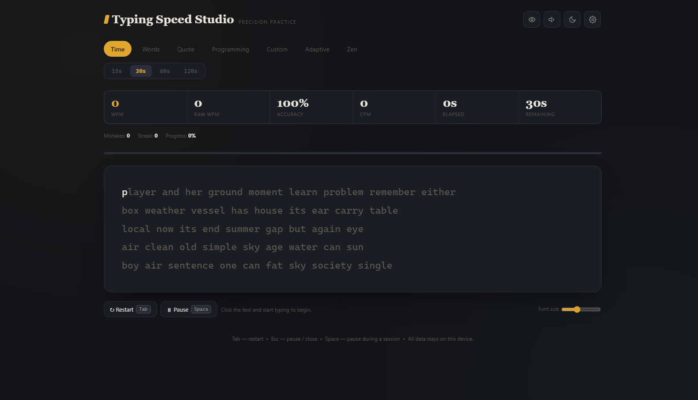
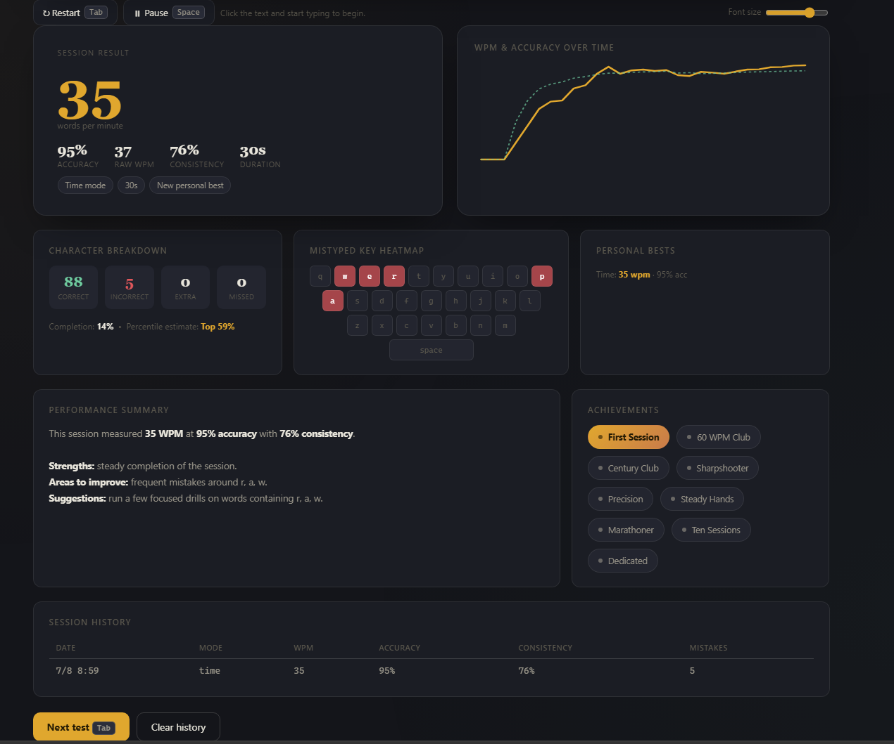

# ⌨️ Day 38 – Typing Speed Studio

### Premium Typing Practice Platform

Welcome to **Day 38** of my **60 Days Claude AI Challenge by ABTalks!**

Today I built **Typing Speed Studio**, a modern typing practice application inspired by platforms like Monkeytype while adding richer analytics, multiple practice modes, customization, and a polished user experience.

The goal was to create a typing trainer that not only measures speed but also helps users understand **how to improve**.

---

# 🚀 Project Overview

Typing Speed Studio is a single-page interactive web application that allows users to practice typing in multiple ways while receiving detailed performance insights after every session.

The application focuses on speed, accuracy, consistency, and long-term improvement.

---

# ✨ Features

## ⌨️ Multiple Practice Modes

- Time Mode (15s, 30s, 60s, 120s)
- Word Count Mode
- Quote Mode
- Programming Mode
- Custom Text Mode
- Adaptive Mode
- Focus Mode
- Zen Mode

---

## 📊 Live Statistics

During every typing session users can track:

- Words Per Minute (WPM)
- Raw WPM
- Accuracy
- Characters Per Minute (CPM)
- Mistakes
- Current Streak
- Progress
- Remaining Time

---

## 📈 Analytics Dashboard

After every completed session the application displays:

- Session WPM
- Accuracy
- Raw WPM
- Consistency
- Character Breakdown
- Mistyped Key Heatmap
- WPM Progress Graph
- Personal Bests
- Achievement Badges
- Performance Summary
- Session History

---

## ⚙️ Additional Features

- Dark & Light Themes
- Accent Color Customization
- Sound Effects
- Adjustable Font Size
- Pause & Resume
- Keyboard Shortcuts
- Local Storage for Session History
- Responsive Design
- Smooth Animations

---

# 🛠️ Technologies Used

- HTML5
- CSS3
- Vanilla JavaScript
- Local Storage
- SVG Graphs

---

# 💡 What I Learned

This challenge helped me understand that creating a premium application goes far beyond writing functional code.

I practiced designing intuitive user interfaces, building accurate performance calculations, creating meaningful analytics, and focusing on delivering an engaging user experience.

---

# 📸 Screenshots

## Home Screen

---

## Session Analytics Dashboard

---

# 🎯 Skills Practiced

- Frontend Development
- JavaScript Logic
- Performance Tracking
- UI/UX Design
- Responsive Design
- Data Visualization
- Local Storage
- Educational Product Design

---

# 🙌 Acknowledgements

Special thanks to **ABTalks** for another amazing challenge in the **60 Days Claude AI Challenge**. Every project pushes me to explore a new area of software development and improve my problem-solving skills.

---

## 🚀 Day 38 / 60 Complete

**Learn • Build • Improve • Repeat**
