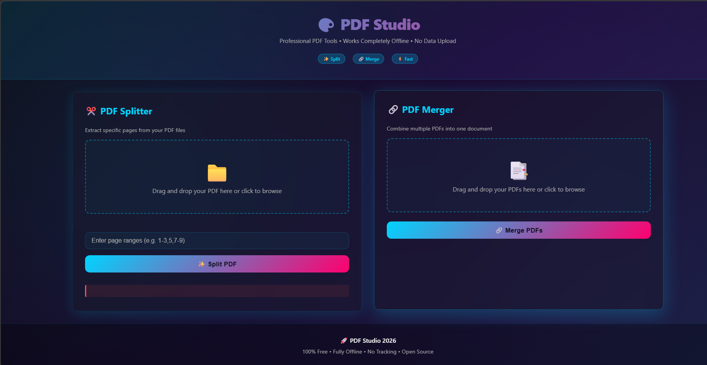

# 📄 Day 39 – PDF Studio

### Offline PDF Splitter & Merger

Welcome to **Day 39** of my **60 Days Claude AI Challenge by ABTalks!**

Today I built **PDF Studio**, a premium browser-based PDF utility that allows users to split and merge PDF documents entirely on their device.

Unlike many online PDF tools, PDF Studio performs all processing locally, ensuring privacy, speed, and offline functionality.

---

# 🚀 Project Overview

PDF Studio is a modern single-page web application designed to simplify common PDF operations while delivering a clean, responsive, and professional user experience.

All document processing happens inside the browser using JavaScript, eliminating the need for external servers or uploads.

---

# ✨ Features

## 📄 PDF Splitter

- Upload PDF files
- Automatic page detection
- Live page thumbnail previews
- Custom page range selection
- Input validation for page ranges
- Instant PDF extraction
- Download split documents

---

## 🔗 PDF Merger

- Upload multiple PDF files
- Drag-and-drop file upload
- Drag-and-drop file reordering
- Automatic page count detection
- Merge multiple PDFs into one document
- Download merged PDF instantly

---

## 🎨 User Experience

- Modern commercial UI
- Responsive layout
- Smooth animations
- Drag & Drop support
- Loading indicators
- Error handling
- Offline-first functionality
- Privacy-focused processing

---

# 🛠️ Technologies Used

- HTML5
- CSS3
- JavaScript (ES6)
- PDF.js
- PDF-lib

---

# 💡 What I Learned

Building PDF Studio helped me explore browser-based document processing and reinforced the importance of creating software that is both functional and user-friendly.

Some key takeaways include:

- Working with PDF rendering
- Client-side file processing
- Drag-and-drop interactions
- Input validation
- Responsive UI/UX design
- Performance optimization

---

# 📸 Screenshots

## Home Interface

🎯 Skills Practiced

- Frontend Development
- JavaScript
- Browser File APIs
- PDF Processing
- UI/UX Design
- Responsive Design
- Drag-and-Drop Interfaces
- Performance Optimization
- Client-side Application Development

---

# 🙌 Acknowledgements

A special thanks to **ABTalks** for another practical and engaging challenge in the **60 Days Claude AI Challenge**. Every project continues to expand my skills and encourages me to build applications that solve real-world problems.

---

# 🚀 Day 39 / 60 Complete

**Build. Learn. Improve. Repeat.**
