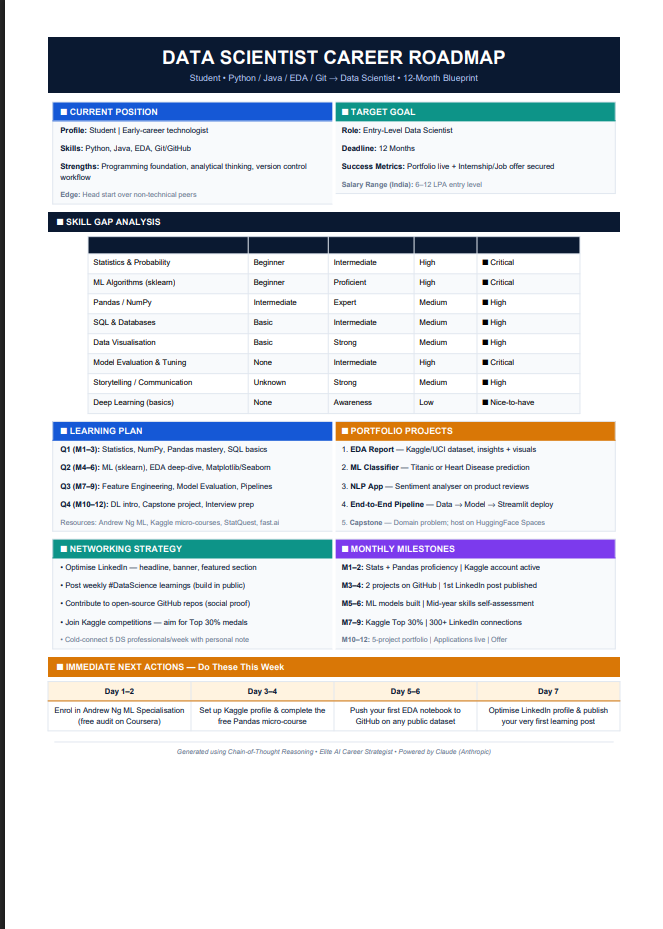

# 🚀 Day 4 – Chain-of-Thought Prompting

## abtalks 60 Days Claude Challenge

### Building a Personalized Data Science Career Roadmap with Claude

---

## 📖 Overview

Today I explored **Chain-of-Thought (CoT) Prompting**, a prompting technique that encourages AI to reason through problems step-by-step before producing a final answer.

Instead of asking Claude a simple question, I provided information about:

* My current skills
* Career goals
* Learning interests
* Strengths and weaknesses
* Desired timeline

Claude analyzed this information and generated a **Personalized Data Science Career Roadmap** outlining skill gaps, projects, learning resources, networking strategies, and monthly milestones.

---

## 🧠 What is Chain-of-Thought Prompting?

Chain-of-Thought Prompting is a technique that guides AI to break down a problem into smaller reasoning steps.

Think of it as asking AI not only for the answer, but also for the thinking process behind the answer.

### Benefits

✅ Better reasoning

✅ More personalized outputs

✅ Improved accuracy

✅ Clearer decision-making

✅ Actionable recommendations

---

## 🎯 My Career Goal

**Target Role:** Data Scientist (Entry-Level)

**Timeline:** 12 Months

**Objective:**

Build the skills, projects, portfolio, and professional network required to secure a Data Science internship or entry-level role.

---

## 📊 Personalized Career Roadmap

### Roadmap Preview

  

  <em>Personalized Data Science Career Roadmap generated by Claude using Chain-of-Thought Prompting.</em>

---

## 📄 Complete Roadmap PDF

  <a href="./DataScience_CareerRoadmap.pdf">
    📥 View Full Career Roadmap (PDF)
  </a>

---

## 🔍 Key Insights

After reviewing the roadmap, I discovered that my biggest opportunities for growth are:

### Critical Skills

* Statistics & Mathematics
* Machine Learning Fundamentals

### Important Skills

* SQL & Databases
* Data Visualization
* Communication & Storytelling

### Biggest Realization

> Becoming a Data Scientist is not just about learning programming languages.

A strong foundation in statistics, machine learning, communication, and real-world projects is equally important.

---

## 🛠 Suggested Projects

The roadmap recommended building the following projects:

| Project                | Purpose                              |
| ---------------------- | ------------------------------------ |
| EDA Dashboard          | Data exploration and visualization   |
| ML Classifier          | Prediction and model-building skills |
| NLP Sentiment Analyzer | Natural Language Processing          |
| End-to-End Pipeline    | Complete data workflow               |
| Capstone Project       | Portfolio showcase                   |

---

## 📅 12-Month Learning Plan

### Q1 (Months 1–3)

* Statistics Fundamentals
* NumPy
* Pandas
* SQL Basics

### Q2 (Months 4–6)

* Machine Learning Fundamentals
* Exploratory Data Analysis
* Matplotlib & Seaborn

### Q3 (Months 7–9)

* Advanced Machine Learning
* Feature Engineering
* Model Evaluation

### Q4 (Months 10–12)

* Deep Learning Basics
* Capstone Project
* Interview Preparation
* Internship Applications

---

## 🌐 Networking Strategy

The roadmap also emphasized building a professional presence.

### Action Plan

* Post weekly learning updates on LinkedIn
* Participate in Kaggle competitions
* Contribute to open-source projects
* Attend Data Science events and meetups
* Connect with Data Science professionals

---

## 🚀 Immediate Next Steps

### Week 1

* Enroll in Andrew Ng's Machine Learning Course

### Week 2

* Create a Kaggle account
* Complete the Pandas Micro-Course

### Week 3

* Publish my first EDA notebook on GitHub

### Week 4

* Optimize LinkedIn profile
* Share my first Data Science learning post

---

## 📚 What I Learned Today

### Lesson 1

Better prompts produce better results.

### Lesson 2

AI can act as a personalized career strategist.

### Lesson 3

Breaking large goals into smaller milestones makes them achievable.

### Lesson 4

Consistency matters more than intensity.

---

## 🌟 Final Takeaway

> Chain-of-Thought Prompting transforms AI from an answer generator into a thinking partner.

By guiding Claude through a structured reasoning process, I received a detailed roadmap that helped me understand where I am today, where I want to go, and how to get there.

This was one of the most practical applications of AI I've explored so far.

---

## 📅 Challenge Progress

* ✅ Day 1 – Getting Started with Claude
* ✅ Day 2 – Prompt Engineering
* ✅ Day 3 – Context Engineering
* ✅ Day 4 – Chain-of-Thought Prompting
* 🔜 Day 5 – Coming Soon

---

### 🚀 Learning in Public

**abtalks 60 Days Claude Challenge**

Building AI Skills • Sharing Learnings • Growing Consistently

