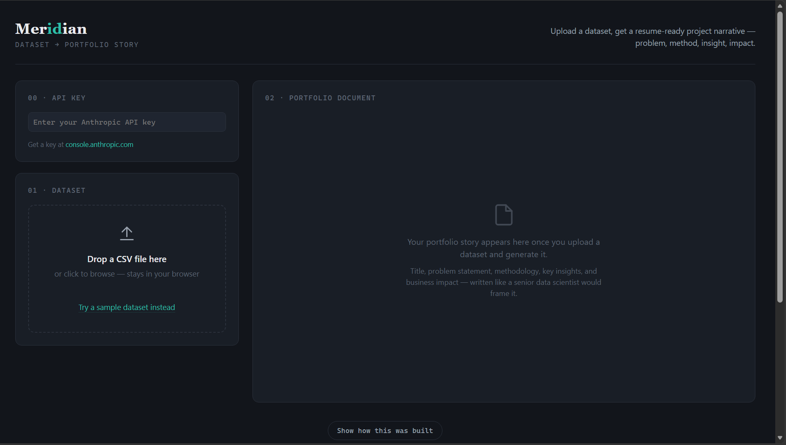
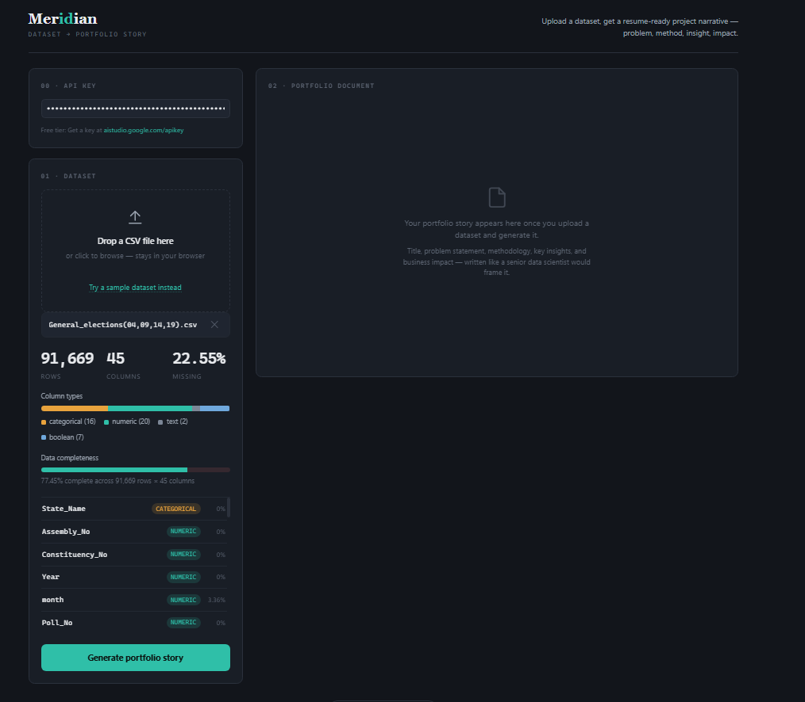

# 🚀 Day 40 — Meridian: AI Portfolio Story Generator

> Upload a dataset. Get a resume-ready project narrative.

Day 40 of the **abtalks 60 Days Claude Challenge**

---

## 📖 Overview

Most data science projects end with charts, notebooks, and dashboards.

But when it comes to writing a compelling GitHub README, portfolio description, or resume project section, many students don't know how to professionally present their work.

That's exactly why I built **Meridian**.

Meridian is an AI-powered assistant that converts a raw CSV dataset into a polished, portfolio-ready project story written from the perspective of a senior data scientist.

Instead of simply summarizing the data, it generates a structured narrative including the business problem, methodology, insights, impact, and even a resume bullet point.

---

## ✨ Features

- 📂 Upload any CSV dataset
- 📊 Automatic dataset profiling
- 📈 Missing value analysis
- 🧮 Column type detection
- 📑 Professional portfolio document generation
- 🎯 Resume-ready project summaries
- 💼 Business impact generation
- 🧠 AI-powered methodology creation
- ⚠ Dataset quality flags
- 🛡 Prompt injection resistance
- 🔒 PII awareness recommendations
- 📥 Export generated portfolio story
- 🌙 Modern responsive UI

---

## 🖼️ Screenshots

### Landing Page

---

### Dataset Analysis & Portfolio Story

---

## 🛠️ Technologies Used

- HTML5
- CSS3
- Vanilla JavaScript
- Gemini API
- Prompt Engineering
- CSV Parsing
- Local File Processing

---

## 💡 What I Learned

While building Meridian, I learned that creating AI products isn't just about connecting an API.

The real challenge is designing an assistant that:

- Produces reliable outputs
- Avoids hallucinations
- Handles edge cases
- Protects user data
- Generates structured responses
- Creates genuine value for users

Prompt engineering, UI/UX, and system design all play equally important roles in building trustworthy AI applications.

---

## 🎯 Future Improvements

- Multiple dataset support
- PDF report export
- Interactive charts
- Project difficulty estimation
- Portfolio templates
- GitHub README generation
- One-click resume export
- Multi-model AI support

---

## 📌 Challenge

This project was built as **Day 40** of the **abtalks 60 Days Claude Challenge**, where I build one AI-powered application every day to improve my skills in AI Engineering, Prompt Engineering, Product Design, and Frontend Development.

---

⭐ If you enjoyed this project, feel free to star the repository and share your feedback!
