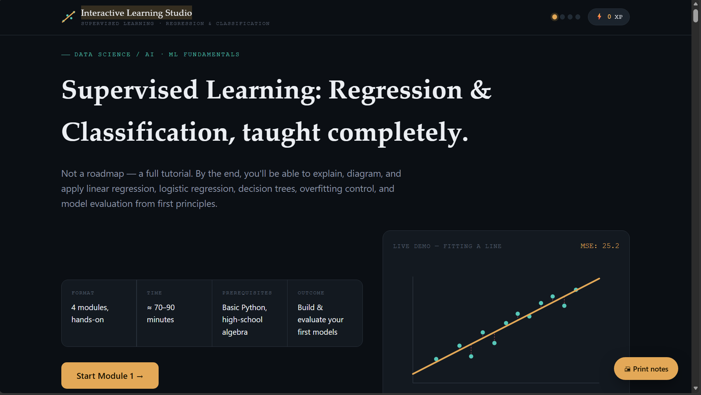

# 🎓 Interactive Learning Studio

---

# 📖 Overview

For **Day 41** of the **abtalks 60 Days Claude Challenge**, I built **Interactive Learning Studio**—a premium interactive educational platform that teaches **Supervised Learning: Regression & Classification** through structured lessons, visual explanations, quizzes, simulations, and practical exercises.

Unlike traditional tutorials, this application focuses on helping learners understand concepts by interacting with them instead of simply reading theory.

The entire application is built as a **single HTML file** using **HTML, CSS, JavaScript, and SVG**, making it lightweight, responsive, and easy to run locally.

---

# 🎯 Challenge Objective

Build an AI-powered learning application that can teach an entire topic from beginner to intermediate level through an engaging and interactive experience.

---

# 📸 Application Screenshots

## 🏠 Home Screen

  

The landing page introduces the course, learning objectives, prerequisites, estimated completion time, rewards, and an interactive regression demonstration.

---

## 📚 Interactive Learning Experience

  

Learners progress through structured modules featuring interactive diagrams, quizzes, simulations, XP rewards, progress tracking, and printable study notes.

---

# ✨ Features

## 📚 Complete Interactive Tutorial

- Four structured learning modules
- Progressive learning path
- Detailed explanations
- Practical examples
- Real-world analogies
- Common misconceptions
- Key takeaways

---

## 📈 Interactive Visualizations

- Linear Regression
- Logistic Regression
- Decision Trees
- Confusion Matrix
- Gradient Descent
- ROC Curve
- Model Evaluation

---

## 🧠 Learning Experience

- Interactive exercises
- Live simulations
- Automatic quiz scoring
- Instant feedback
- Progressive module unlocking
- XP reward system
- Achievement badges

---

## 📄 Learning Resources

- Final Practical Challenge
- Cheat Sheet
- Summary Notes
- Books
- Documentation
- Research Papers
- Practice Platforms
- AI Learning Prompts

---

## 🎨 Modern Experience

- Premium UI
- Fully Responsive Design
- Dark Theme
- Smooth Animations
- Progress Tracking
- Printable PDF Notes
- Local Progress Saving

---

# 📚 Topics Covered

- Supervised Learning
- Linear Regression
- Logistic Regression
- Decision Trees
- Gradient Descent
- Cost Functions
- Overfitting
- Underfitting
- Train/Test Split
- Regularization
- Cross Validation
- Confusion Matrix
- Precision
- Recall
- F1 Score
- ROC-AUC
- Model Evaluation

---

# 💡 What I Learned

- Interactive learning significantly improves concept retention.
- AI can create complete educational experiences—not just generate code.
- Great educational software requires a combination of pedagogy, UX, and engineering.
- Visual simulations make complex Machine Learning concepts much easier to understand.

---

# 🚀 Final Takeaway

> **The best way to learn isn't by consuming more content—it's by interacting with it.**

This project demonstrates how AI can transform traditional tutorials into engaging learning experiences that encourage exploration, experimentation, and active learning.

---

# 🌟 Challenge Progress

- ✅ Day 1 – Day 40 Completed
- ✅ **Day 41 – Interactive Learning Studio**
- 🔜 Day 42 – Coming Soon

---

### 🚀 Learning in Public

**Artificial Intelligence • Machine Learning • Education Technology • Interactive Learning • Frontend Development • HTML • CSS • JavaScript**
