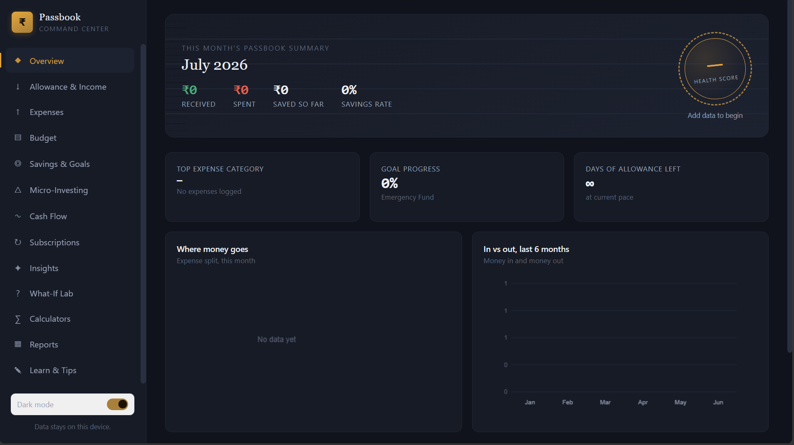
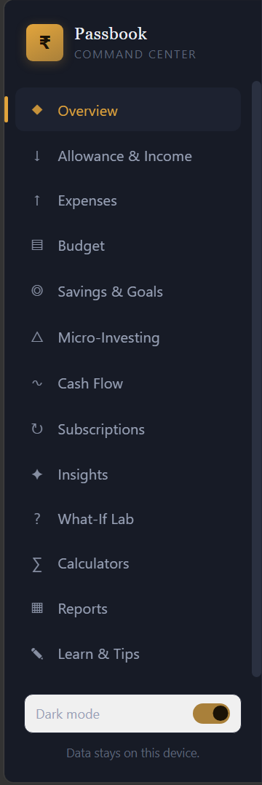

# 💳 Passbook — Personal Financial Command Center

---

# 📖 Overview

For **Day 42** of the **abtalks 60 Days Claude Challenge**, I built **Passbook — Personal Financial Command Center**, a premium personal finance dashboard designed to help users understand, manage, and improve their financial health.

Unlike a traditional expense tracker, this application combines budgeting, savings, financial planning, interactive visualizations, calculators, AI-inspired insights, and what-if simulations into one modern interface.

Everything runs completely inside the browser using **HTML, CSS, and JavaScript**, ensuring all financial data remains on the user's device.

---

# 🎯 Challenge Objective

Build an interactive financial dashboard that helps users make smarter financial decisions instead of simply recording transactions.

---

# 📸 Application Screenshots

## Dashboard Overview

The overview dashboard displays monthly financial summaries, health score, spending analytics, savings progress, interactive charts, and AI-generated financial insights.

---

## Personal Finance Workspace

The complete financial workspace includes dedicated modules for income tracking, budgeting, expenses, savings goals, investments, subscriptions, cash flow, reports, financial calculators, and learning resources.

---

# ✨ Features

## 💰 Income & Expense Management

- Income tracking
- Expense logging
- Category-wise spending
- Transaction history
- Local data storage

---

## 📊 Financial Dashboard

- Monthly financial summary
- Financial Health Score
- Savings Rate
- Expense breakdown
- Cash flow visualization
- Spending trends

---

## 🎯 Savings & Planning

- Savings goals
- Goal progress tracking
- Budget planner
- Monthly budget allocation
- Goal timeline estimation

---

## 📈 Investment Tools

- SIP / Micro-investment simulator
- Compound growth visualization
- Investment projections
- Return estimation

---

## 🧠 Smart Financial Insights

- AI-inspired spending insights
- Personalized recommendations
- Financial habit analysis
- Spending pattern detection

---

## 🔬 What-If Lab

- Spending simulations
- Savings impact calculator
- Financial scenario planning
- Future savings projections

---

## 🧮 Financial Calculators

- Savings Goal Calculator
- Compound Interest Calculator
- Budget Split Calculator

---

## 📄 Reports

- Printable financial reports
- Monthly summaries
- Goal reports
- Expense reports
- PDF printing support

---

## 🎨 User Experience

- Premium modern interface
- Responsive layout
- Dark / Light mode
- Smooth animations
- Interactive charts
- Local Storage
- Mobile-friendly design

---

# 📚 What I Learned

- Financial dashboards should help users make decisions, not just display numbers.
- Interactive visualizations make financial data much easier to understand.
- AI can improve personal finance through insights and planning assistance.
- Great financial applications combine UX, analytics, and thoughtful product design.

---

# 💡 Biggest Insight

> **Financial freedom starts with understanding your money, not just earning it.**

---

# 🚀 Final Takeaway

This challenge showed how AI can help build intelligent financial tools that go beyond expense tracking by encouraging better planning, smarter saving, and healthier financial habits.

---

## 🌟 Challenge Progress

- ✅ Day 1 – Day 41 Completed
- ✅ Day 42 – Personal Financial Command Center
- 🔜 Day 43 – Coming Soon

---

### 🚀 Learning in Public

**Artificial Intelligence • Personal Finance • FinTech • Data Visualization • Frontend Development**
