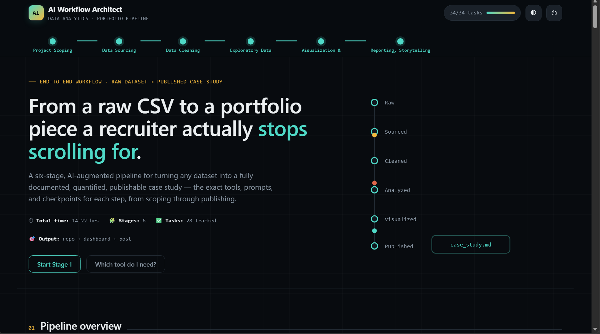
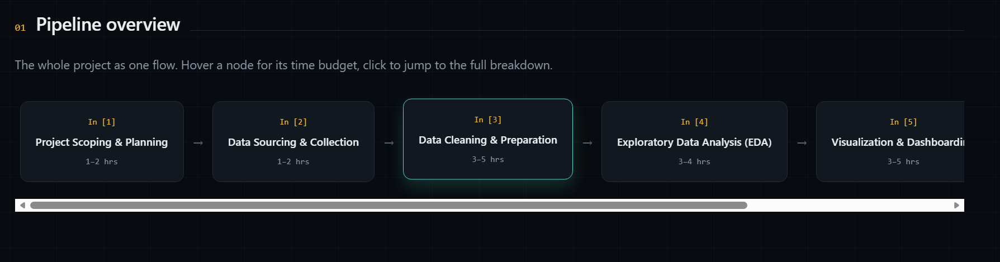
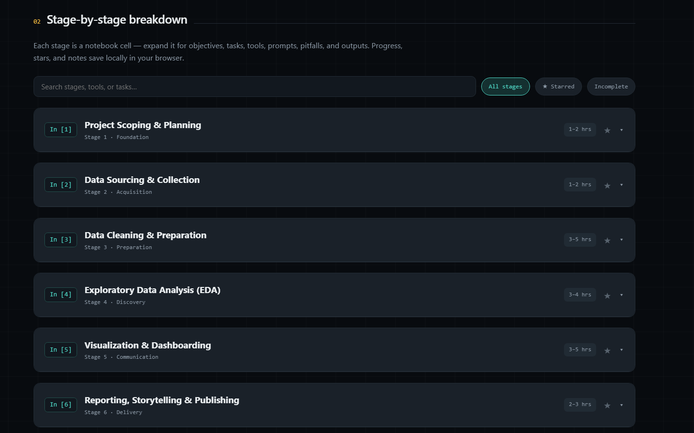
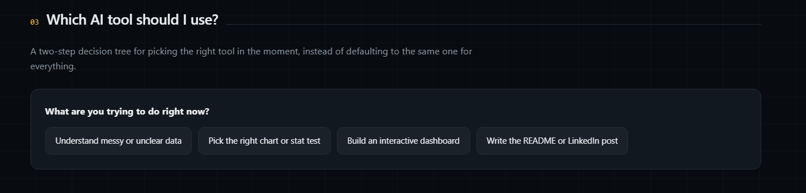
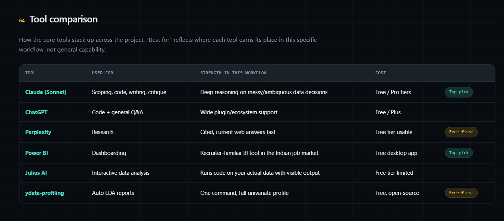
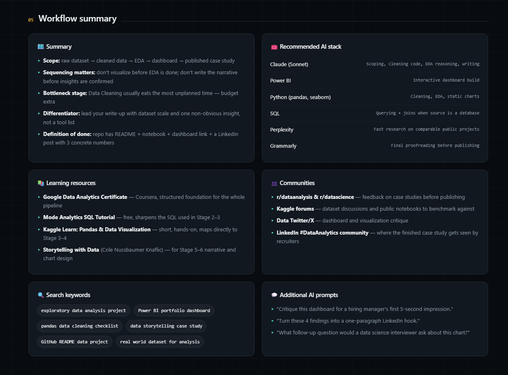
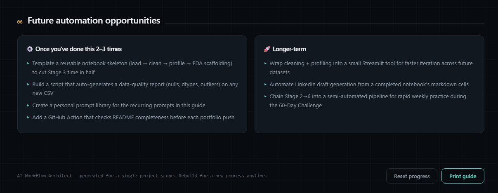

# 🤖 AI Workflow Architect

---

# 📖 Overview

For **Day 43** of the **abtalks 60 Days Claude Challenge**, I built **AI Workflow Architect**—an interactive platform that guides learners through the complete lifecycle of a Data Analytics project.

Instead of providing a simple checklist, the application maps the entire workflow from a **raw CSV dataset** to a **published portfolio case study**, helping users understand what to do at every stage of the project.

Built entirely using **HTML, CSS, JavaScript, and SVG**, the application is lightweight, responsive, and runs directly in any modern browser.

---

# 🎯 Challenge Objective

Create an AI-powered workflow platform that transforms complex data analytics processes into an easy-to-follow interactive experience.

---

# 📸 Application Screenshots

## Home Screen

The landing page introduces the complete workflow pipeline, project scope, estimated time, progress tracking, and an animated end-to-end visualization.

---

## Pipeline Overview

A visual representation of the six-stage workflow allows users to understand the complete journey from project planning to publishing.

---

## Stage-by-Stage Breakdown

Each workflow stage expands into detailed objectives, tasks, AI tools, prompts, best practices, common mistakes, expected outputs, and personal notes.

---

## AI Decision Tree

An interactive decision tree helps users determine the most appropriate AI tool based on their current task.

---

## AI Tool Comparison

Compare popular AI and analytics tools, understand where each tool performs best, and choose the right one for every workflow stage.

---

## Workflow Summary

Access the recommended AI stack, learning resources, communities, search keywords, and additional prompts for continued learning.

---

## Future Automation Opportunities

Explore ideas for automating repetitive tasks and building reusable data analytics workflows.

---

# ✨ Features

### 📊 End-to-End Analytics Workflow

- Six structured workflow stages
- Interactive pipeline visualization
- Stage navigation
- Time estimates
- Progress tracking

### 🤖 AI Workflow Guidance

- Best AI tools for each stage
- Why each tool is recommended
- Alternative tools
- Ready-to-use prompts
- Decision tree

### 📚 Practical Learning

- Objectives
- Tasks
- Best practices
- Common mistakes
- Expected outputs
- Efficiency tips

### 📈 Productivity

- Bookmark important stages
- Local notes
- Progress saved locally
- Search & filtering

### 📖 Learning Resources

- Recommended AI Stack
- Learning Resources
- Communities
- Search Keywords
- Future Automation Ideas

### 🎨 Modern Experience

- Premium UI
- Responsive Design
- Dark Mode
- Local Storage
- Smooth Animations
- Printable Workflow Guide

---

# 🗂️ Workflow Stages

- Project Scoping & Planning
- Data Sourcing & Collection
- Data Cleaning & Preparation
- Exploratory Data Analysis (EDA)
- Visualization & Dashboarding
- Reporting, Storytelling & Publishing

---

# 💡 What I Learned

- Structured workflows improve project quality.
- AI is most useful when combined with good planning.
- Documentation and storytelling are just as important as coding.
- Interactive tools make complex workflows easier to understand.

---

# 🚀 Final Takeaway

> **A great data project isn't built by chance—it follows a clear workflow from raw data to meaningful insights.**

---

## 🌟 Challenge Progress

- ✅ Day 1 – Day 42 Completed
- ✅ Day 43 – AI Workflow Architect
- 🔜 Day 44 – Coming Soon

---

### 🚀 Learning in Public

**Artificial Intelligence • Data Analytics • Data Science • Workflow Automation • Frontend Development**
