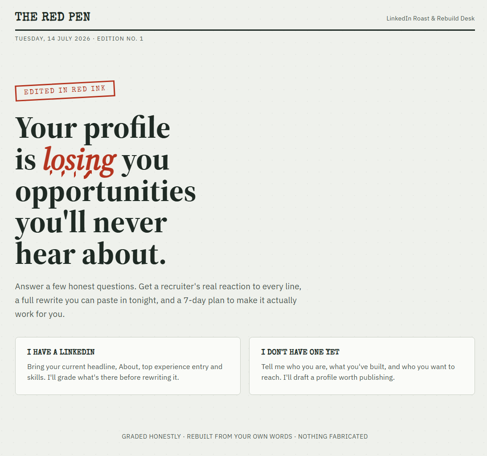
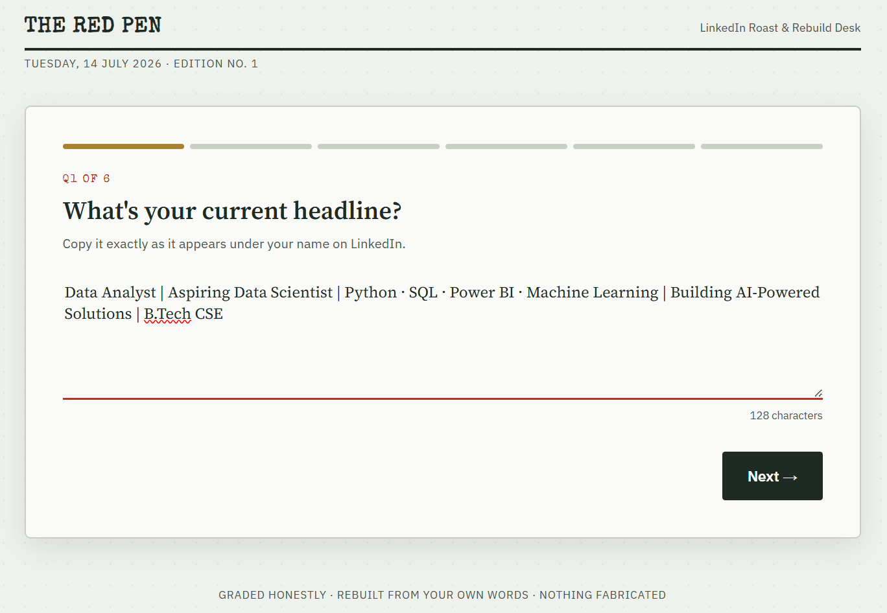
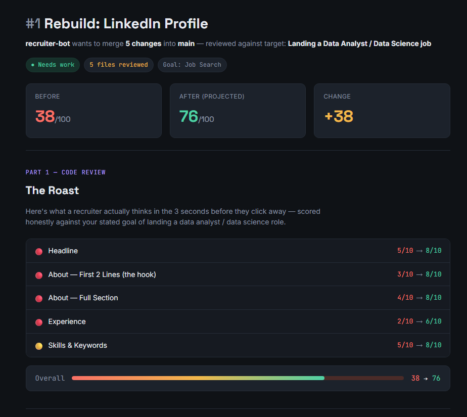
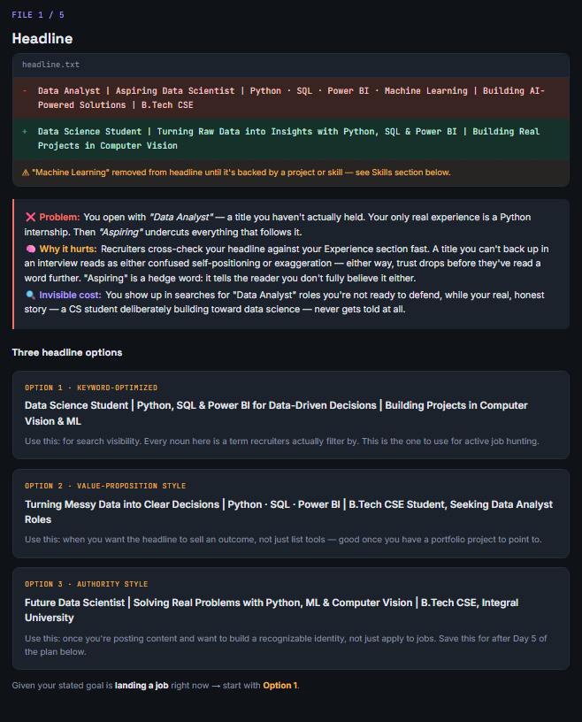
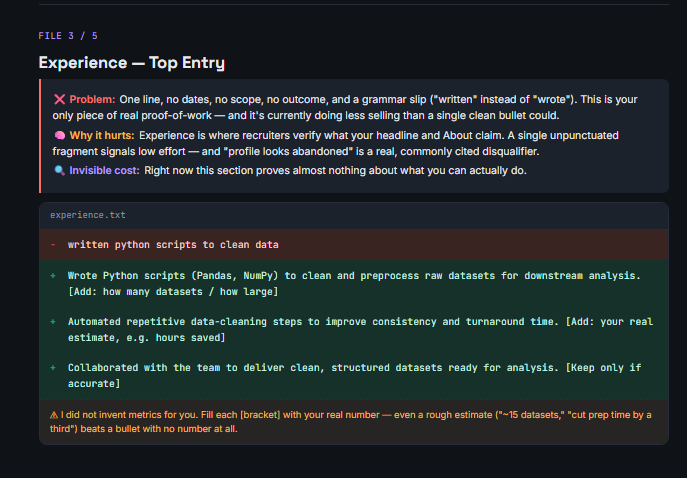
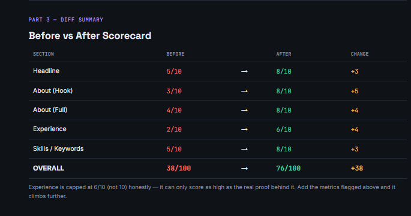
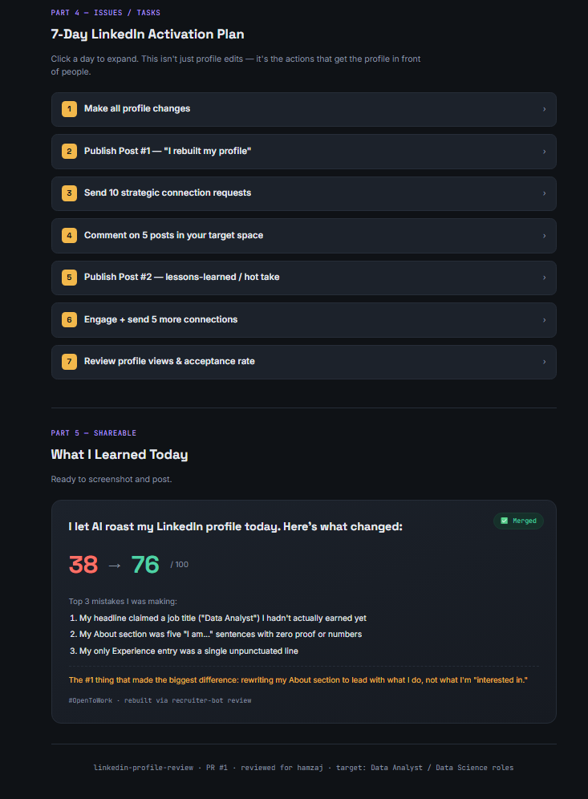

# 🖊️ The Red Pen – LinkedIn Roast & Rebuild Desk

---

# 📖 Overview

For **Day 44** of the **abtalks 60 Days Claude Challenge**, I explored how carefully designed prompts can transform Claude into a personalized LinkedIn profile reviewer.

Using recruiter-focused instructions, Claude generated an interactive application that analyzes a LinkedIn profile, explains weak areas, rewrites sections using only the user's information, and provides a structured improvement plan.

Rather than simply suggesting edits, the application explains **why** each recommendation matters from a recruiter's perspective.

---

# 🎯 Challenge Objective

Explore how prompt engineering can guide Claude to perform structured profile reviews while remaining transparent, educational, and personalized.

---

# 📸 Application Screenshots

## Landing Page

Choose whether to review an existing LinkedIn profile or create one from scratch.

---

## Guided Profile Review

A step-by-step workflow collects profile information including headline, About section, experience, skills, and career goals.

---

## Recruiter Report Card

Receive a recruiter-style evaluation with section-wise scores and an overall profile rating.

---

## Headline & About Rebuild

Claude explains weaknesses before suggesting stronger, keyword-optimized alternatives.

---

## Experience & Skills Optimization

Rewrite experience bullets, prioritize relevant skills, and improve search visibility.

---

## Before vs After Analysis

Compare profile improvements through a visual scorecard.

---

## 7-Day LinkedIn Action Plan

Receive a practical roadmap for improving profile visibility and engagement.

---

# ✨ Features

### 🔍 Recruiter Review

- Profile scoring
- Honest profile roast
- Section-wise analysis
- Recruiter perspective
- Before vs After comparison

### ✍️ Profile Optimization

- Headline rewrites
- About section rebuild
- Experience improvements
- Skills recommendations
- LinkedIn keyword optimization

### 📊 Insights

- Overall profile score
- Improvement suggestions
- Recruiter reasoning
- Personalized recommendations

### 📅 Career Growth

- 7-Day LinkedIn activation plan
- Networking strategy
- Content ideas
- Engagement checklist

### 🎨 User Experience

- Premium responsive interface
- Interactive workflow
- Dark mode
- Progress tracking
- Local storage
- Printable report

---

# 📚 What I Learned

- Prompt constraints significantly improve AI outputs.
- Transparency builds more trustworthy AI experiences.
- Explaining *why* a recommendation matters is often more valuable than the recommendation itself.
- Well-designed prompts can turn AI into an educational mentor instead of a simple text generator.

---

# 💡 Biggest Takeaway

> Great AI outputs don't happen by accident—they come from carefully designed prompts that provide the right context, constraints, and objectives.

---

# 🌟 Challenge Progress

- ✅ Day 1 – Day 43 Completed
- ✅ Day 44 – The Red Pen: LinkedIn Roast & Rebuild Desk
- 🔜 Day 45 – Coming Soon

---

### 🚀 Learning in Public

**Prompt Engineering • Personal Branding • LinkedIn Optimization • Artificial Intelligence • Continuous Learning**
