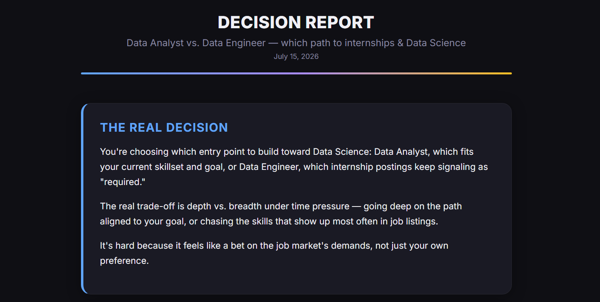
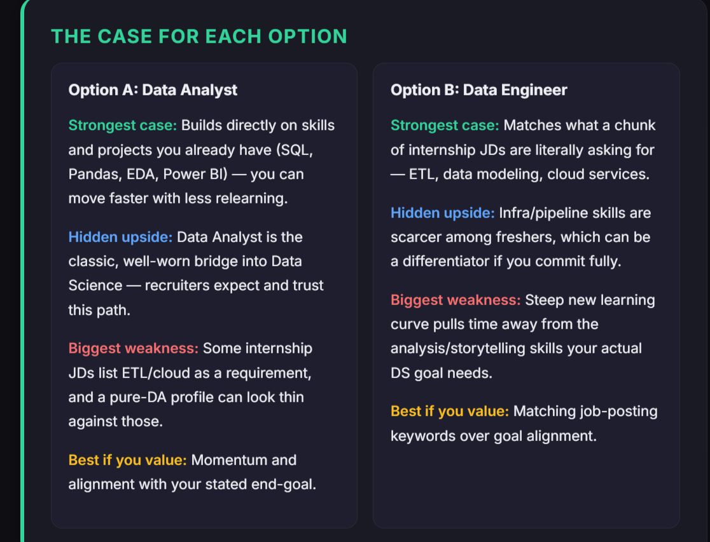
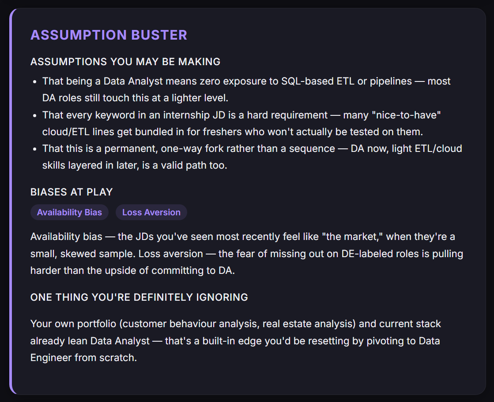
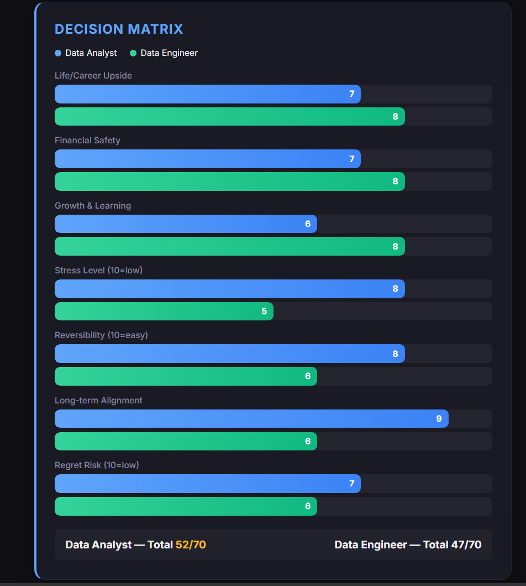
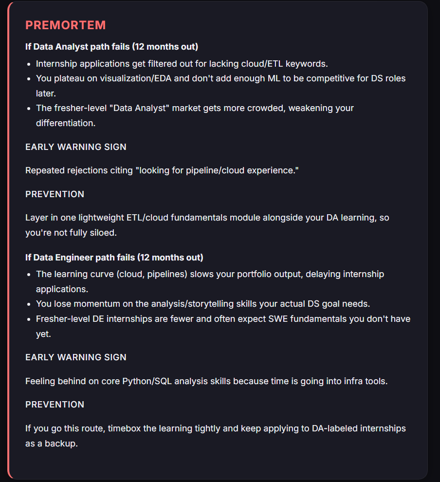
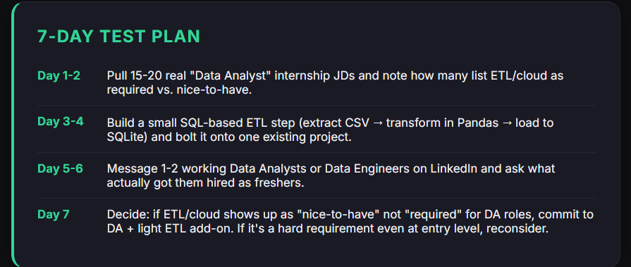
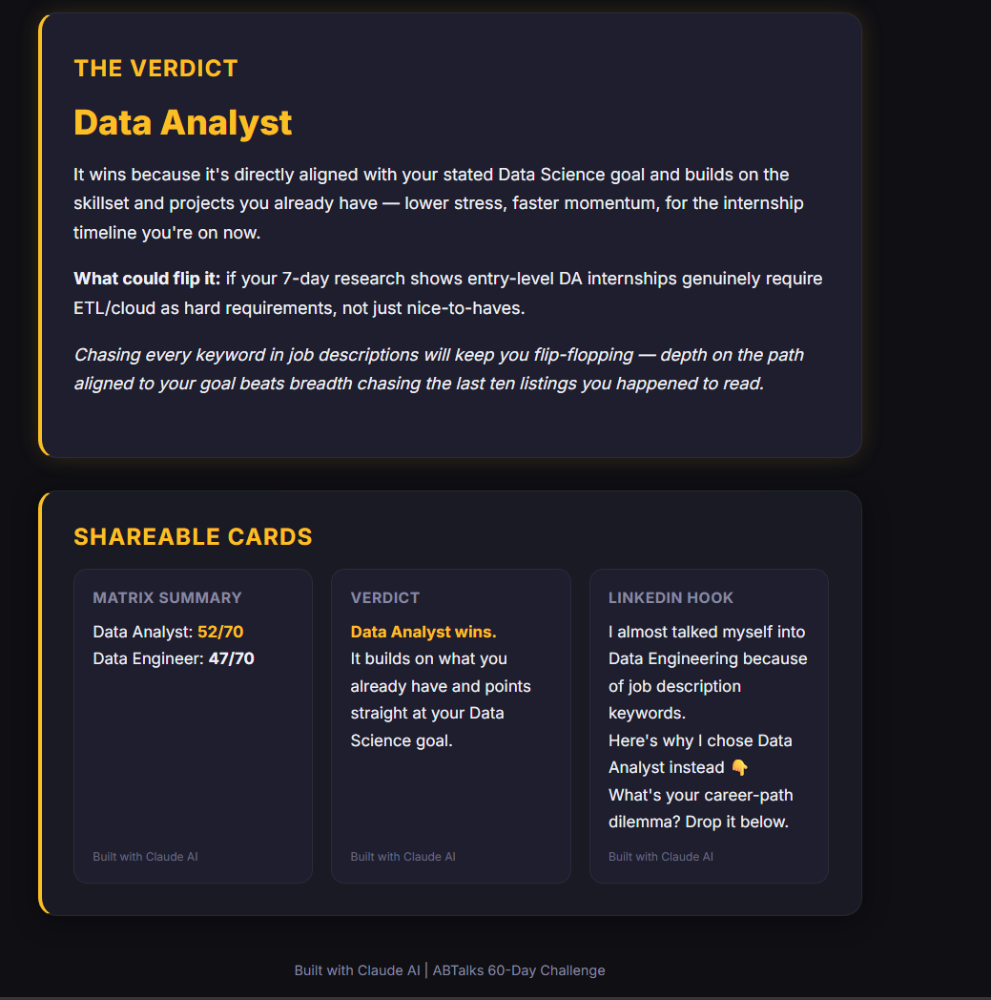

# 🧠 Decision Report

---

# 📖 Overview

For **Day 45** of the **abtalks 60 Days Claude Challenge**, I explored how prompt engineering can transform Claude into an impartial decision strategist.

Instead of immediately recommending one option, Claude first conducts a short interview to understand the user's situation before generating a personalized **Decision Report**.

The application combines structured reasoning, decision matrices, assumption analysis, risk evaluation, and actionable experiments into a single interactive dashboard.

---

# 🎯 Challenge Objective

Explore how AI can support better decision-making by asking thoughtful questions first, rather than jumping directly to conclusions.

---

# ✨ Features

- 🎯 Four-question guided interview
- 📊 Decision Matrix with weighted comparisons
- ⚖️ Balanced analysis of each option
- 🧠 Assumption & Bias Detection
- ⚠️ 12-Month Premortem Analysis
- 📅 7-Day Validation Plan
- 🏆 Final Verdict with reasoning
- 📸 Shareable summary cards
- 📱 Fully responsive interface
- 🎨 Interactive animated dashboard

---

# 📸 Screenshots

## Decision Overview

A concise summary of the real decision, emotional trade-offs, and the core dilemma.

---

## Comparing Both Options

Side-by-side evaluation of each option, including strengths, hidden advantages, weaknesses, and ideal use cases.

---

## Assumption Buster

Highlights assumptions, cognitive biases, and overlooked factors that may influence the final decision.

---

## Decision Matrix

Scores each option across seven different dimensions using animated comparison bars.

---

## Premortem Analysis

Imagines how each decision could fail after one year and suggests preventive actions.

---

## 7-Day Experiment Plan

A practical roadmap to validate the decision through research, small experiments, and conversations.

---

## Final Verdict

Summarizes the recommended choice, explains why it wins, and includes shareable insight cards.

---

# 💡 What I Learned

This challenge reinforced that **great AI doesn't begin with answers—it begins with better questions.**

By collecting context first, the final recommendation became significantly more personalized, balanced, and actionable.

I also learned that structured prompts can guide AI to reason through uncertainty instead of simply producing opinions.

---

# 🚀 Key Takeaways

- Better questions produce better AI outputs.
- Decision-making benefits from structured thinking, not instant advice.
- Prompt engineering is as much about designing conversations as it is about writing instructions.
- AI can help reduce decision bias when given enough context.

---

# 🛠️ Technologies

- Claude AI
- HTML5
- CSS3
- Vanilla JavaScript

---

# 🌟 Challenge Progress

- ✅ Day 1–44 Completed
- ✅ Day 45 — Decision Report
- 🔜 Day 46 Coming Soon

---

