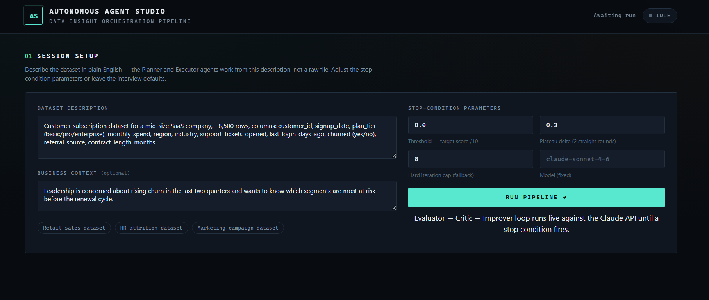
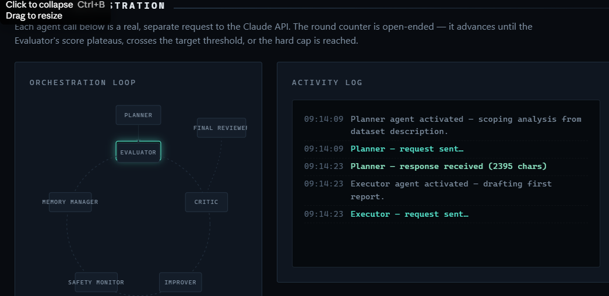
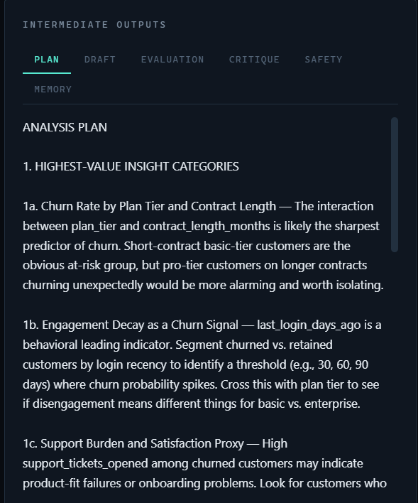
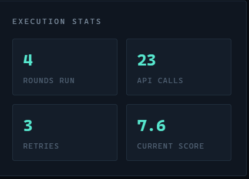

# 🤖 Autonomous Agent Studio

Day 46 of the **ABTalks 60 Days Claude Challenge**

An interactive HTML application generated through Claude that demonstrates how an autonomous multi-agent AI workflow can iteratively improve its own output.

---

## 📌 Overview

Modern AI systems are moving beyond single prompts.

This project explores how multiple specialized AI agents can collaborate to solve a task by planning, executing, evaluating, improving, and reviewing their work until predefined stopping conditions are met.

Instead of a traditional chatbot interaction, the application visualizes a complete autonomous orchestration pipeline.

---

## 🎯 Challenge Objective

Explore how prompt engineering can be used to generate an interactive application that demonstrates:

- Autonomous multi-agent workflows
- Iterative reasoning
- Evaluation-driven improvement
- AI orchestration concepts
- Interactive monitoring dashboards

---

## ✨ Features

- 🧠 Planner Agent
- ⚙️ Executor Agent
- 📊 Evaluator Agent
- 🔍 Critic Agent
- 🚀 Improver Agent
- 🧩 Memory Manager
- 🛡️ Safety Monitor
- ✅ Final Reviewer

Additional capabilities include:

- Live orchestration workflow visualization
- Activity logs
- Intermediate outputs
- Evaluation reports
- Execution statistics
- Memory updates
- Stop-condition monitoring
- Responsive dark-themed interface

---

## 📸 Screenshots

### Session Setup

---

### Live Agent Orchestration

---

### Analysis Planning

---

### Execution Statistics

---

## 💡 What I Learned

This project helped me understand that prompt engineering is evolving beyond writing better prompts.

I learned how autonomous AI systems can be designed using multiple specialized agents that:

- divide responsibilities,
- collaborate,
- evaluate one another,
- retain memory,
- iteratively improve their work,
- and stop automatically once quality goals are achieved.

One of the biggest takeaways was seeing how evaluation loops can make AI workflows significantly more reliable than a single prompt-response interaction.

---

## 🔑 Key Takeaway

Good AI systems aren't always built around one powerful prompt.

Sometimes they're built around many specialized agents working together with feedback loops.

---

## 🌐 Live Demo

https://claude.ai/public/artifacts/1cd520ea-083a-4042-9c40-35e53d122aa6

---

## 🚀 Challenge Progress

✅ Day 46 / 60 Completed

Continuing to explore Prompt Engineering, Agentic AI, and practical AI applications through the ABTalks 60 Days Claude Challenge.

---

Built with Claude AI • Shared as part of the ABTalks 60 Days Claude Challenge
