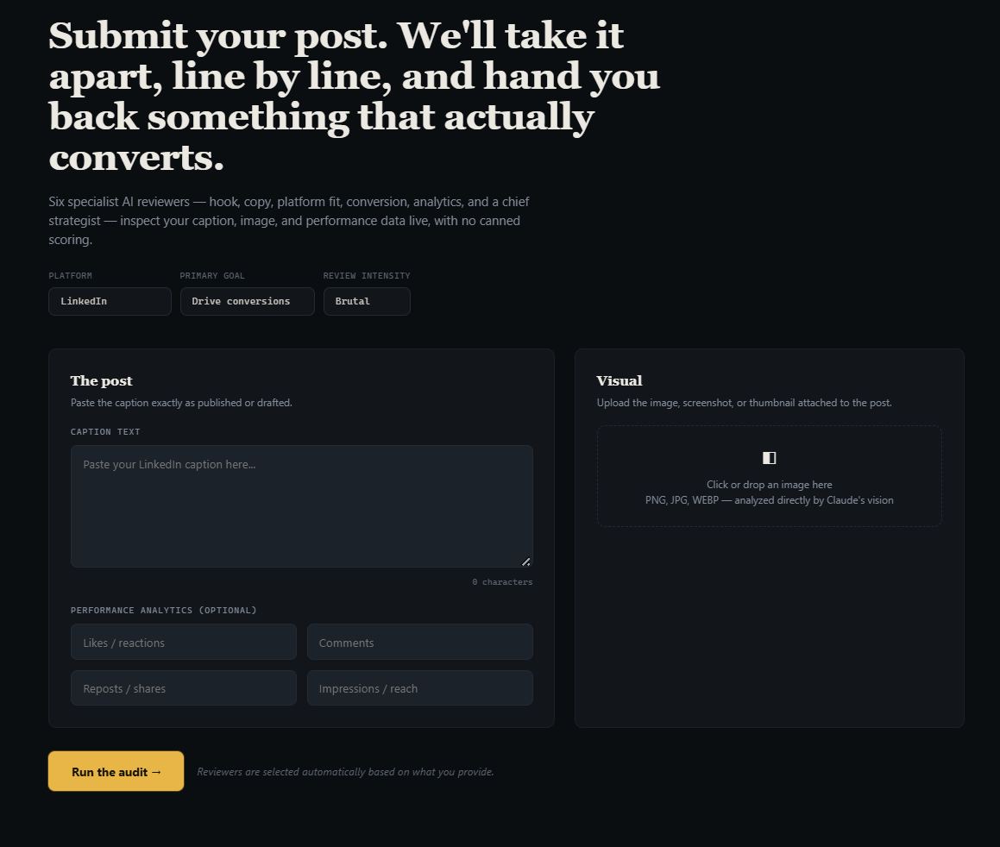
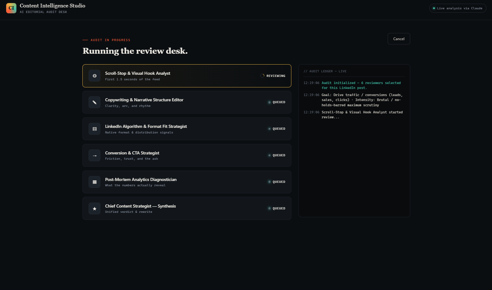
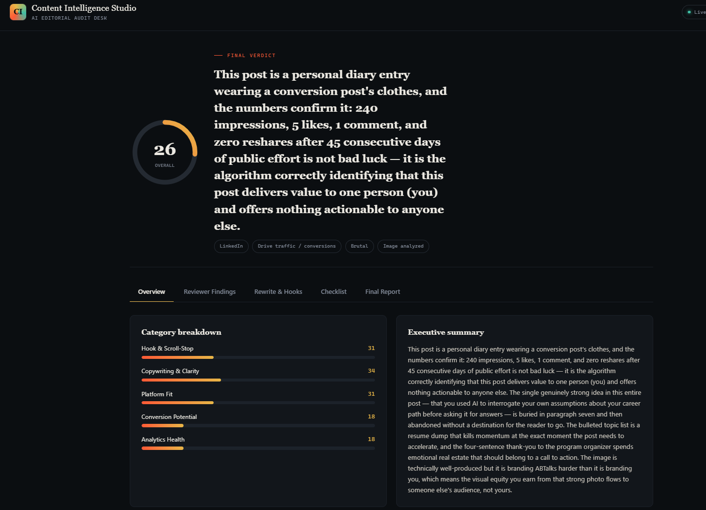
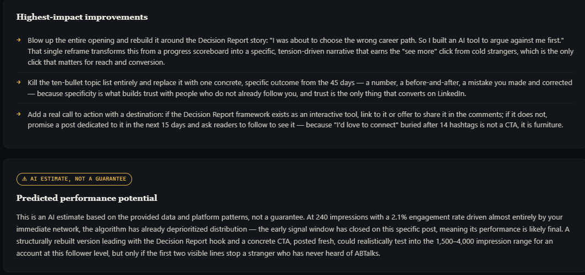

# Day 47 – Content Intelligence Studio

## Overview

Day 47 of the **ABTalks 60 Days Claude Challenge** focused on building an AI-powered content review platform capable of analyzing social media content before publishing.

Rather than simply generating content, I explored how Claude could simulate a team of specialized reviewers that evaluate a post from multiple perspectives, helping creators understand how their content may perform and where it can be improved.

This project demonstrates how prompt engineering can transform Claude into a practical content strategy assistant.

---

## Challenge Objective

Create a **Content Intelligence Studio** that:

- Reviews LinkedIn posts with AI
- Accepts captions, images, and analytics
- Simulates multiple expert reviewers
- Provides actionable recommendations
- Generates rewritten content and optimization suggestions
- Produces an executive report with performance insights

---

## Features

- 📝 Caption analysis
- 🖼️ Image & visual review
- 📊 Analytics interpretation
- 👀 Scroll-stop evaluation
- ✍️ Copywriting review
- 📈 LinkedIn algorithm fit analysis
- 🎯 CTA & conversion analysis
- 🧠 Executive summary
- 📋 Publishing checklist
- 🚀 Performance improvement recommendations

---

## What I Learned

The biggest lesson from this project wasn't about writing better prompts.

It was learning that great content starts by thinking about the reader rather than the creator.

Instead of asking:

> "Did I explain everything?"

I learned to ask:

> "Why should someone stop scrolling and care?"

That perspective fundamentally changes how content is written.

---

## Screenshots

### Landing Page

### AI Review Workflow

### Final Audit Dashboard

### Improvement Recommendations

---

## Tech Stack

- Claude AI
- Prompt Engineering
- HTML
- CSS
- Vanilla JavaScript

---

## Key Takeaway

Prompt engineering isn't only about generating better content.

It's also about designing AI systems that evaluate, critique, and improve the work we create.

---

## Challenge Progress

**Day 47 / 60 ✅**

Building in public.
Learning in public.
Improving one prompt at a time.

---

**Built during the ABTalks 60 Days Claude Challenge**
