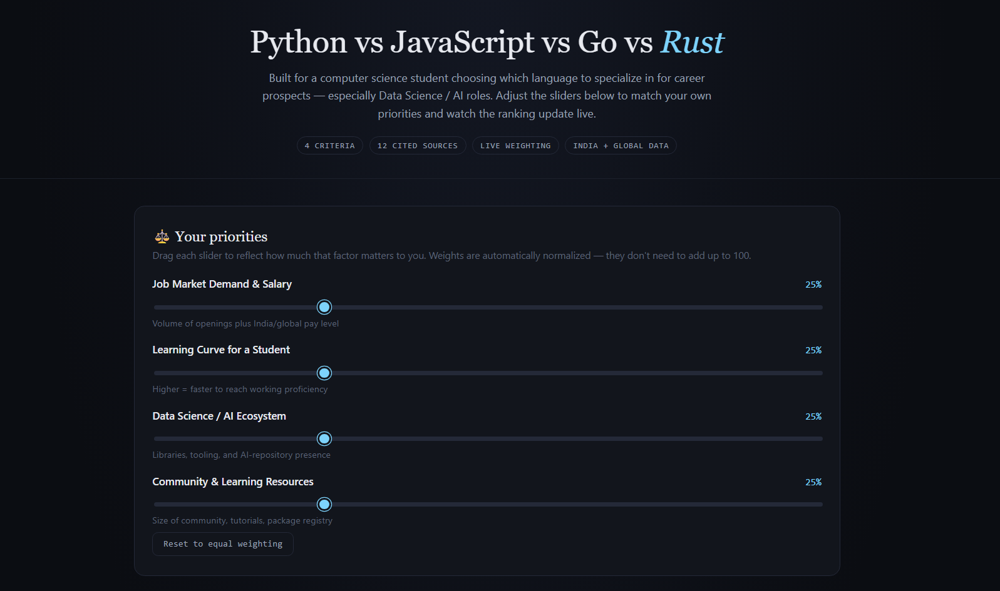
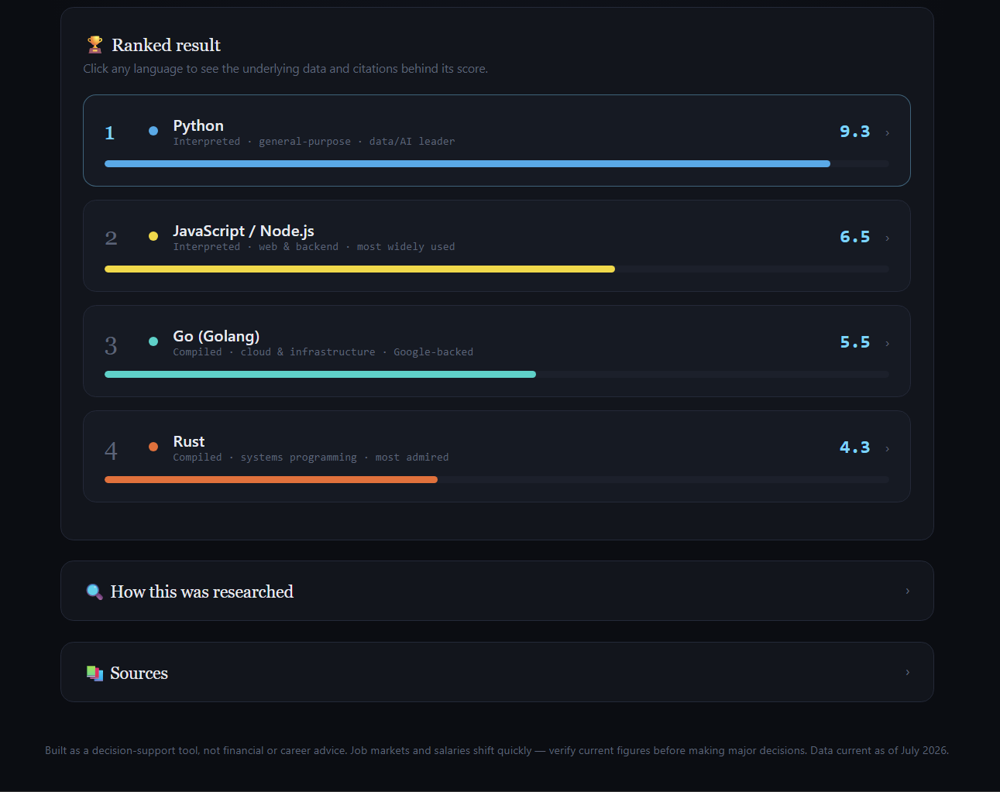

# Day 48 – Compare & Decide Builder

## Overview

For **Day 48** of the **ABTalks 60 Days Claude Challenge**, I built an interactive **Compare & Decide Builder**.

The goal was to create a research-backed decision-support tool that helps users compare multiple options using real-world data instead of opinions.

For this project, I compared:

- Python
- JavaScript / Node.js
- Go (Golang)
- Rust

The application allows users to prioritize different criteria and instantly see how the rankings change.

---

## Challenge Objective

Build an interactive comparison tool that:

- Interviews the user before generating results
- Researches and cites real-world sources
- Compares options using measurable criteria
- Lets users adjust priorities with live sliders
- Updates rankings dynamically
- Displays complete research methodology and citations

---

## Features

- ⚖️ Interactive criteria weighting
- 📊 Live ranking updates
- 📚 Source-backed comparisons
- 🔍 Research methodology panel
- 📈 Dynamic decision support
- 📱 Responsive interface
- 🌙 Modern dark UI

---

## Comparison Criteria

- Job Market Demand & Salary
- Learning Curve
- Data Science / AI Ecosystem
- Community & Learning Resources

---

## What I Learned

One of the biggest takeaways from this project was that **AI shouldn't simply recommend an answer—it should explain the reasoning behind it.**

By combining real-world sources with interactive weighting, users can explore how different priorities influence the final decision instead of blindly trusting a fixed ranking.

This project reinforced the importance of transparency, explainability, and evidence-based decision making.

---

## Screenshots

### Home Screen

### Interactive Ranking Dashboard

---

## Technologies Used

- Claude AI
- Prompt Engineering
- HTML
- CSS
- Vanilla JavaScript

---

## Key Takeaways

- Research-backed comparisons improve trust.
- User priorities matter as much as raw data.
- Explainable AI leads to better decisions.
- Interactive decision-support tools can simplify complex choices.

---

## Challenge Progress

**Day 48 / 60 ✅**

Learning.
Building.
Improving every single day.

---

**Built during the ABTalks 60 Days Claude Challenge**
