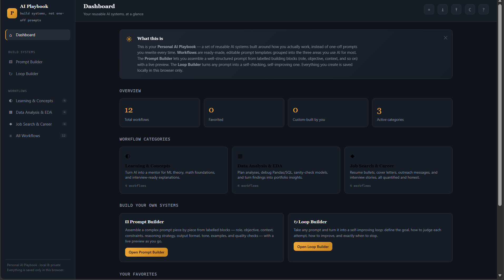

# Day 49 – Personal AI Playbook

## Overview

For **Day 49** of the **ABTalks 60 Days Claude Challenge**, I built a **Personal AI Playbook** — an interactive browser-based application that helps transform one-off prompts into reusable AI workflow systems.

Instead of maintaining hundreds of disconnected prompts, this application organizes reusable workflows tailored to how I actually use AI in my daily Data Science and AI Engineering journey.

The playbook includes editable workflows, a modular Prompt Builder, a Loop Builder for autonomous prompt refinement, and local storage so everything remains private within the browser.

---

## Challenge Objective

Build a fully personalized AI workflow system by first interviewing the user and then generating reusable AI systems instead of generic prompts.

The application focuses on helping users:

- Learn faster
- Perform better data analysis
- Improve prompt engineering
- Build reusable AI workflows
- Stay organized

---

## My Personalized Playbook

The application was generated after an interview about my workflow and is specifically tailored for my **Data Science & AI Engineering** journey.

### Focus Areas

- 📚 Learning Machine Learning concepts
- 📊 Data Analysis & Exploratory Data Analysis (EDA)
- 💼 Resume optimization
- ✉️ Cover letter generation
- 🤝 Job search outreach

My biggest challenge identified during the interview was:

> Structuring prompts effectively for complex tasks.

The generated playbook addresses this by providing reusable prompt systems rather than isolated prompts.

---

## Features

- 📚 Personalized AI workflows
- 🧠 Prompt Builder
- 🔄 Loop Builder
- 📝 Editable workflow templates
- ⭐ Favorite workflows
- 📂 Organize by categories
- 🔍 Search & filter
- 📋 One-click copy
- 💾 Local storage
- 📤 Import & Export
- 🌙 Dark mode
- 📱 Responsive interface
- ⌨️ Keyboard shortcuts
- 💡 Built-in onboarding
- ❓ Interactive help system

---

## Workflow Categories

The playbook automatically organizes workflows into categories relevant to my work.

- Learning & Concepts
- Data Analysis & EDA
- Job Search & Career

Each workflow contains:

- Editable template
- Custom variables
- Practical examples
- Best practices
- One-click copy functionality

---

## Prompt Builder

The Prompt Builder allows prompts to be assembled from reusable building blocks instead of writing everything from scratch.

Available building blocks include:

- Role
- Objective
- Context
- Constraints
- Reasoning Strategy
- Output Format
- Tone
- Examples
- Quality Checks

Every block includes an explanation describing:

- What it does
- Why it matters
- How it improves prompt quality

---

## Loop Builder

The Loop Builder converts ordinary prompts into self-improving AI workflows.

Users can define:

- Goal
- Evaluation Criteria
- Improvement Strategy
- Stop Conditions
- Safety Rules

This enables iterative prompting for higher-quality outputs.

---

## Screenshot

### Dashboard

---

## What I Learned

This project helped me better understand:

- Prompt engineering principles
- Modular workflow design
- Reusable AI systems
- UX design for productivity tools
- Local storage implementation
- Interactive frontend development
- Building SaaS-style dashboards using HTML, CSS, and JavaScript

More importantly, I learned that effective AI usage isn't about collecting hundreds of prompts—it's about designing reusable systems that consistently produce better results.

---

## Technologies Used

- HTML5
- CSS3
- JavaScript
- Local Storage API

---

## Challenge Progress

**Day 49 / 60 ✅**

Building practical AI applications while improving my Data Science and AI Engineering workflow.

---

**Built as part of the ABTalks 60 Days Claude Challenge**
