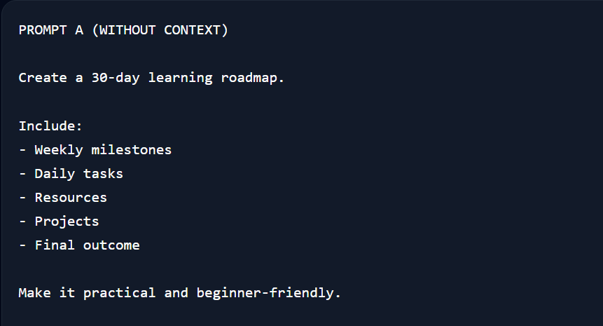
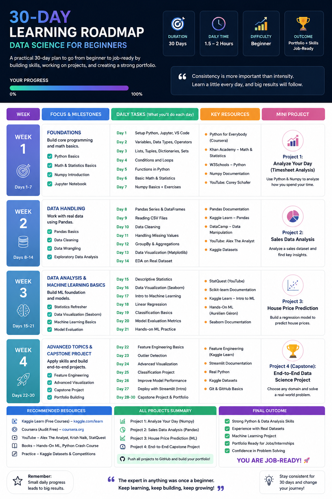
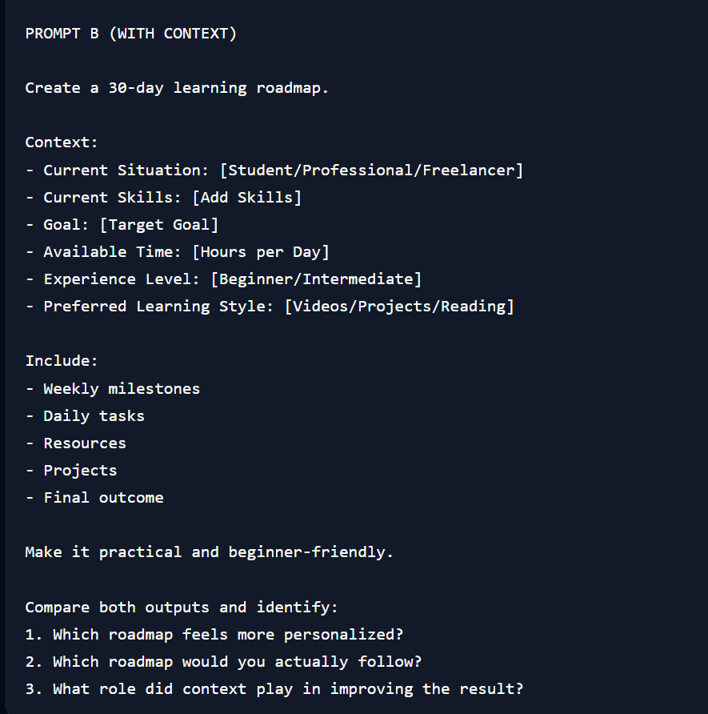
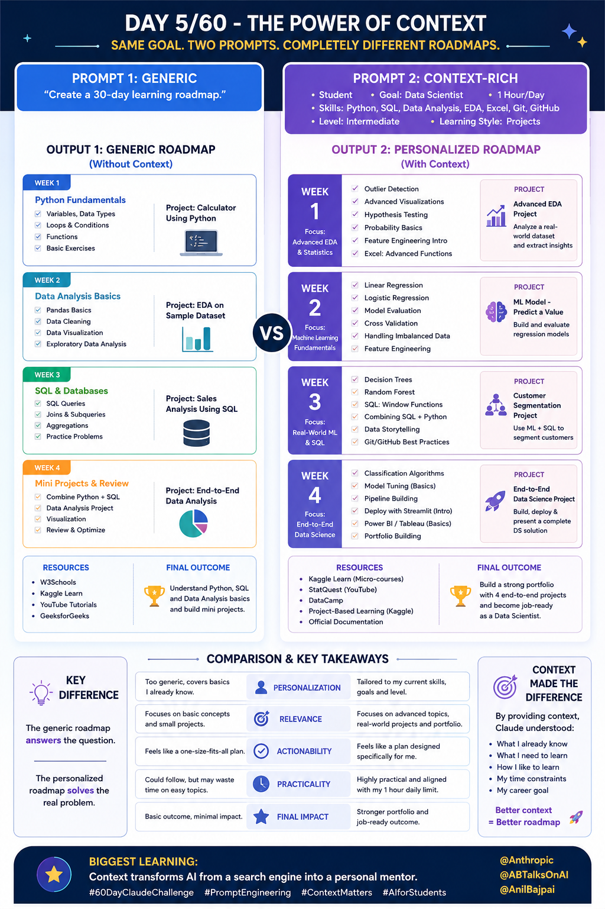

# 🚀 Day 5 – The Power of Context

<div align="center">

## abtalks 60 Days Claude Challenge

### Generic Prompt vs Context-Rich Prompt

*"The difference between getting an answer and getting the right answer."*

</div>

---

# 📖 Overview

Today I explored one of the most important concepts in Prompt Engineering:

> **Context changes everything.**

The objective was simple:

Create a **30-Day Learning Roadmap** using Claude.

I tested two versions of the same prompt:

### Prompt A

A generic prompt with minimal information.

### Prompt B

A context-rich prompt that included information about my background, goals, skills, available time, and preferred learning style.

The results were dramatically different.

---

# 📝 Prompt A – Generic Prompt

## Prompt Screenshot

<p align="center">
  
</p>

## Prompt Used

```text
Create a 30-day learning roadmap.

Include:
- Weekly milestones
- Daily tasks
- Resources
- Projects
- Final outcome

Make it practical and beginner-friendly.
```

## Output Screenshot

<p align="center">
  
</p>

## Observation

The roadmap was useful but generic.

Since Claude had no information about me, it created a roadmap that could apply to almost anyone.

The roadmap focused on broad beginner topics and lacked personalization.

---

# 📝 Prompt B – Context-Rich Prompt

## Prompt Screenshot

<p align="center">
  
</p>

## Prompt Used

```text
Create a 30-day learning roadmap.

Context:
- Current Situation: Student
- Current Skills: Python, SQL, Data Analysis, EDA, Excel, Git and GitHub
- Goal: Data Scientist
- Available Time: 1 Hour Daily
- Experience Level: Intermediate
- Preferred Learning Style: Projects

Include:
- Weekly milestones
- Daily tasks
- Resources
- Projects
- Final outcome

Make it practical and beginner-friendly.

Compare both outputs and identify:
1. Which roadmap feels more personalized?
2. Which roadmap would you actually follow?
3. What role did context play in improving the result?
```

## Output Screenshot

<p align="center">
  
</p>

## Observation

This roadmap felt significantly more useful.

Instead of teaching skills I already knew, Claude focused on:

* Data Science concepts
* Machine Learning fundamentals
* Statistics
* Real-world projects
* Career-focused learning

The roadmap aligned much better with my actual goal of becoming a Data Scientist.

---

# 🔍 Comparison

| Generic Prompt        | Context-Rich Prompt      |
| --------------------- | ------------------------ |
| One-size-fits-all     | Personalized             |
| Assumes beginner      | Matches my level         |
| Broad recommendations | Relevant recommendations |
| Generic learning path | Goal-oriented roadmap    |
| Useful                | Actionable               |
| Anyone can use it     | Designed for me          |

---

# 💡 Biggest Difference

The generic roadmap answered the question.

The personalized roadmap answered **my question**.

Adding context transformed the output from a general study plan into a roadmap specifically designed for my situation.

---

# 📚 What I Learned

## 1. Context Improves Accuracy

The more relevant information you provide, the more relevant the output becomes.

---

## 2. AI Needs Direction

AI performs best when it understands:

* Who you are
* What you know
* What you're trying to achieve

---

## 3. Personalization Creates Value

The roadmap became more practical because Claude understood my current skill level and career goals.

---

## 4. Better Inputs = Better Outputs

Prompt quality directly influences output quality.

Small changes in the prompt can create dramatically different results.

---

# 🎯 Answers to the Challenge Questions

## 1. Which roadmap feels more personalized?

✅ The Context-Rich Roadmap

Because it reflects my background, skills, learning style, and career goals.

---

## 2. Which roadmap would you actually follow?

✅ The Context-Rich Roadmap

Because it focuses on skills I actually need to develop to become a Data Scientist.

---

## 3. What role did context play?

Context helped Claude understand:

* What I already know
* What I need to learn
* My available time
* My preferred learning style
* My end goal

Without context, Claude guessed.

With context, Claude understood.

---

# 🌟 Final Takeaway

> Context is what transforms AI from a search engine into a personal mentor.

The experiment showed that the best prompts don't just ask questions.

They provide the information needed for AI to give meaningful, personalized, and actionable responses.

This was my biggest lesson from Day 5 of the **abtalks 60 Days Claude Challenge**.

---

# 📅 Challenge Progress

* ✅ Day 1 – Getting Started with Claude
* ✅ Day 2 – Prompt Engineering
* ✅ Day 3 – Context Engineering
* ✅ Day 4 – Chain-of-Thought Prompting
* ✅ Day 5 – The Power of Context
* 🔜 Day 6 – Coming Soon

---

<div align="center">

## 🚀 Learning in Public

### abtalks 60 Days Claude Challenge

Building AI Skills • Creating Projects • Sharing Learnings

</div>
