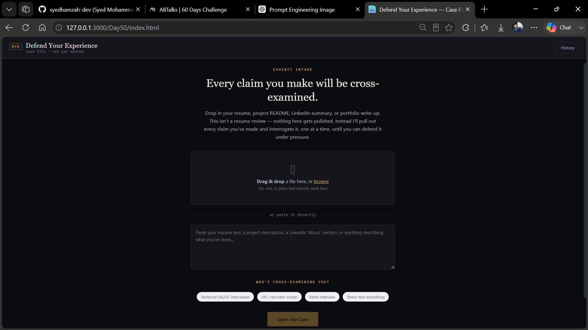

# Day 50 – Defend Your Experience

## Overview

For **Day 50** of the **ABTalks 60 Days Claude Challenge**, I built **Defend Your Experience**—an AI-powered interview preparation application that helps users confidently defend every claim they make about themselves.

Instead of reviewing or rewriting resumes, the application extracts meaningful claims from resumes, LinkedIn profiles, project READMEs, portfolios, or other professional documents and conducts adaptive cross-examinations similar to a real interview.

The experience is designed as an investigative case file where every claim becomes an exhibit that must be defended with evidence, reasoning, and confidence.

---

## Challenge Objective

Create an intelligent interview simulator that:

- Extracts meaningful claims from uploaded content
- Challenges those claims with personalized follow-up questions
- Adapts based on every answer
- Identifies weak or unsupported experiences
- Builds confidence for real interviews

The focus is not improving documents—it is improving the person's ability to defend them.

---

## Features

- 📄 Resume, README, LinkedIn & portfolio uploads
- 🔍 Automatic claim extraction
- 🎯 AI-powered adaptive cross-examination
- 🧠 Personalized follow-up questioning
- 📊 Defense confidence tracking
- 📈 Exhibit progress visualization
- 📝 Final Defense Report
- 💾 Local Storage session history
- 📤 Export interview reports
- 📱 Responsive design
- 🌙 Dark "Case File" inspired interface
- ⚡ Graceful fallback handling for temporary API errors

---

## How It Works

1. Upload or paste professional content.
2. Select the interview audience.
3. AI extracts important claims.
4. Every claim becomes an exhibit.
5. The interviewer challenges each claim.
6. Your responses influence future questions.
7. Receive a detailed Defense Report highlighting strengths and weaknesses.

---

## Defense Report

After the interview session, the application generates a comprehensive report containing:

- Overall readiness score
- Interview confidence level
- Well-defended experiences
- Weak or unsupported claims
- Personalized recommendations
- Action plan for improvement

---

## Screenshot

### Application Dashboard

---

## What I Learned

This project helped me better understand:

- Adaptive AI conversations
- Prompt engineering for interview simulations
- Behavioral interviewing techniques
- UX design for productivity tools
- Building interactive AI-powered applications
- Local storage management
- Creating structured evaluation workflows

More importantly, it reinforced the idea that successful interviews depend not only on having good experiences but also on clearly explaining and defending them under pressure.

---

## Technologies Used

- HTML5
- CSS3
- JavaScript
- Anthropic Messages API
- Local Storage API

---

## Challenge Progress

**Day 50 / 60 ✅**

Building practical AI applications while strengthening real-world problem-solving skills.

---

**Built as part of the ABTalks 60 Days Claude Challenge**
