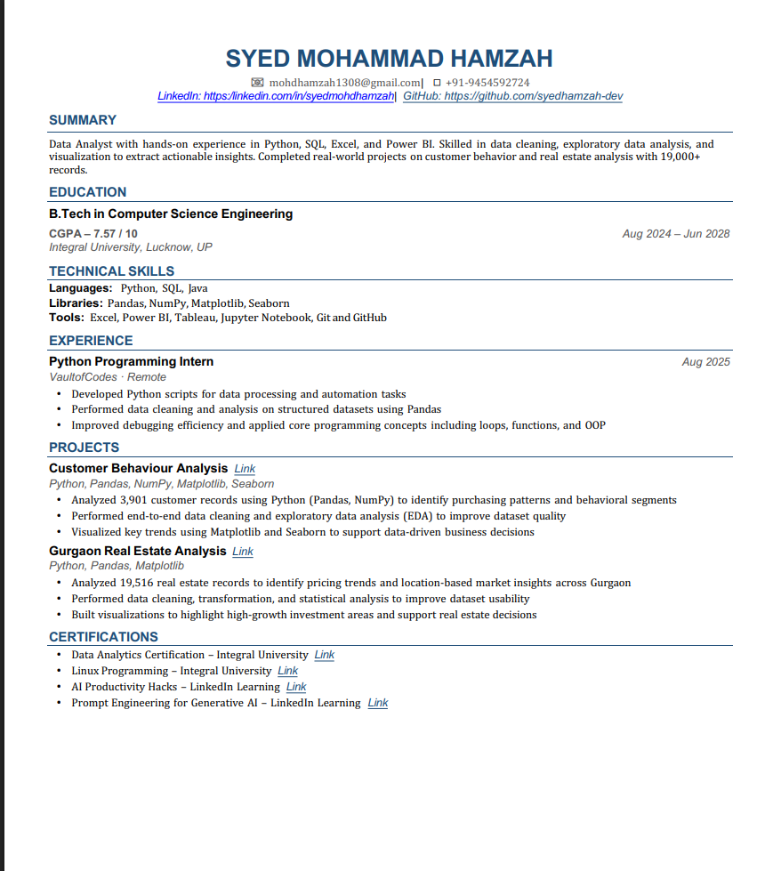
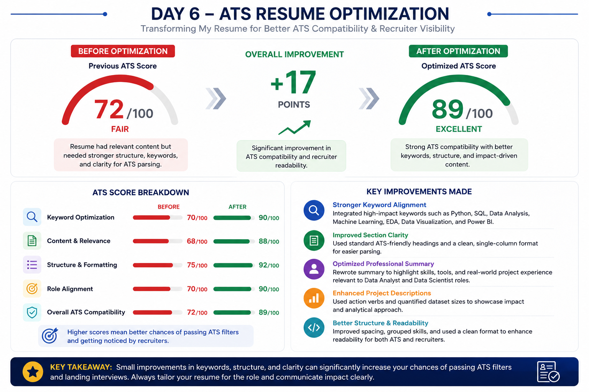
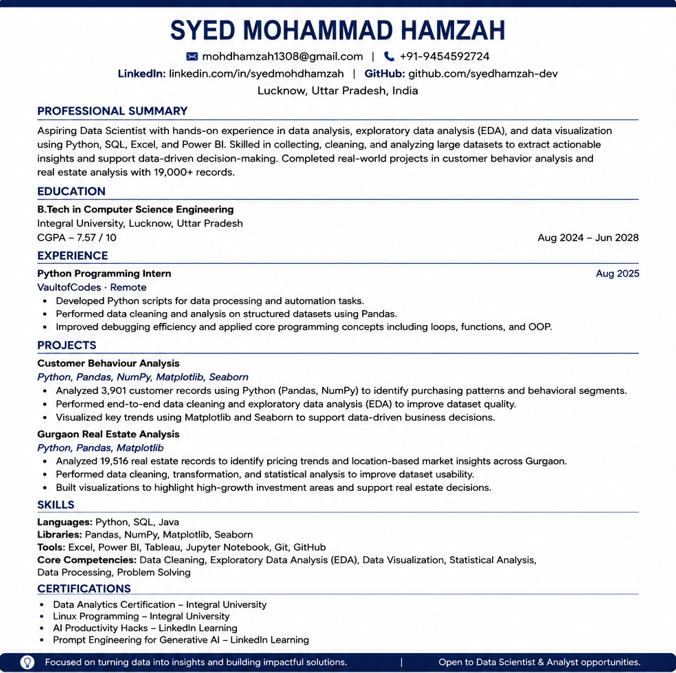

# 🚀 Day 6 – ATS Resume Optimization

## abtalks 60 Days Claude Challenge

### Optimizing My Resume for ATS & Recruiter Readability

---

# 📖 Overview

Today I explored how AI can be used to improve resume quality and ATS compatibility.

The challenge was to upload my resume to Claude and use an ATS Resume Optimizer prompt to:

* Analyze the resume
* Estimate ATS compatibility
* Identify weaknesses
* Generate an optimized one-page version
* Improve recruiter readability

The result was a significantly improved resume optimized for Data Analyst and aspiring Data Scientist roles.

---

# 📄 Original Resume

  

### Initial Observations

* Resume contained relevant skills and projects.
* ATS keyword coverage could be improved.
* Project descriptions could be more impactful.
* Professional summary needed stronger positioning.

---

# 🤖 ATS Analysis

  

### ATS Score Improvement

| Metric              | Score      |
| ------------------- | ---------- |
| Previous ATS Score  | 72/100     |
| Optimized ATS Score | 89/100     |
| Improvement         | +17 Points |

---

# 📑 Optimized Resume

  

---

# 🔍 Key Improvements

### 1. Better Keyword Alignment

Added and emphasized keywords related to:

* Data Analysis
* Python
* SQL
* EDA
* Data Visualization
* Power BI

---

### 2. ATS-Friendly Formatting

Improved section structure and readability while maintaining a clean single-column layout.

---

### 3. Stronger Professional Summary

Created a concise summary highlighting:

* Skills
* Experience
* Analytical capabilities
* Project work

---

### 4. Enhanced Project Descriptions

Improved clarity and emphasized:

* Dataset size
* Analytical techniques
* Business insights generated

---

### 5. Improved Skills Organization

Grouped technical skills into:

* Languages
* Libraries
* Tools
* Core Competencies

---

# 💡 Biggest Insight

> Building skills is important, but presenting them effectively is equally important.

A resume should not simply list experiences.

It should clearly communicate value to both recruiters and ATS systems.

---

# 📚 What I Learned

### ATS Systems Matter

Many resumes are filtered before a recruiter sees them.

### Keywords Are Important

Relevant keywords improve discoverability.

### Formatting Affects Parsing

Simple formatting often performs better than complex designs.

### Projects Should Demonstrate Impact

Strong project descriptions make skills more credible.

---

# 🌟 Final Takeaway

AI can act as a career development assistant.

By analyzing and improving resume structure, keyword usage, and content quality, Claude helped transform a good resume into a stronger ATS-friendly resume.

This was one of the most practical applications of AI I've explored so far.

---

# 📅 Challenge Progress

* ✅ Day 1 – Getting Started with Claude
* ✅ Day 2 – Prompt Engineering
* ✅ Day 3 – Context Engineering
* ✅ Day 4 – Chain-of-Thought Prompting
* ✅ Day 5 – The Power of Context
* ✅ Day 6 – ATS Resume Optimization
* 🔜 Day 7 – Coming Soon

---

## 🚀 Learning in Public

### abtalks 60 Days Claude Challenge

Building AI Skills • Creating Projects • Sharing Learnings

