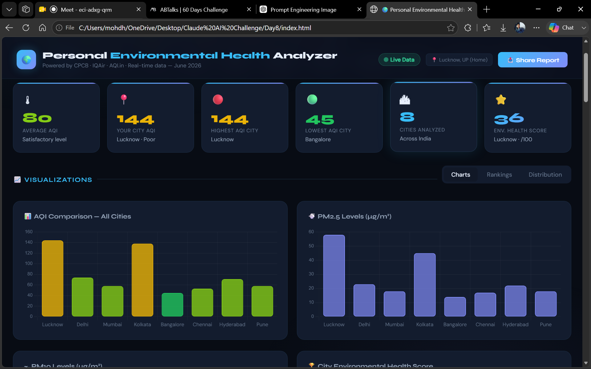
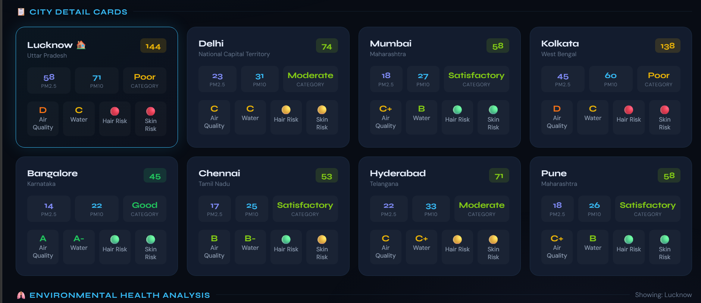
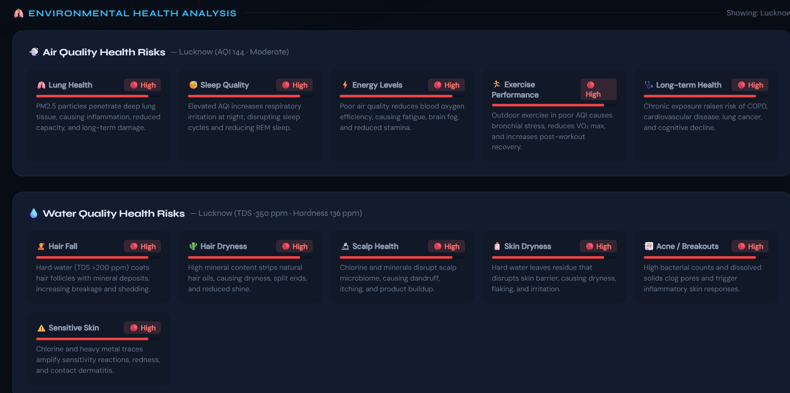

# 🚀 Day 8 – Personal Environmental Health Analyzer

## abtalks 60 Days Claude Challenge

### Building an Interactive Environmental Analytics Dashboard with Claude

---

# 📖 Overview

Today's challenge focused on using Claude to create a complete interactive application instead of generating simple text outputs.

Using a detailed prompt, Claude generated a dashboard called:

# 🌍 Personal Environmental Health Analyzer

The application combines environmental data, health analysis, visualizations, and personalized recommendations into a modern dashboard experience.

---

# 🎯 Challenge Objective

Create a Claude Artifact capable of:

* Analyzing Air Quality Data
* Evaluating Water Quality
* Generating Environmental Health Scores
* Visualizing AQI Metrics
* Providing Personalized Health Insights
* Creating Interactive Dashboards

---

# 📝 Prompt Used

The prompt instructed Claude to act as:

* Senior Data Analyst
* Environmental Researcher
* UX Designer
* Frontend Dashboard Developer

The goal was to create a fully interactive and responsive HTML dashboard capable of analyzing environmental health metrics and presenting insights visually.

---

# 📸 Dashboard Screenshots

  

  

  

---

# ✨ Features Generated by Claude

## 📊 Key Metrics

* Average AQI
* Highest AQI City
* Lowest AQI City
* Number of Cities Analyzed
* Environmental Health Score

---

## 📈 Interactive Visualizations

* AQI Comparison Chart
* PM2.5 Analysis
* PM10 Analysis
* City Ranking Dashboard
* AQI Distribution Analysis

---

## 🎛 Interactive Filters

* City Selector
* AQI Filters
* Pollutant Filters
* Health Risk Filters
* City Comparison Mode

---

## 🫁 Environmental Health Analysis

The dashboard evaluates:

### Air Quality Impact

* Lung Health
* Sleep Quality
* Energy Levels
* Exercise Performance
* Long-Term Health Risks

### Water Quality Impact

* Hair Fall Risk
* Hair Dryness
* Scalp Health
* Skin Dryness
* Acne Risk
* Sensitive Skin Risk

---

## 📋 Environmental Report Card

The dashboard generates:

* Air Quality Score
* Water Quality Score
* Overall Environmental Score
* Environmental Grades
* Risk Assessment

---

## 💡 Insights Panel

Provides:

* Cleanest Cities
* Most Polluted Cities
* Environmental Trends
* Anomalies
* Key Observations

---

# 📚 Key Learnings

### 1. AI Can Build Complete Applications

Claude generated an entire dashboard structure from a single detailed prompt.

### 2. Prompt Quality Directly Impacts Output Quality

The more detailed the prompt, the more complete and useful the generated application became.

### 3. Data Visualization Improves Understanding

Interactive charts make environmental data easier to interpret and analyze.

### 4. AI Can Play Multiple Roles

Claude successfully acted as:

* Analyst
* Researcher
* Designer
* Developer

within a single workflow.

---

# 💡 Biggest Insight

> AI becomes significantly more powerful when it is given a clear role, objective, and output format.

Instead of generating a simple answer, Claude generated a complete solution.

---

# 🌟 Final Takeaway

This challenge demonstrated how powerful AI can be when combined with structured prompting.

A well-designed prompt can transform Claude from a chatbot into a complete application builder capable of generating dashboards, analytics systems, and interactive user experiences.

---

# 📅 Challenge Progress

* ✅ Day 1 – Getting Started with Claude
* ✅ Day 2 – Prompt Engineering
* ✅ Day 3 – Context Engineering
* ✅ Day 4 – Chain-of-Thought Prompting
* ✅ Day 5 – The Power of Context
* ✅ Day 6 – ATS Resume Optimization
* ✅ Day 7 – My Claude Usage Strategy
* ✅ Day 8 – Personal Environmental Health Analyzer
* 🔜 Day 9 – Coming Soon

---

## 🚀 Learning in Public

### abtalks 60 Days Claude Challenge

Building AI Skills • Creating Projects • Sharing Learnings

