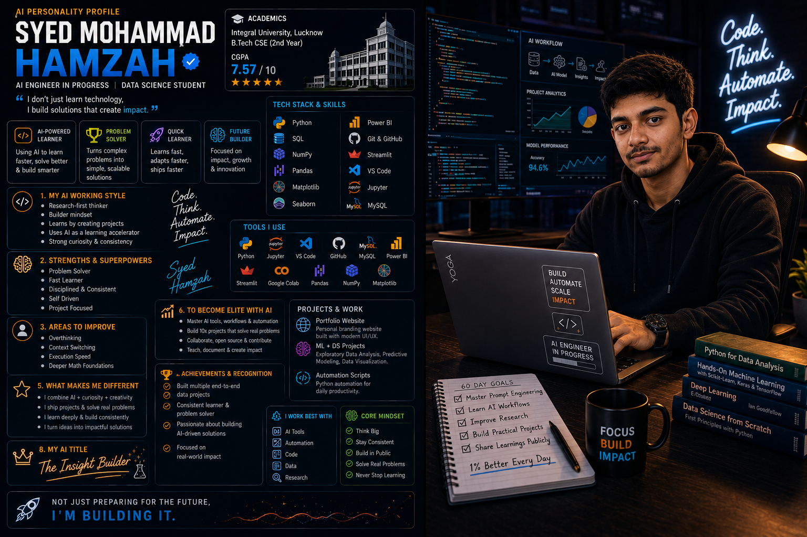

# 🚀 Day 01 — AI Personality Profile & Challenge Kickoff

## AI Personality Profile & Cinematic Portrait

  

---

## 📖 Overview

Today I started my **60-Day Claude AI Mastery Challenge** journey.

The objective of Day 1 was to create an AI Personality Profile, generate a cinematic AI portrait, and begin documenting my AI learning journey publicly through GitHub and LinkedIn.

---

## 👨‍💻 About Me

**Syed Mohammad Hamzah**
B.Tech CSE (2nd Year) — Integral University, Lucknow
CGPA: **7.57/10**

### Current Learning Focus

* Python
* SQL
* NumPy
* Pandas
* Data Visualization
* Data Science
* Mathematics for Machine Learning

### Career Goal

To become an **AI Engineer** and **Data Scientist** capable of building impactful real-world solutions.

---

## ✅ Day 1 Tasks Completed

* Created my Claude Project: **60 Days of AI**
* Generated my AI Personality Profile
* Created a Cinematic AI Portrait
* Shared my progress on LinkedIn
* Created this GitHub repository

---

## 🎯 Goals for the Next 60 Days

* Master Prompt Engineering
* Learn AI Workflows
* Explore Automation
* Build Practical Projects
* Improve AI Productivity
* Learn Context Engineering

---

> "Not just preparing for the future — building it."

✅ **Day 01 Completed**
