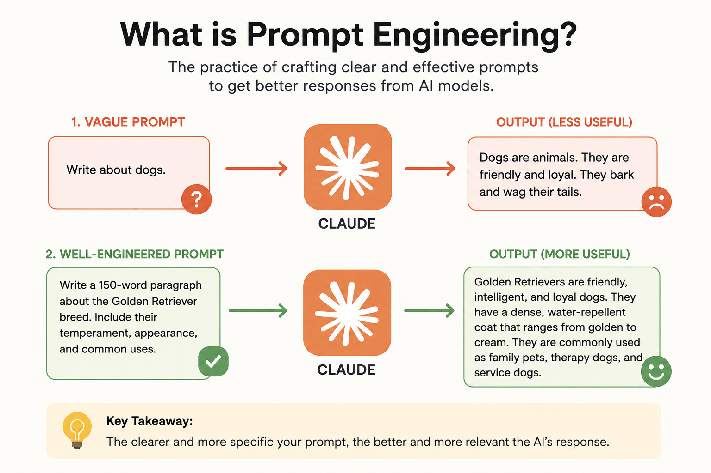
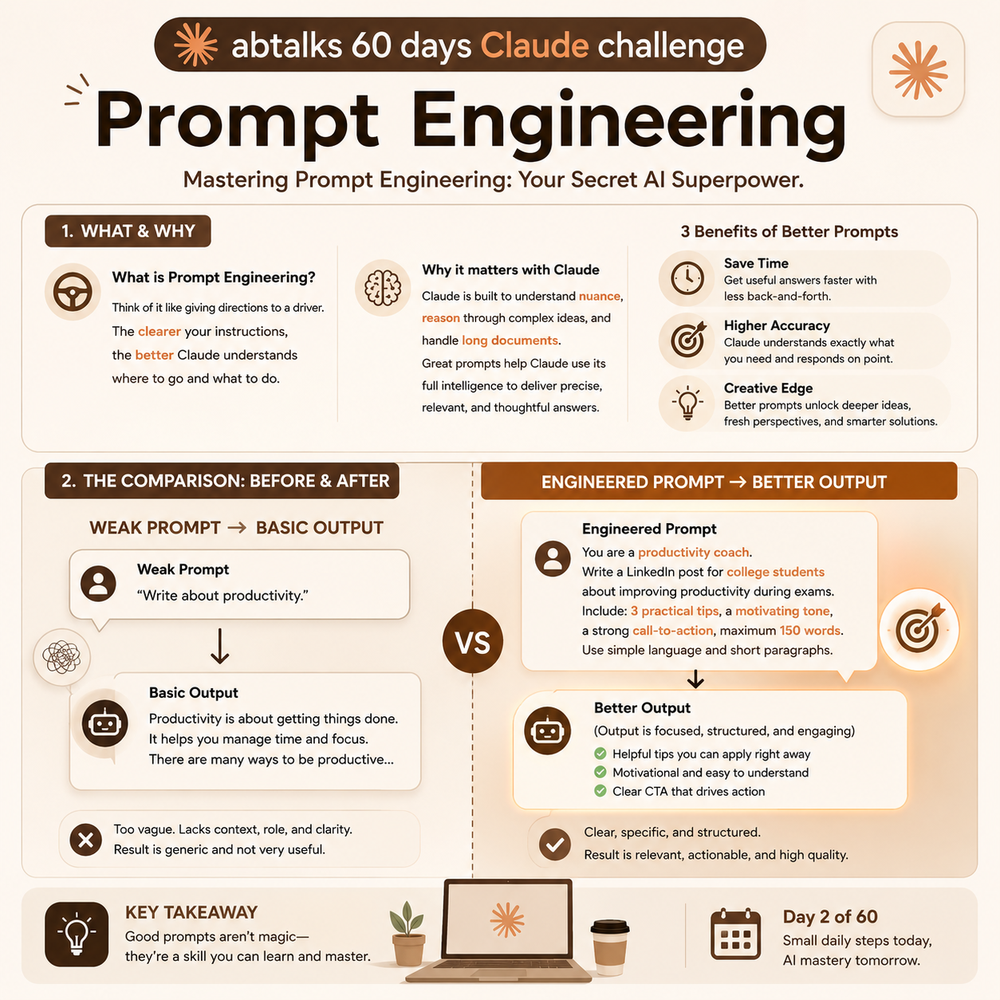

# 🚀 Day 2: Mastering Prompt Engineering

## abtalks 60 Days Claude Challenge

Welcome to Day 2 of my Claude AI Challenge journey.

Today I learned one of the most important skills for working with AI: **Prompt Engineering**.

---

# What is Prompt Engineering?

Prompt Engineering is the skill of writing clear and effective instructions for an AI model.

Think of it like giving directions to a driver.

If you simply say:

> "Take me somewhere nice."

The driver has to guess what you mean.

But if you say:

> "Take me to a quiet coffee shop with Wi-Fi within 10 minutes."

You'll likely get exactly what you're looking for.

The same principle applies when working with AI.

The clearer your instructions, the better the results.

---

# Why is Prompt Engineering Important?

Modern AI systems such as Claude are incredibly powerful.

They can:

* Analyze information
* Generate content
* Solve problems
* Explain complex concepts
* Assist with research and productivity

However, the quality of the output depends heavily on the quality of the prompt.

A vague prompt often produces generic results.

A well-engineered prompt produces focused, useful, and high-quality results.

---

# My Experiment

To understand Prompt Engineering better, I performed a simple experiment.

I asked Claude to create an image explaining Prompt Engineering using two different prompts.

---

# 🔴 Lazy Prompt

### Prompt

```text
Create an image to describe Prompt Engineering.
```

### Result

<p align="center">
  
</p>

### Observation

The image was decent but generic.

Because the prompt lacked context, audience information, design requirements, and output constraints, Claude had to guess what I wanted.

The result was usable but not optimized for any specific purpose.

---

# 🟢 Engineered Prompt

### Prompt

```text
Create a professional LinkedIn infographic explaining Prompt Engineering to complete beginners.

Use a Claude-inspired color palette with beige, cream, and brown tones.

Include:
- Title: Prompt Engineering
- Weak Prompt → Basic Output
- Engineered Prompt → Better Output
- Modern AI and productivity-themed visuals
- Clean professional layout
- 1080×1080 LinkedIn format
```

### Result

<p align="center">
  
</p>

### Observation

The output was significantly better.

The image became:

* More informative
* Better structured
* More visually appealing
* Suitable for LinkedIn
* Tailored to a specific audience
* Aligned with the intended goal

---

# What Makes an Engineered Prompt Better?

A good prompt usually contains:

### Context

Provides background information.

### Objective

Clearly states the goal.

### Audience

Defines who the content is for.

### Constraints

Specifies requirements such as format, style, length, or design.

### Desired Output

Explains what the final result should look like.

---

# Key Lessons Learned

## 1. Context Matters

The more context you provide, the better AI understands your goal.

## 2. Specificity Improves Quality

Clear requirements produce better outputs.

## 3. Constraints Guide the AI

Formatting and style instructions help shape the final result.

## 4. Better Prompts Save Time

A well-written prompt reduces the need for multiple revisions.

---

# Before vs After

| Lazy Prompt    | Engineered Prompt    |
| -------------- | -------------------- |
| Vague          | Specific             |
| No audience    | Defined audience     |
| No context     | Clear context        |
| No constraints | Clear requirements   |
| Generic output | Goal-oriented output |
| AI guesses     | AI understands       |

---

# Key Takeaway

> Prompt Engineering is not about using complicated words.

It is about communicating clearly.

The experiment showed that even a simple improvement in the prompt can dramatically improve the quality of the result.

Better prompts lead to:

✅ Better outputs

✅ Faster results

✅ More accuracy

✅ More creativity

---

## Challenge Progress

* ✅ Day 1 — Getting Started with Claude AI
* ✅ Day 2 — Mastering Prompt Engineering
* 🔜 Day 3 — Coming Soon

---

### Follow My Journey

I'm documenting my learnings from the **abtalks 60 Days Claude Challenge** and sharing everything I discover along the way.

Let's learn AI together! 🚀

#60DayClaudeChallenge #ABTalks #ClaudeAI #PromptEngineering #ArtificialIntelligence #LearningInPublic #BuildInPublic #AI
